# Lab 3: Correlation

<script>
$("#coverpic").hide();
</script>

<span class="newthought">
If ... we choose a group of social phenomena with no antecedent knowledge of the causation or absence of causation among them, then the calculation of correlation coefficients, total or partial, will not advance us a step toward evaluating the importance of the causes at work.
---Sir Ronald Fisher
</span>

In lecture and in the textbook, we have been discussing the idea of correlation. This is the idea that two things that we measure can be somehow related to one another. For example, your personal happiness, which we could try to measure say with a questionnaire, might be related to other things in your life that we could also measure, such as number of close friends, yearly salary, how much chocolate you have in your bedroom, or how many times you have said the word Nintendo in your life. Some of the relationships that we can measure are meaningful, and might reflect a causal relationship where one thing causes a change in another thing. Some of the relationships are spurious, and do not reflect a causal relationship.

In this lab you will learn how to compute correlations between two variables in software, and then ask some questions about the correlations that you observe.

## General Goals

1. Compute Pearson's r between two variables using software
2. Discuss the possible meaning of correlations that you observe

### Important Info

We use data from the [World Happiness Report](http://worldhappiness.report). A .csv of the data can be found here: <a href="https://raw.githubusercontent.com/CrumpLab/statisticsLab/master/data/WHR2018.csv" download>WHR2018.csv</a>

## R

In this lab we use explore to explore correlations between any two variables, and also show how to do a regression line. There will be three main parts. Getting R to compute the correlation, and looking at the data using scatter plots. We'll look at some correlations from the World Happiness Report. Then you'll look at correlations using data we collect from ourselves. It will be fun.

### cor for correlation

R has the `cor` function for computing Pearson's r between any two variables. In fact this same function computes other versions of correlation, but we'll skip those here. To use the function you just need two variables with numbers in them like this:

```{r}
x  <- c(1,3,2,5,4,6,5,8,9)
y  <- c(6,5,8,7,9,7,8,10,13)
cor(x,y)
```
 Well, that was easy. 
 
#### scatterplots

Let's take our silly example, and plot the data in a scatter plot using ggplot2, and let's also return the correlation and print it on the scatter plot. Remember, ggplot2 wants the data in a data.frame, so we first put our x and y variables in a data frame.

```{r, warning=F, message=F}
library(ggplot2)

# create data frame for plotting
my_df <- data.frame(x,y)

# plot it
ggplot(my_df, aes(x=x,y=y))+
  geom_point()+
  geom_text(aes(label = round(cor(x,y), digits=2), y=12, x=2 ))
```

Wow, we're moving fast here.

#### lots of scatterplots

Before we move on to real data, let's look at some fake data first. Often we will have many measures of X and Y, split between a few different conditions, for example, A, B, C, and D. Let's make some fake data for X and Y, for each condition A, B, C, and D, and then use facet_wrapping to look at four scatter plots all at once

```{r}
x<-rnorm(40,0,1)
y<-rnorm(40,0,1)
conditions<-rep(c("A","B","C","D"), each=10)

all_df <- data.frame(conditions, x, y)

ggplot(all_df, aes(x=x,y=y))+
  geom_point()+
  facet_wrap(~conditions)

```

#### computing the correlations all at once

We've seen how we can make four graphs at once. Facet_wrap will always try to make as many graphs as there are individual conditions in the column variable. In this case there are four, so it makes four.

Notice, the scatter plots don't show the correlation (r) values. Getting these numbers on there is possible, but we have to calculate them first. We'll leave it to you to Google how to do this, if it's something you want to do. Instead, what we will do is make a table of the correlations in addition to the scatter plot. We again use `dplyr` to do this:

OK, we are basically ready to turn to some real data and ask if there are correlations between interesting variables...You will find that there are some... But before we do that, we do one more thing. This will help you become a little bit more skeptical of these "correlations".

#### Chance correlations

As you learned from the textbook. We can find correlations by chance alone, even when there is no true correlation between the variables. For example, if we sampled randomly into x, and then sampled some numbers randomly into y. We know they aren't related, because we randomly sampled the numbers. However, doing this creates some correlations some of the time just by chance. You can demonstrate this to yourself with the following code. It's a repeat of what we already saw, jut with a few more conditions added. Let's look at 20 conditions, with random numbers for x and y in each. For each, sample size will be 10. We'll make the fake data, then make a big graph to look at all. And, even though we get to regression later in the lab, I'll put the best fit line onto each scatter plot, so you can "see the correlations".

```{r}
x<-rnorm(10*20,0,1)
y<-rnorm(10*20,0,1)
conditions<-rep(1:20, each=10)

all_df <- data.frame(conditions, x, y)

ggplot(all_df, aes(x=x,y=y))+
  geom_point()+
  geom_smooth(method=lm, se=FALSE)+
  facet_wrap(~conditions)+
  theme_classic()

```

You can see that the slope of the blue line is not always flat. Sometimes it looks like there is a correlation, when we know there shouldn't be. You can keep re-doing this graph, by re-knitting your R Markdown document, or by pressing the little green play button. This is basically you simulating the outcomes as many times as you press the button.

The point is, now you know you can find correlations by chance. So, in the next section, you should always wonder if the correlations you find reflect meaningful association between the x and y variable, or could have just occurred by chance.

### World Happiness Report

Let's take a look at some correlations in real data. We are going to look at responses to a questionnaire about happiness that was sent around the world, from the [world happiness report](http://worldhappiness.report)

#### Load the data

We load the data into a data frame. Reminder, the following assumes that you have downloaded the [RMarkdownsLab.zip](https://github.com/CrumpLab/statisticsLab/raw/master/RMarkdownsLab.zip) file which contains the data file in the data folder.

```{r, warning=F, message=F}
library(data.table)
whr_data <- fread('data/WHR2018.csv')
```

You can also load the data using the following URL

```{r, warning=F, message=F, eval=F}
library(data.table)
whr_data <- fread("https://raw.githubusercontent.com/CrumpLab/statisticsLab/master/data/WHR2018.csv")
```

#### Look at the data

```{r, eval=FALSE, warning=F, message=F}
library(summarytools)
view(dfSummary(whr_data))
```

You should be able to see that there is data for many different countries, across a few different years. There are lots of different kinds of measures, and each are given a name. I'll show you some examples of asking questions about correlations with this data, then you get to ask and answer your own questions.

#### My Question #1
 
For the year 2017 only, does a countries measure for "freedom to make life choices" correlate with that countries measure for " Confidence in national government"?

Let's find out. We calculate the correlation, and then we make the scatter plot.


```{r}

cor(whr_data$`Freedom to make life choices`,
    whr_data$`Confidence in national government`)

ggplot(whr_data, aes(x=`Freedom to make life choices`,
                     y=`Confidence in national government`))+
  geom_point()+
  theme_classic()

```

Interesting, what happened here? We can see some dots, but the correlation was NA (meaning undefined). This occurred because there are some missing data points in the data. We can remove all the rows with missing data first, then do the correlation. We will do this a couple steps, first creating our own data.frame with only the numbers we want to analyse. We can select the columns we want to keep using `select`. Then we use `filter` to remove the rows with NAs.

```{r, warning=F, message=F}
library(dplyr)

smaller_df <- whr_data %>%
               select(country,
                      `Freedom to make life choices`,
                      `Confidence in national government`) %>%
               filter(!is.na(`Freedom to make life choices`),
                      !is.na(`Confidence in national government`))

cor(smaller_df$`Freedom to make life choices`,
    smaller_df$`Confidence in national government`)
```

Now we see the correlation is .408. 

Although the scatter plot shows the dots are everywhere, it generally shows that as Freedom to make life choices increases in a country, that countries confidence in their national government also increase. This is a positive correlation. Let's do this again and add the best fit line, so the trend is more clear, we use `geom_smooth(method=lm, se=FALSE)`. I also change the `alpha` value of the dots so they blend it bit, and you can see more of them.

```{r}

# select DVs and filter for NAs

smaller_df <- whr_data %>%
               select(country,
                      `Freedom to make life choices`,
                      `Confidence in national government`) %>%
               filter(!is.na(`Freedom to make life choices`),
                      !is.na(`Confidence in national government`))

# calcualte correlation

cor(smaller_df$`Freedom to make life choices`,
    smaller_df$`Confidence in national government`)

# plot the data with best fit line

ggplot(smaller_df, aes(x=`Freedom to make life choices`,
                     y=`Confidence in national government`))+
  geom_point(alpha=.5)+
  geom_smooth(method=lm, se=FALSE)+
  theme_classic()


```

#### My Question #2

After all that work, we can now speedily answer more questions. For example, what is the relationship between positive affect in a country and negative affect in a country. I wouldn't be surprised if there was a negative correlation here: when positive feelings generally go up, shouldn't negative feelings generally go down?

To answer this question, we just copy paste the last code block, and change the DVs to be `Positive affect`, and `Negative affect`

```{r}

# select DVs and filter for NAs

smaller_df <- whr_data %>%
               select(country,
                      `Positive affect`,
                      `Negative affect`) %>%
               filter(!is.na(`Positive affect`),
                      !is.na(`Negative affect`))

# calcualte correlation

cor(smaller_df$`Positive affect`,
    smaller_df$`Negative affect`)

# plot the data with best fit line

ggplot(smaller_df, aes(x=`Positive affect`,
                     y=`Negative affect`))+
  geom_point(alpha=.5)+
  geom_smooth(method=lm, se=FALSE)+
  theme_classic()


```

Bam, there we have it. As positive affect goes up, negative affect goes down. A negative correlation.


### Generalization Exercise

This generalization exercise will explore the idea that correlations between two measures can arise by chance alone. There are two questions to answer. For each question you will be sampling random numbers from uniform distribution. To conduct the estimate, you will be running a simulation 100 times. The questions are: 

1. Estimate the range (minimum and maximum) of correlations (using pearons's r) that could occur by chance between two variables with n=10.

2. Estimate the range (minimum and maximum) of correlations (using pearons's r) that could occur bychance between two variables with n = 100.

Use these tips to answer the question.

Tip 1: You can use the `runif()` function to sample random numbers between a minimum value, and maximum value. The example below sample 10 (n=10) random numbers between the range 0 (min = 0) and 10 (max=10). Everytime you run this code, the 10 values in x will be re-sampled, and will be 10 new random numbers

```{r}
x <- runif(n=10, min=0, max=10)
```

Tip 2: You can compute the correlation between two sets of random numbers, by first sampling random numbers into each variable, and then running the `cor()` function.

```{r}
x <- runif(n=10, min=0, max=10)
y <- runif(n=10, min=0, max=10)
cor(x,y)
```

Running the above code will give different values for the correlation each time, because the numbers in x and y are always randomly different. We might expect that because x and y are chosen randomly that there should be a 0 correlation. However, what we see is that random sampling can produce "fake" correlations just by chance alone. We want to estimate the range of correlations that chance can produce. 

Tip 3: One way to estimate the range of correlations that chance can produce is to repeat the above code many times. For example, if you ran the above code 100 times, you could save the correlations each time, then look at the smallest and largest correlation. This would be an estimate of the range of correlations that can be produced by chance. How can you repeat the above code many times to solve this problem? 

We can do this using a `for` loop. The code below shows how to repeat everything inside the for loop 100 times. The variable `i` is an index, that goes from 1 to 100. The `saved_value` variable starts out as an empty variable, and then we put a value into it (at index position i, from 1 to 100). In this code, we put the sum of the products of x and y into the `saved_value` variable. At the end of the simulation, the `save_value` variable contains 100 numbers. The `min()` and `max()` functions are used to find the minimum and maximum values for each of the 100 simulations. You should be able to modify this code by replacing `sum(x*y)` with `cor(x,y)`. Doing this will allow you to run the simulation 100 times, and find the minimum correlation and maximum correlation that arises by chance. This will be estimate for question 1. To provide an estimate for question 2, you will need to change `n=10` to `n=100`.

```{r}
saved_value <- c() #make an empty variable
for (i in 1:100){
  x <- runif(n=10, min=0, max=10)
  y <- runif(n=10, min=0, max=10)
  saved_value[i] <- sum(x*y)
}

min(saved_value)
max(saved_value)

```


### Writing assignment

Answer the following questions with complete sentences. When you have finished everything. Knit the document and hand in your stuff (you can submit your .RMD file to blackboard if it does not knit.)

1. Imagine a researcher found a positive correlation between two variables, and reported that the r value was +.3. One possibility is that there is a true correlation between these two variables. Discuss one alternative possibility that would also explain the observation of +.3 value between the variables.

2. Explain the difference between a correlation of r = .3 and r = .7. What does a larger value of r represent?

3. Explain the difference between a correlation of r = .5, and r = -.5.

## Excel

How to do it in Excel

## SPSS


In this lab, we will use SPSS to calculate the correlation coefficient. We will focus on the most-commonly used Pearson's coefficient, r. We will learn how to:

1. Calculate the Pearson's r correlation coefficient for bivariate data
2. Produce a correlation matrix, reporting Pearson's r for more than two variables at a time
3. Produce a scatterplot
4. Split a data file for further analysis

Let's first begin with a short data set we will enter into a new SPSS data spreadsheet. Remember, in order to calculate a correlation, you need to have bivariate data; that is, you must have at least two variables, x and y. You can have more than two variables, in which case we can calculate a correlation matrix, as indicated in the section that follows. 

### Correlation Coefficient for Bivariate Data: Two Variables

---

Let's use the following data set: {x= 1, 3, 2, 5, 4, 6, 5, 8, 9} {y= 6, 5, 8, 7, 9, 7, 8, 10, 13}. Notice there are two variables, `x` and `y`. Enter these into SPSS and name them appropriately. 

```{r , echo=FALSE,dev='png'}
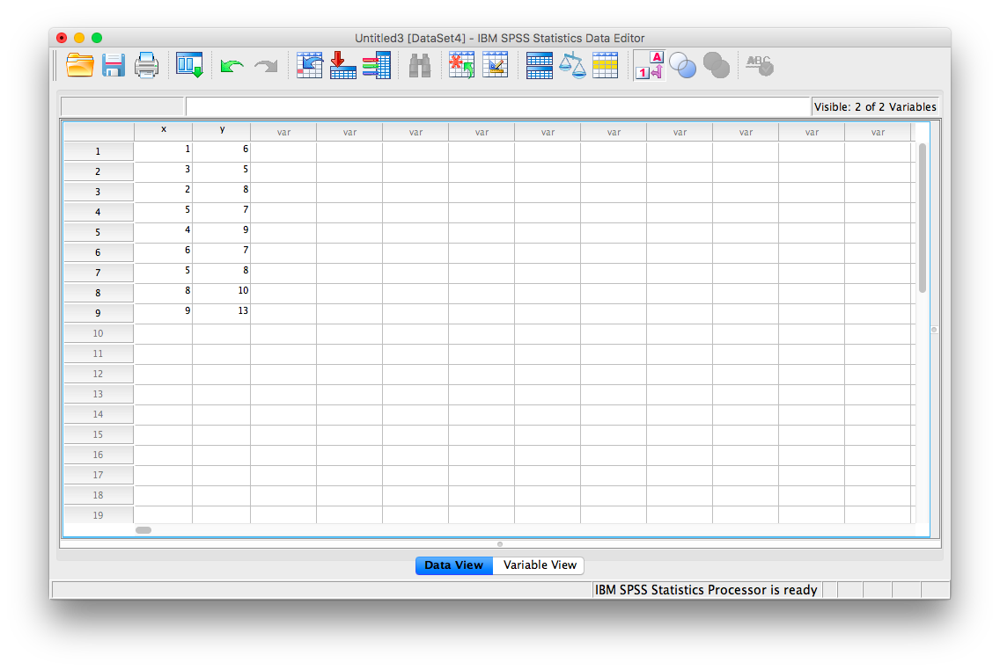
```

Next, click <span style="color:blue">Analyze</span>, then <span style="color:blue">Correlate</span>, then <span style="color:blue">Bivariate</span>:

```{r , echo=FALSE,dev='png'}

```

The next window will ask you to select variables to correlate. Since we have two (`x` and `y`) move them both from the left-hand field to the right-hand field using the arrow. Notice that in this window, <span style="color:blue">Pearson</span> is selected. This is the default setting (and the one we want), but notice there are other ways to calculate the correlation between variables. We will stick with Pearson's correlation coefficient for this course. 

```{r , echo=FALSE,dev='png'}

```

Now, click <span style="color:blue">OK</span>. 

SPSS will produce an output table containing the correlation coefficient requested. Notice that the table is redundant; it gives us the correlation between x and y, the correlation between y and x, the correlation between x and itself, and the correlation between y and itself. Any variable correlated with itself will result in an r of 1. The Pearson r correlation between variables x and y is .765.

```{r , echo=FALSE,dev='png'}
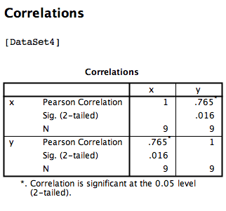
```


### Correlation Matrix

---


In the event that you have more than two variables in your spreadsheet, and would like to evaluate correlations between several variables taken two at a time, you need not re-run the correlations in SPSS repeatedly. You can, in fact, enter multiple variables into the correlation window and obtain a correlation matrix--a table showing every possible bivariate correlation amongst a group of variables.

To illustrate how this is done, let's add a new variable to our existing spreadsheet: variable `z`, {z= 1, 4, 2, 9, 5, 7, 12, 5, 3}
```{r , echo=FALSE,dev='png'}
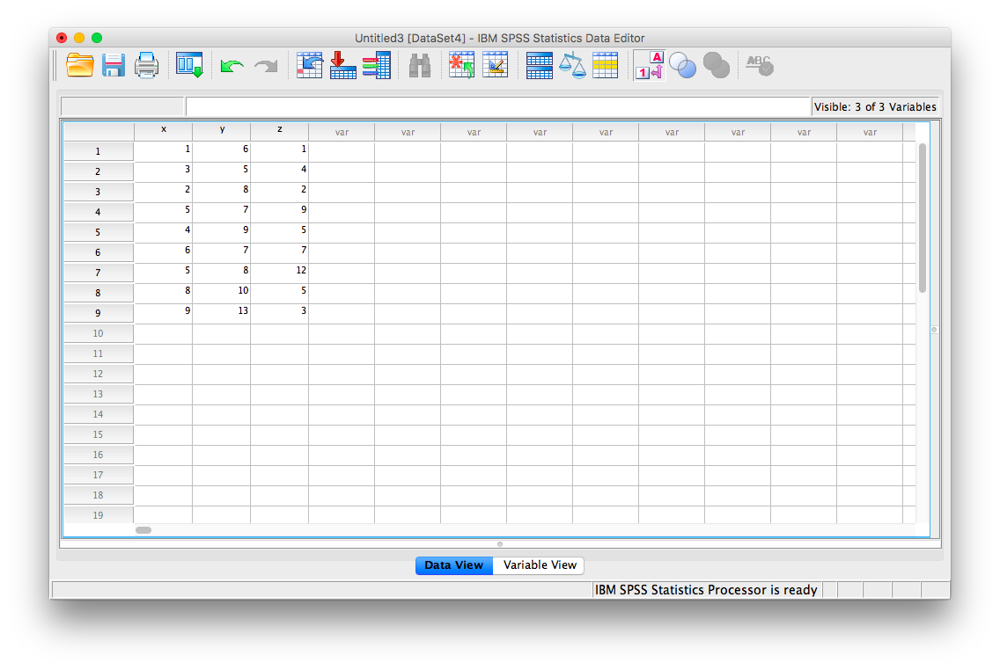
```

From here, go to <span style="color:blue">Analyze</span>, then <span style="color:blue">Correlate</span>, then <span style="color:blue">Bivariate</span>:

```{r , echo=FALSE,dev='png'}
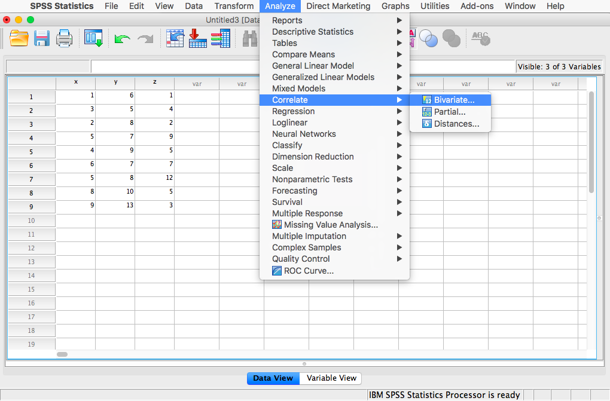
```

Next, you will encounter the window that asks you to indicate which variables to correlate. Select all three variables (`x`, `y`, and `z`) and move them to the right-hand field using the arrow. 

```{r , echo=FALSE,dev='png'}

```

Click <span style="color:blue">OK</span>. SPSS will produce an output table that contains correlations for every pairing of our three variables, along with the correlations of each variable with itself. 

```{r , echo=FALSE,dev='png'}
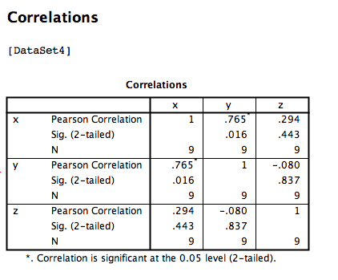
```

According to this output:

1. The correlation coefficient between variables `x` and `y` is .765
2. The correlation coefficient between variables `x` and `z` is .294
3. The correlation coefficient between variables `y` and `z` is -.080


### Correlation and Scatterplots

---


To accompany the calculation of the correlation coefficient, the scatterplot is the relevant visualization tool. Let's use data from The World Happiness Report, a questionnaire about happiness. [Here](https://github.com/CrumpLab/statisticsLab/blob/master/data/spssdata/WHR2018.sav) is a link to the file named WHR2018.sav.

Using this data, let's answer the following question: does a country's measure for `freedom to make life choices` correlate with that country's measure for `Confidence in national government`?

Let's find the correlation coefficient between these variables first. Go to <span style="color:blue">Analyze</span>, then <span style="color:blue">Correlate</span>, then <span style="color:blue">Bivariate</span>:

```{r , echo=FALSE,dev='png'}
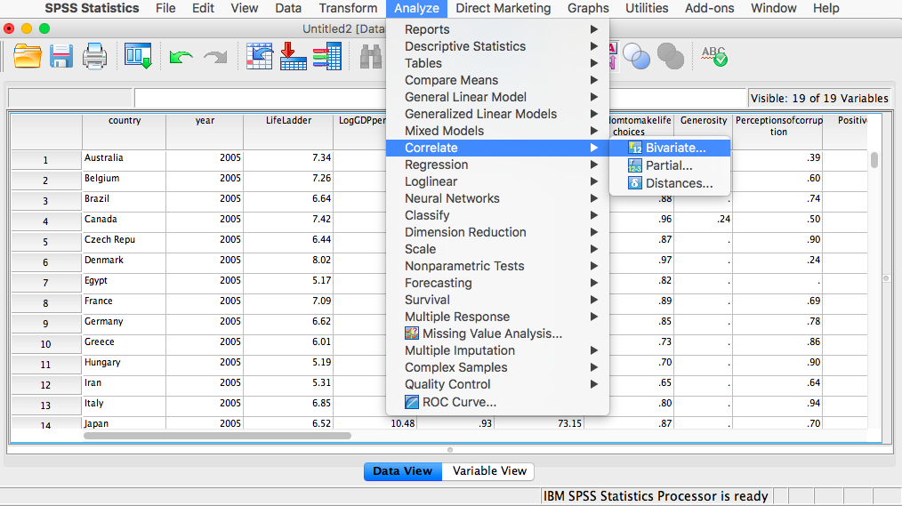
```

Next, a window will appear asking for the variables to be correlated. Go through the list on the left and find `Freedom to make life choices` as well as `Confidence in national government`. Move both of these variables to the field on the right using the arrow.

```{r , echo=FALSE,dev='png'}
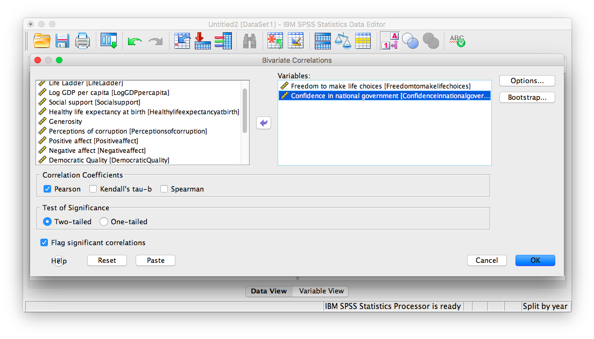
```
Click OK. SPSS will produce a correlation table.

```{r , echo=FALSE,dev='png'}
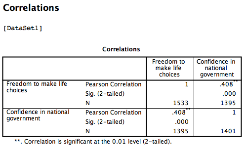
```

Based on this output, the correlation between `Freedom to make life choices` and `Confidence in national government` is .408.

Let's continue to create the scatterplot for this data. Go to <span style="color:blue">Graphs</span>, then <span style="color:blue">Legacy Dialogs</span>, then <span style="color:blue">Scatter...</span>
```{r , echo=FALSE,dev='png'}
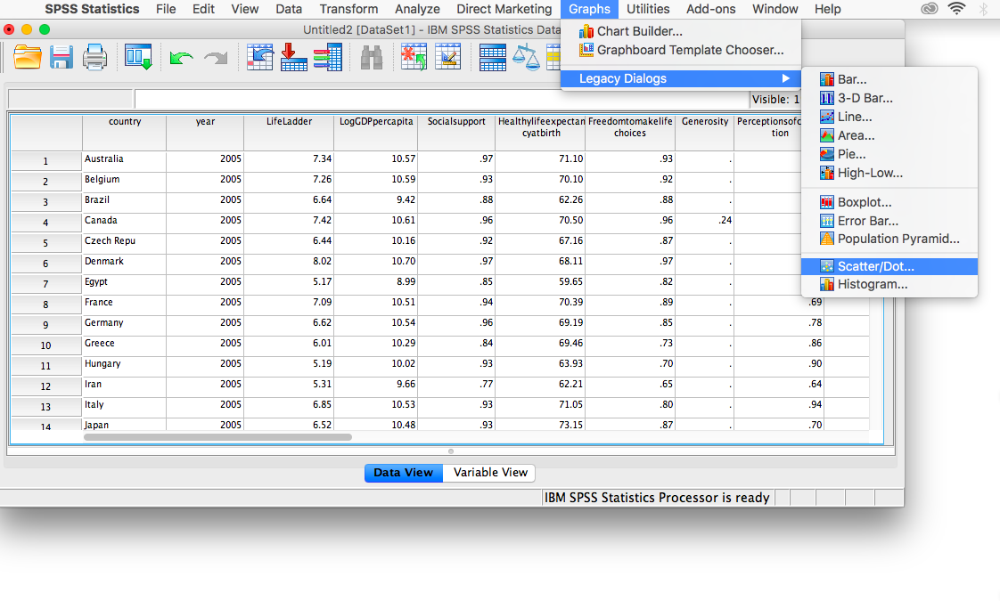
```

In the next window, choose <span style="color:blue">Simple</span>, then <span style="color:blue">Define</span>:
```{r , echo=FALSE,dev='png'}
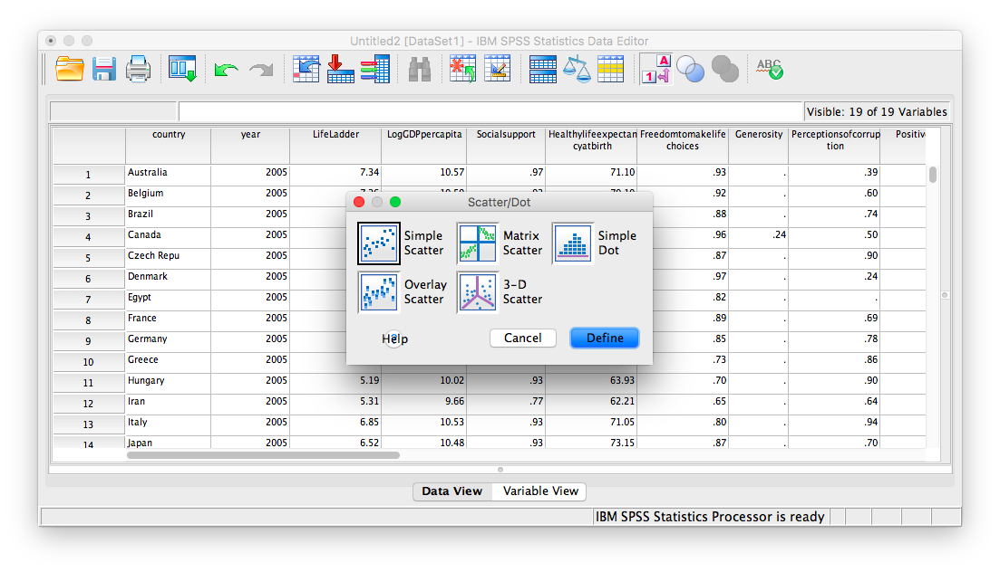
```

Next, move your two variables (`freedom to make life choices` and `confidence in national government`) into the x-axis and y-axis fields. Again, it does not matter which variable goes where, for now.

```{r , echo=FALSE,dev='png'}
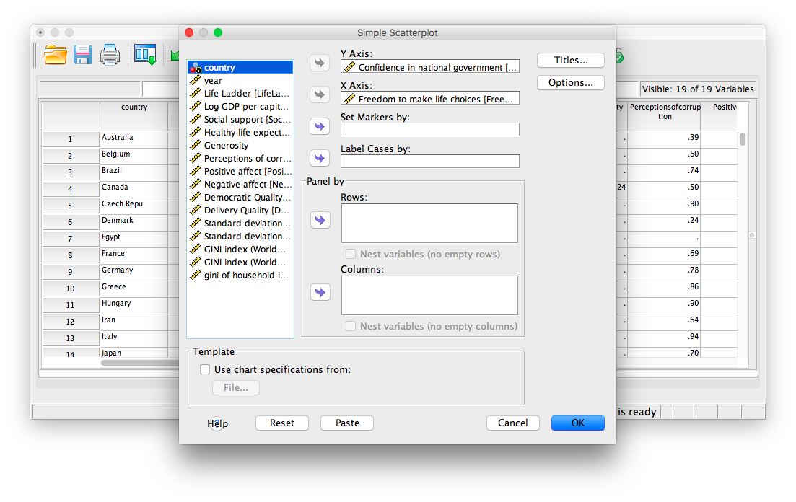
```

Click <span style="color:blue">OK</span>. SPSS will produce a scatterplot of your data, as follows:

```{r , echo=FALSE,dev='png'}
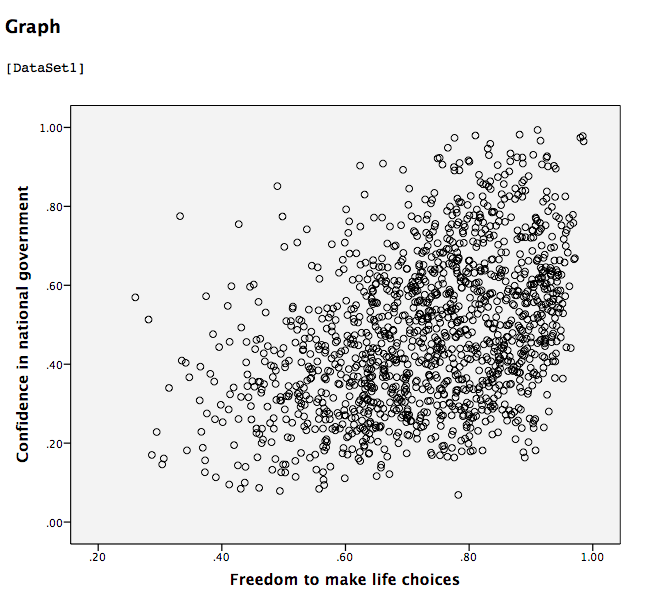
```

You can keep this scatterplot as it is, or, you can edit it to include a straight line that best fits the data points. This line is known as the best-fitting line as it minimizes the distance from it to all the data. To edit the scatterplot double click on the graph and a window labeled Chart Editor should appear:

```{r , echo=FALSE,dev='png'}
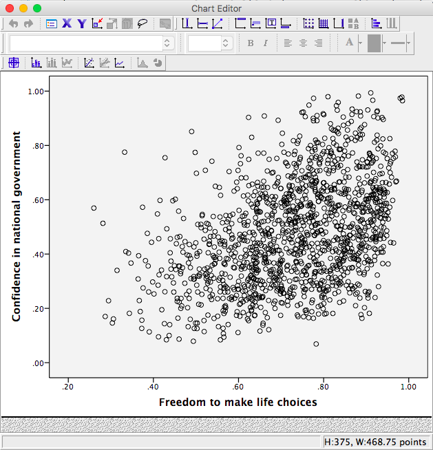
```

In this window, find the button at the top that reads <span style="color:blue">Fit Line at Total</span> when you hover your mouse over it. Below, I have highlighted it for clarity:

```{r , echo=FALSE,dev='png'}
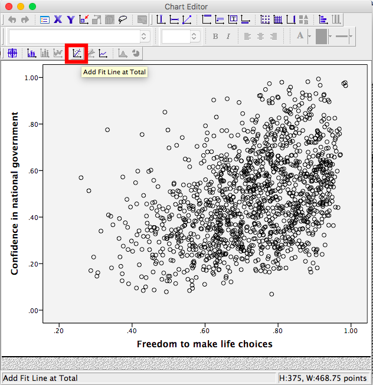
```

Press this button and you will see a new menu. Make sure <span style="color:blue">Linear</span> is selected and click <span style="color:blue">Apply</span>.

```{r , echo=FALSE,dev='png'}
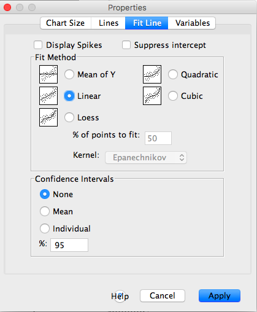
```

Next, exit from the Chart Editor. This means you will hit the <span style="color:blue">X</span> in the corner of the window. You will find that the graph in your output window has now updated and has a line drawn on it.

```{r , echo=FALSE,dev='png'}
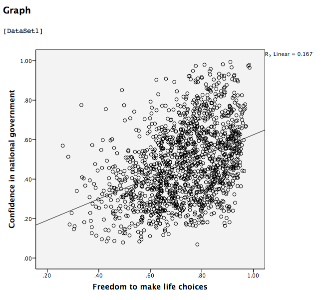
```

This scatterplot is very important. The distance between the line and the data points is indicative of the strength of the correlation coefficient; they are directly related. For example, if the data were more clustered or tighter to the line, the correlation would be stronger. If the data points are more spread out and far from the line, the correlation is weaker. 

### Splitting a File

---

What if we asked the question: for the year 2017 only, does a countries measure for `freedom to make life choices` correlate with that countries measure for `Confidence in national government`?

Notice that this question is asking us to find the correlation between the same two variables we used in the previous example, but only in the case where the year is 2017. To acheive this, we're going to utilize a function called splitting. Splitting takes the file as a whole, and sets it up so that every analysis is done on some subset of the data. For example, if we split our data by year and calculate a correlation coefficient, SPSS will find Pearson r for only 2017, and another for only 2016, and so on. 

In order to split the data, we go to the top menu and choose <span style="color:blue">Data</span>, then <span style="color:blue">Split file...</span>

```{r , echo=FALSE,dev='png'}
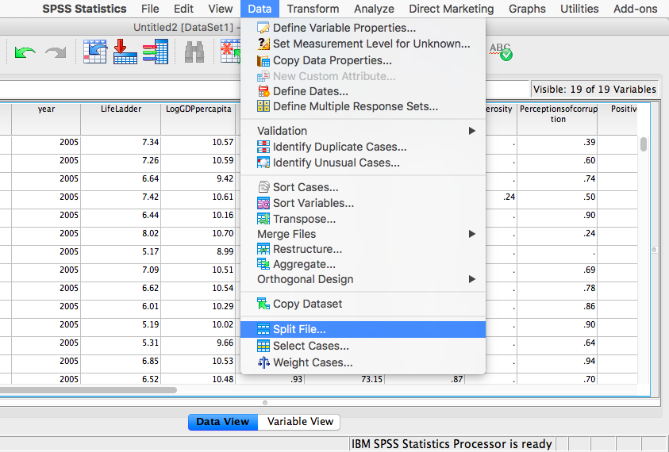
```

In the next window, you must select <span style="color:blue">Organize output by groups</span> and then specify which variable will be used to split the data. Select `year` and move it to the right-hand field using the arrow. 

```{r , echo=FALSE,dev='png'}
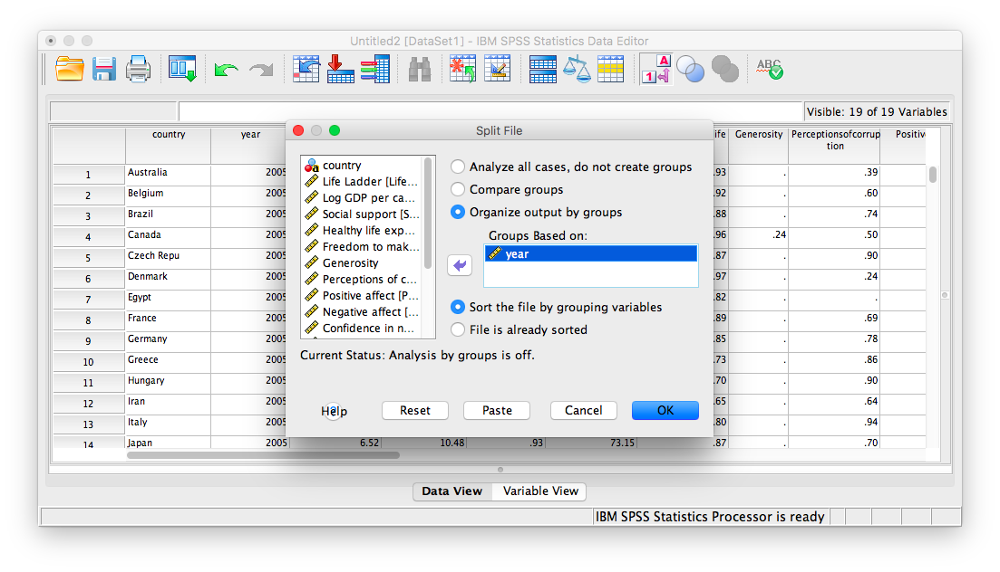
```

Click <span style="color:blue">OK</span>. Notice that this will cause the output window to produce some next indicating that you have split your file. You can ignore this and go back to your data window.

From here, any analysis you choose to do will be done separately for each year's worth of data. Let's calculate the correlation coefficient, as usual. Click <span style="color:blue">Analyze</span>, then <span style="color:blue">Correlate</span>, then <span style="color:blue">Bivariate</span>:

```{r , echo=FALSE,dev='png'}
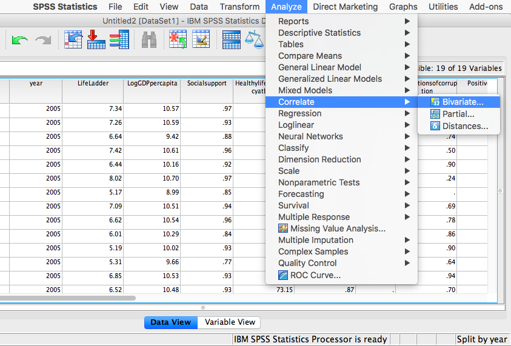
```

In the next window, select the variables to be used (they will be the same as in the last example). 

```{r , echo=FALSE,dev='png'}
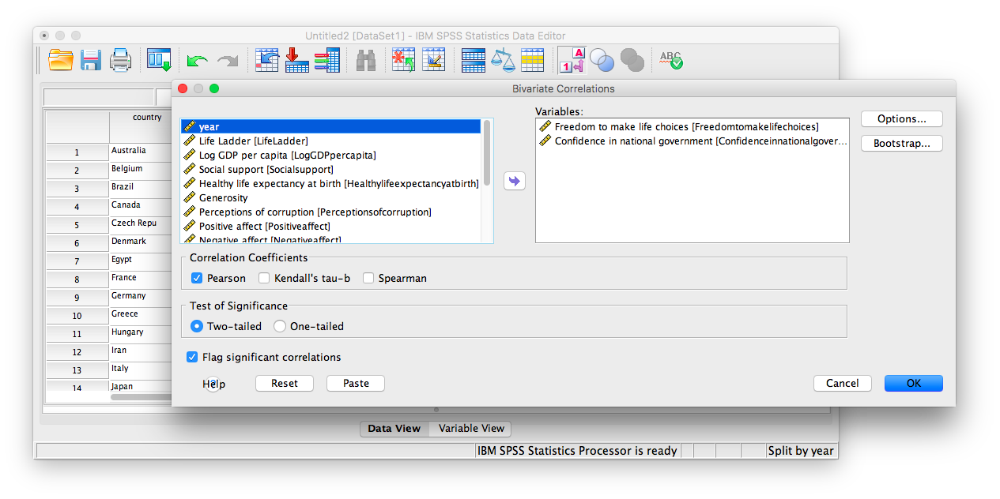
```

Click <span style="color:blue">OK</span>. Notice that in the output window you will see a bunch of correlation tables (13 of them to be exact); one for each year. Scroll down and find the table with the heading "year = 2017". That's the table we need in order to answer our question:

```{r , echo=FALSE,dev='png'}
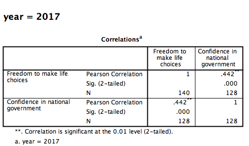
```

This table indicates that, if we only look at the year 2017, the correlation coefficient between `freedom to make life choices` and `confidence in national government` is .442.

It is VERY important to remember that once you have split a file, every analysis that follows the split will be done on the split variable. If you want to go back to performing analyses and calculating statistics for the data as a whole, you must UNSPLIT your data file (or undo the split). To do this, go to <span style="color:blue">Data</span>, then <span style="color:blue">Split file...</span>

```{r , echo=FALSE,dev='png'}
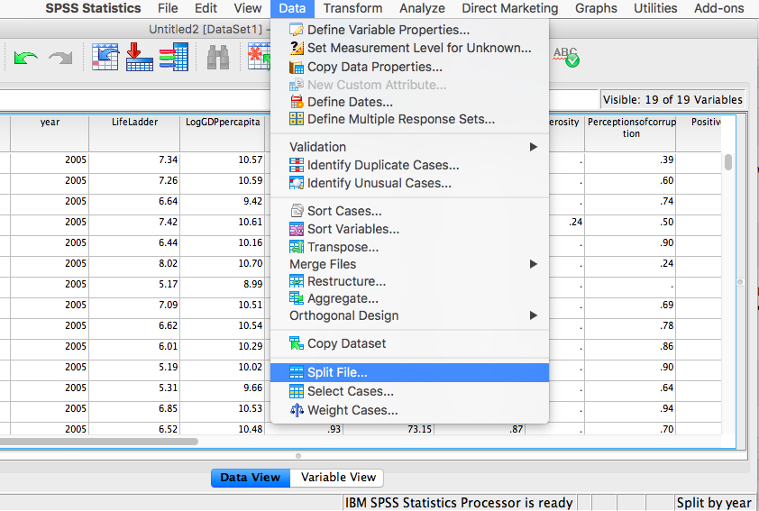
```

Then make sure to select <span style="color:blue">Analyze all cases, do not create groups</span> and click <span style="color:blue">OK</span>.

```{r , echo=FALSE,dev='png'}
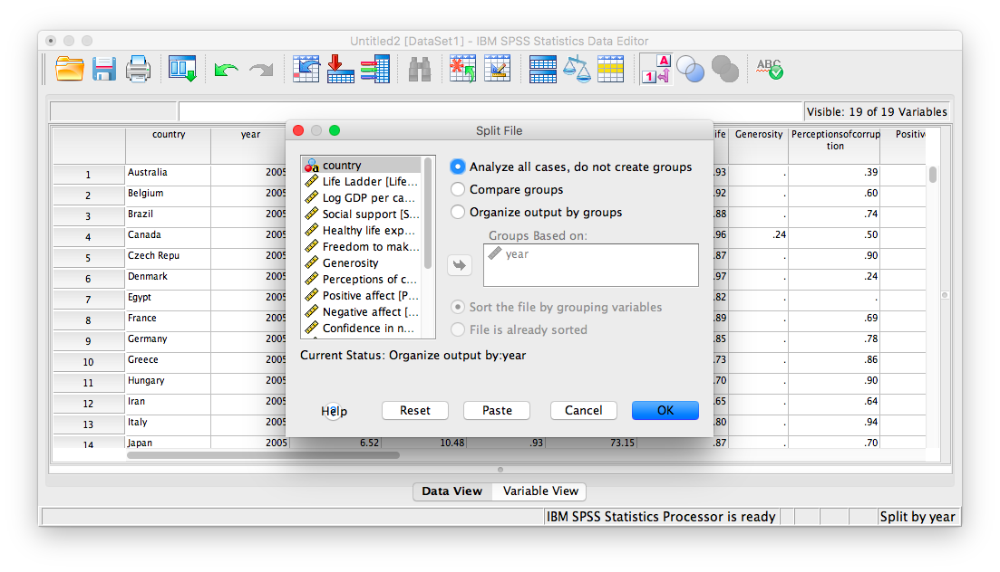
```


### Practice Problems

___


1. For the year 2005 ONLY, find the correlation between “perceptions of corruption” and “positive affect”. Create a scatterplot to visualize this relationship. What are your conclusions about the relationship between affect and perceived corruption? Is this surprising to you?

2. What has happened to log GDP (consider this a measure of GDP) in the United States ONLY with time (as the year has increased)? Explain this relationship and provide a scatterplot.

3. Which country (or countries) have seen a more consistent and strong increase in log GDP over time? Which country (or countries) have seen a decrease over time?

## JAMOVI

How to do it in JAMOVI

