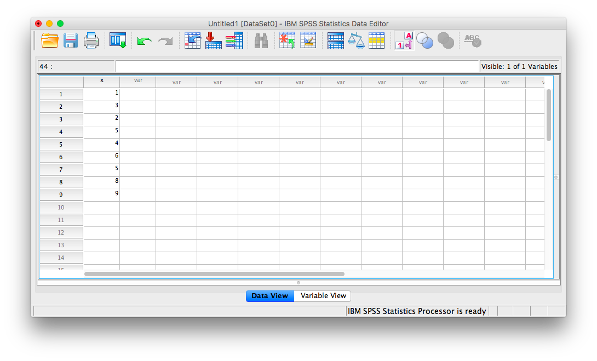
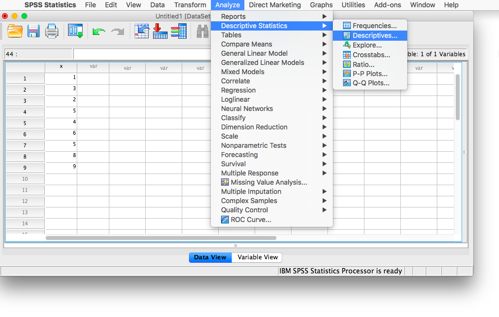
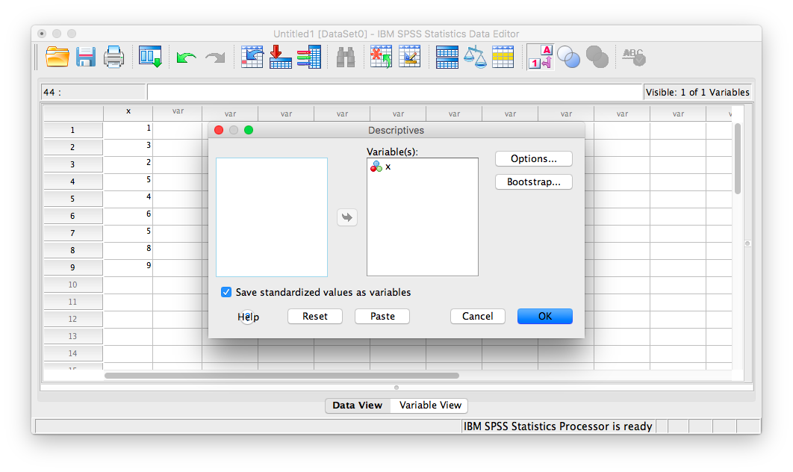
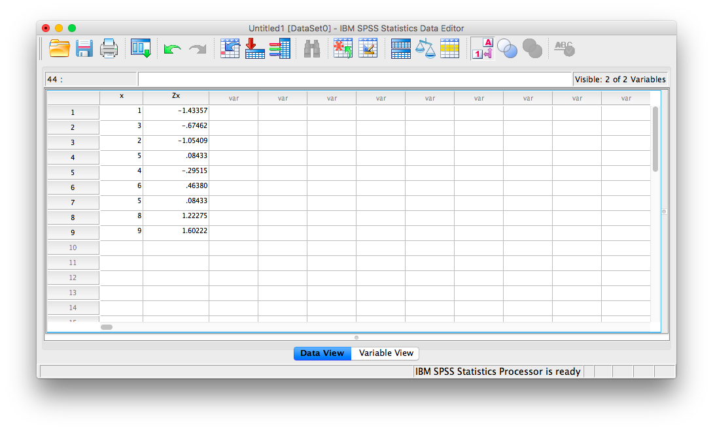
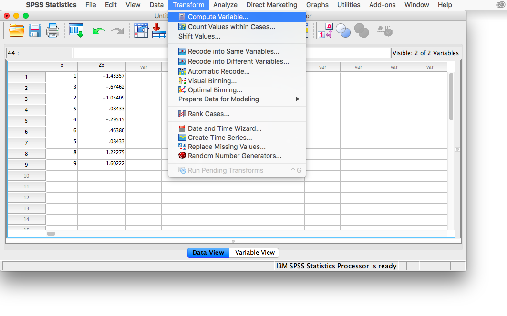
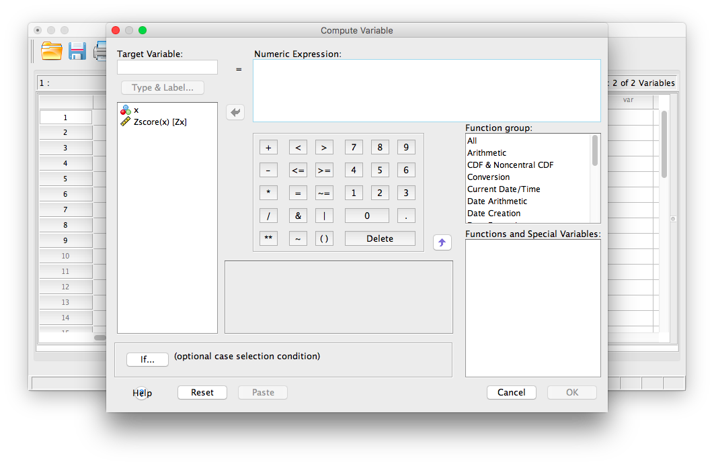
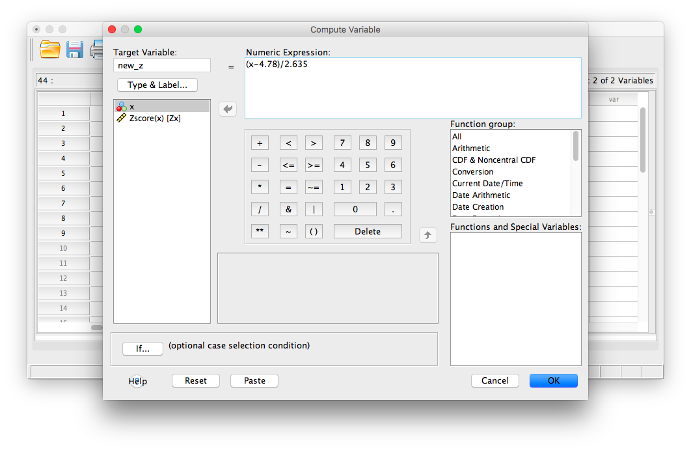
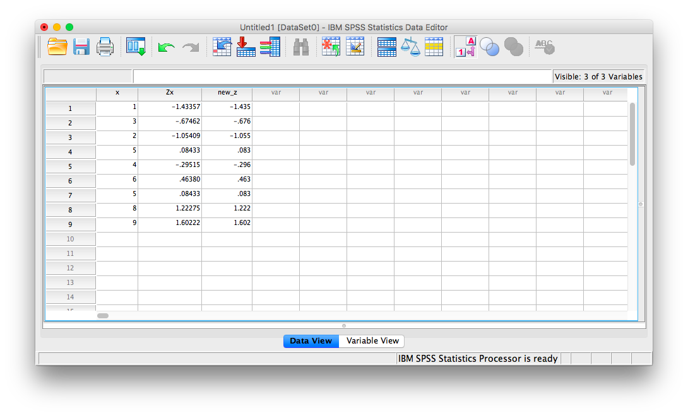

# Lab 4: Normal Distribution & Central Limit Theorem

<script>
$("#coverpic").hide();
</script>

<span class="newthought">
By a small sample, we may judge of the whole piece.
---Miguel de Cervantes from Don Quixote
</span>


## General Goals

1. Distributions
2. Sampling from distributions
3. Sampling distribution of the mean
4. Sampling statistics (statistics of many samples)
5. Central limit theorem
6. Normal Distribution
7. z-scores

## R

This is one of two special labs where we don't use too much real data. We will mostly fake everything. Yes, you will learn how to fake data in this course. Be a superhero, and only use these skills for good and not for evil.

As we progress through the course, you will learn that generating simulated data can be very useful to help you understand real data. In fact, I will say this right now. If you can't simulate the data you expect to find, then you probably can't understand the data that you do find very well. That's a bold statement. It's probably partly true.

### Generating Numbers in R

There are many ways to make R generate numbers for you. In all cases you define how the numbers are generated. We'll go through a few of the many ways.

#### sample

The sample function is like an endless gumball machine. You put the gumballs inside with different properties, say As and Bs, and then you let sample endlessly take gumballs out. Check it out:

```{r}
gumballs <- c("A","B")
sample_of_gumballs <-sample(gumballs, 10, replace=TRUE)
sample_of_gumballs
```

Here the sample function randomly picks A or B each time. We set it do this 10 times, so our sample has 10 things in it. We set `replace=TRUE` so that after each sample, we put the item back into the gumball machine and start again. Here's another example with numbers

```{r}
some_numbers <- c(1,2,3,4,5,5,5,5)
sample_of_numbers <-sample(some_numbers, 20, replace=TRUE)
sample_of_numbers
```

Let's do one more thing with sample. Let's sample 1000 times from our `some_numbers` variable, and then look at the histogram

```{r}
library(ggplot2)
some_numbers <- c(1,2,3,4,5,5,5,5)
sample_of_numbers <-sample(some_numbers, 1000, replace=TRUE)
hist(sample_of_numbers)

```

We are looking at lots of samples from our little gumball machine of numbers. We put more 5s in, and voila, more 5s come out of in our big sample of 1000.

#### runif uniform distribution

We can sample random numbers between any range using the `runif(n, min=0, max = 1)` function for the uniform distribution. We discussed this in the textbook. A uniform distribution is flat, and all the numbers between the min and max should occur roughly equally frequently. Let's take 1000 random numbers between 0 and 1 and plot the histogram. We'll just do it all in one line for speed.

```{r}
hist(runif(1000,0,1))
```

This is histogram is flattish. Not perfectly flat, after all we only took 1000 samples. What if we took many more, say 10,000 total samples? Now it looks more flat, each bin is occurring about 500 times each, which is pretty close to the same amount.

```{r}
hist(runif(10000,0,1))
```


#### rbinom the binomial distribution

The binomial distribution sounds like a scary word... binomial (AAGGGGHHHHH, stay away!). The binomial can be a coin flipping distribution. You use `rbinom(n, size, prob)`. `n` gives the number of samples you want to take. We'll keep `size = 1` for now, it's the number of trials (forget this for now, it's more useful for more complicated things than what we are doing, if you want to know what it does, try it out, and see if you figure it out). `prob` is a little list you make of probabilities, that define how often certain things happen. 

For example, consider flipping a coin. It will be heads or tails, and the coin, if it is fair, should have a 50% chance of being heads or tails. Here's how we flip a coin 10 times using `rbinom`.

```{r}
coin_flips <- rbinom(10,1,.5)
coin_flips

```

We get a bunch of 0s, and 1s. We can pretend 0 = tails, and 1 = heads. Great, now we can do coin flipping if we want. For example, if you flip 10 coins, how many heads do you get? We can can do the above again, and then `sum(coin_flips)`. All the 1s are heads, so it will work out.

```{r}
coin_flips <- rbinom(10,1,.5)
sum(coin_flips)
```
 Alright, so we get the sum, which tells us the number of heads. But, should we always get that number of heads if we flipped a coin 10 times? If you keep redoing the above, you'll get different answers. 5 heads will be the most frequent answer, but you will get lots of other answers too.
 
Hold on to your seats for this next one. With R, we can simulate the flipping of a coin 10 times (you already know that, you just did it), and we can do that over and over as many times as we want. For example, we could do it 100 times over, saving the number of heads for each set of 10 flips. Then we could look at the distribution of those sums. That would tell us about the range of things that can happen when we flip a coin 10 times. We can do that in loop like this:

```{r}
save_number_of_heads<-length(1000) # make an empty variable to save things in

for(i in 1:1000){
  save_number_of_heads[i] <- sum(rbinom(10,1,.5))
}

hist(save_number_of_heads)

```
 
See, that wasn't too painful. Now we see another histogram. The histogram shows us the frequency observing different numbers of heads (for 10 flips) across the 1000 simulations. 5 happens the most, but 2 happens sometimes, and so does 8. All of the possibilities seem to happen sometimes, some more than others.

#### rnorm the normal distribution

We'll quickly show how to use `rnorm(n, mean=0, sd=1)` to sample numbers from a normal distribution. And, then we'll come back to the normal distribution later, because it is so important.

```{r}
hist(rnorm(10000,0,1))
```

There it is, a bell-shaped normal distribution with a mean of 0, and a standard deviation of 1. You've probably seen things like this before. Now you can sample numbers from normal distributions with any mean or standard deviation, just by changing those parts of the `rnorm` function.

#### mixing it up

The r functions are like Legos, you can put them together and come up with different things. What if wanted to sample from a distribution that looked like a two-humped camel's back? Just sample from `rnorm` twice like this... mix away.

```{r}
hist( c( rnorm(100,25,5), rnorm(100,50,5)) )
```

#### summary

You can generate as many numbers as your computer can handle with R. PSA: Don't ask R to generate a bajillion numbers or it will explode (or more likely just crash, probably won't explode, that's a metaphor).

### sampling distribution of the mean.

Remember the sampling distribution of the sample means from the textbook? Now, you will see the R code that made the graphs from before. As we've seen, we can take samples from distributions in R. We can take as many as we want. We can set our sample-size to be anything we want. And, we can take multiple samples of the same size as many times as we want.

#### Taking multiple samples of the same size

Let's take 10 samples from a normal distribution (mean = 0, and SD = 1). Let's set the sample-size for each to be 20. Then, we'll put them all in a data frame and look at 10 different histograms, one for each sample.

```{r}
scores <- rnorm(10*20,0,1)
samples <- rep(1:10,each=20)
my_df <- data.frame(samples,scores)
```

First, look at the new my_df data frame. You can see there is a column with numbers 1 to 10, these are the sample names. There are also 20 scores for each in the scores column. Let's make histograms for each sample, so we can see what all of the samples look like:

```{r}
ggplot(my_df, aes(x=scores))+
  geom_histogram(color="white")+
  facet_wrap(~samples)+
  theme_classic()
```

Notice, all of the samples do not have the same looking histogram. This is because of random sampling error. All of the samples are coming from the same normal distributions, but random chance makes each sample a little bit different (e.g., you don't always get 5 heads and 5 tails when you flip a coin right)

#### Getting the means of the samples

Now, let's look at the means of the samples, we will use `dplyr` to get the means for each sample, and put them in a table:

```{r}
library(dplyr)

sample_means <- my_df %>%
                group_by(samples) %>%
                summarise(means=mean(scores))

knitr::kable(sample_means)

```
 
So, those are the means of our samples. What should the means be? Well, we would hope they are estimating the mean of the distribution they came from, which was 0. Notice, the numbers are all not 0, but they are kind of close to 0.
 
#### histogram for the means of the samples
 
What if we now plot these 10 means (of each of the samples) in their own distribution?
 
```{r}
 
 ggplot(sample_means, aes(x=means))+
  geom_histogram(color="white")+
  theme_classic()
 
```

That is the distribution of the sample means. It doesn't look like much eh? That's because we only took 10 samples right. 

Notice one more thing...What is the mean of our 10 sample means? This is a mean of means. Remember that.

```{r}
mean(sample_means$means)
```

Well, that's pretty close to zero. Which is good. When we average over our samples, they better estimate the mean of the distribution they came from. 

#### simulating the distribution of sample means

Our histogram with 10 sample means looked kind of sad. Let's give it some more friends. How about we repeat our little sampling experiment 1000 times. 

Explain...We take 1000 samples. Each sample takes 20 scores from a normal distribution (mean=0, SD=1). Then we find the means of each sample (giving us 1000 sample means). Then, we plot that distribution.

```{r}
# get 1000 samples with 20 scores each

scores <- rnorm(1000*20,0,1)
samples <- rep(1:1000,each=20)
my_df <- data.frame(samples,scores)

# get the means of the samples

sample_means <- my_df %>%
                group_by(samples) %>%
                summarise(means=mean(scores))

# make a histogram

 ggplot(sample_means, aes(x=means))+
  geom_histogram(color="white")+
  theme_classic()


```


There, that looks more like a sampling distribution of the sample means. Notice it's properties. It is centered on 0, which tells us that sample means are mostly around zero. It is also bell-shaped, like the normal distribution it came from. It is also quite narrow. The numbers on the x-axis don't go much past -.5 to +.5.

We will use things like the sampling distribution of the mean to make inferences about what chance can do in your data later on in this course.

### Sampling distributions for any statistic

Just for fun here are some different sampling distributions for different statistics. We will take a normal distribution with mean = 100, and standard deviation =20. Then, we'll take lots of samples with n = 50 (50 observations per sample). We'll save all of the sample statistics, then plot their histograms. We do the sample means, standard deviations, maximum values, and medians. Let's do it.

```{r}
all_df<-data.frame()
for(i in 1:1000){
  sample<-rnorm(50,100,20)
  sample_mean<-mean(sample)
  sample_sd<-sd(sample)
  sample_max<-max(sample)
  sample_median<-median(sample)
  t_df<-data.frame(i,sample_mean,sample_sd,sample_max,sample_median)
  all_df<-rbind(all_df,t_df)
}

library(ggpubr)
a<-ggplot(all_df,aes(x=sample_mean))+
  geom_histogram(color="white")+
  theme_classic()
b<-ggplot(all_df,aes(x=sample_sd))+
  geom_histogram(color="white")+
  theme_classic()
c<-ggplot(all_df,aes(x=sample_max))+
  geom_histogram(color="white")+
  theme_classic()
d<-ggplot(all_df,aes(x=sample_median))+
  geom_histogram(color="white")+
  theme_classic()

ggarrange(a,b,c,d,
          ncol = 2, nrow = 2)

```

From reading the textbook and attending lecture, you should be able to start thinking about why these sampling statistic distributions might be useful...For now, just know that you can make a sampling statistic for pretty much anything in R, just by simulating the process of sampling, measuring the statistic, doing it over a bunch, and then plotting the histogram. This gives you a pretty good estimate of the distribution for that sampling statistic.

### Central limit theorem

We have been building you up for the central limit theorem, described in the textbook and in class. The central limit theorem is basically that the distribution of sample means will be a normal curve. We already saw that before. But, the interesting thing about it, is that the distribution of your sample means will be normal, even if the distribution the samples came from is not normal. Huh what? 

To demonstrate this the next bit of code is modified from what we did earlier. We create 100 samples. Each sample has 1000 observations. All of them come from a uniform distribution between 0 to 1. This means all of the numbers between 0 and 1 should occur equally frequently. Below I plot histograms for the first 10 samples (out of the 100 total, 100 is too many to look at). Notice the histograms are not normal, they are roughly flat.

```{r}
scores <- runif(100*1000,0,1)
samples <- rep(1:100,each=1000)
my_df <- data.frame(samples,scores)

ggplot(my_df[1:(10*1000),], aes(x=scores))+
  geom_histogram(color="white", bins=10)+
  facet_wrap(~samples)+
  theme_classic()+
  ylim(0,200)

```

We took samples from a flat uniform distribution, and the samples themselves look like that same flat distribution. 

HOWEVER, if we now do the next step, and compute the means of each of our 100 samples, we could then look at the sampling distribution of the sample means. Let's do that:

```{r}

sample_means <- my_df %>%
                group_by(samples) %>%
                summarise(means=mean(scores))

# make a histogram

 ggplot(sample_means, aes(x=means))+
  geom_histogram(color="white", bins=15)+
  theme_classic()


```

As you can see, the sampling distribution of the sample means is not flat. It's shaped kind of normal-ish. If we had taken many more samples, found their means, and then looked at a histogram, it would become even more normal looking. Because that's what happens according to the central limit theorem.

### The normal distribution

"Why does any of this matter, why are we doing this, can we stop now!!!!!! PLEEEEAASSEE, somebody HELP".

We are basically just repeating what was said in the textbook, and the lecture, so that you get the concept explained in a bunch of different ways. It will sink in. 

The reason the central limit theorem is important, is because researchers often take many samples, then analyse the means of their samples. That's what they do. 

An experiment might have 20 people. You might take 20 measurements from each person. That's taking 20 samples. Then, because we know that samples are noisy. We take the means of the samples. 

So, what researchers are often looking at, (and you too, very soon) are means of samples. Not just the samples. And, now we know that means of samples (if we had a lot of samples), look like they are distributed normally (the central limit theorem says the should be).

We can use this knowledge. If we learn a little bit more about normal distributions, and how they behave and work, we can take that and use it to understand our sample means better. This will become more clear as head into the topic of statistical inference next week. This is all a build up for that. 

To continue the build-up we now look at some more properties of the normal distribution.


#### Graphing the normal distribution

"Wait, I thought we already did that". We sort of did. We sampled numbers and made histograms that looked like normal distributions. But, a "normal distribution" is more of an abstract idea. It looks like this in the abstract:


```{r}
normal_dist <- dnorm(seq(-4,4,.1), 0, 1)
values <-seq(-4,4,.1)
normal_df <-data.frame(values,normal_dist)

ggplot(normal_df, aes(x=values,y=normal_dist))+
  geom_line()+
  theme_classic()


```

A really nice shaped bell-like thing. This normal distribution has a mean of 0, and standard deviation of 1. The heights of the lines tell you roughly how likely each value is. Notice, it is centered on 0 (most likely that numbers from this distribution will be near 0), and it goes down as numbers get bigger or smaller (so bigger or smaller numbers get less likely). There is a range to it. Notice the values don't go much beyond -4 and +4. This because those values don't happen very often. Theoretically any value could happen, but really big or small values have really low probabilities.

#### calculating the probability of specific ranges.

We can use R to tell us about the probability of getting numbers in a certain range. For example, when you think about. It should be obvious that you have a 50% probability of getting the number 0 or greater. Half of the distribution is 0 or greater, so you have a 50% probability.

We can use the `pnorm` function to confirm this:

```{r}
pnorm(0, mean = 0, sd= 1, lower.tail=FALSE)
```

Agreed, `pnorm` tells us the probability of getting 0 or greater is .5. 

Well, what is the probability of getting a 2 or greater? That's a bit harder to judge, obviously less than 50%. Use R like this to find out:


```{r}
pnorm(2, mean = 0, sd= 1, lower.tail=FALSE)
```
The probability of getting a 2 or greater is .0227 (not very probable)

What is the probability of getting a score between -1 and 1?

```{r}
ps<-pnorm(c(-1,1), mean = 0, sd= 1, lower.tail=FALSE)
ps[1]-ps[2]
```
 About 68%. About 68% of all the numbers would be between -1 and 1. So naturally, about 34% of the numbers would be between 0 and 1. Notice, we are just getting a feeling for this, you'll see why in a bit when we do z-scores (some of you may realize we are already doing that...) 
 
 What about the numbers between 1 and 2?
 
```{r}
ps<-pnorm(c(1,2), mean = 0, sd= 1, lower.tail=FALSE)
ps[1]-ps[2]
```
 About 13.5% of numbers fall in that range, not much. 
 
 How about between 2 and 3?
 
```{r}
ps<-pnorm(c(2,3), mean = 0, sd= 1, lower.tail=FALSE)
ps[1]-ps[2]
```

Again a very small amount, only 2.1 % of the numbers, not a a lot.

#### summary pnorm

You can always use `pnorm` to figure how the probabilities of getting certain values from any normal distribution. That's great.


### z-scores

We just spent a bunch of time looking at a very special normal distribution, the one where the mean = 0, and the standard deviation = 1. Then we got a little bit comfortable with what those numbers mean. 0 happens a lot. Numbers between -1 and 1 happen a lot. Numbers bigger or smaller than 1 also happen fairly often, but less often. Number bigger than 2 don't happen a lot, numbers bigger than 3 don't happen hardly at all. 

We can use this knowledge for our convenience. Often, we are not dealing with numbers exactly like these. For example, someone might say, I got a number, it's 550. It came from a distribution with mean = 600, and standard deviation = 25. So, does 545 happen a lot or not? The numbers don't tell you right away.

If we were talking about our handy distribution with mean = 0 and standard deviation = 1, and I told I got a number 4.5 from that distribution. You would automatically know that 4.5 doesn't happen a lot. Right? Right!

z-scores are a way of transforming one set of numbers into our neato normal distribution, with mean = 0 and standard deviation = 1.

Here's a simple example, like what we said in the textbook. If you have a normal distribution with mean = 550, and standard deviation 25, then how far from the mean is the number 575? It's a whole 25 away (550+25 = 575). How many standard deviations is that? It's 1 whole standard deviation.  So does a number like 575 happen a lot? Well, based on what you know about normal distributions, 1 standard deviation of the mean isn't that far, and it does happen fairly often. This is what we are doing here.

#### Calculating z-scores

1. get some numbers

```{r}
some_numbers <- rnorm(20,50,25)
```

2. Calculate the mean and standard deviation

```{r}
my_mean <- mean(some_numbers)
my_sd <-sd(some_numbers)

print(my_mean)
print(my_sd)
```

3. subtract the mean from your numbers

```{r}
differences<-some_numbers-my_mean
print(differences)
```

4. divide by the standard deviation

```{r}
z_scores<-differences/my_sd
print(z_scores)
```

Done. Now you have converted your original numbers into what we call standardized scores. They are standardized to have the same properties (assumed properties) as a normal distribution with mean = 0, and SD = 1.

You could look at each of your original scores, and try to figure out if they are likely or unlikely numbers. But, if you make them into z-scores, then you can tell right away. Numbers close to 0 happen a lot, bigger numbers closer to 1 happen less often, but still fairly often, and numbers bigger than 2 or 3 hardly happen at all. 


### Generalization Exercise

(1 point - Pass/Fail)

Complete the generalization exercise described in your R Markdown document for this lab.

1. Simulate the sampling distribution of the mean for sample-size =10, from a normal distribution with mean =100, and standard deviation = 25. Run the simulation 1000 times, taking 1000 samples, and computing the sample mean each time.

 a. Plot the sampling distribution of the mean in a histogram
 b. Report the mean of the sampling distribution of the mean
 c. Report the standard deviation of the sampling distribution of the mean
 
2. Repeat all of the above, except change the sample-size to 100 for all simulations

 a. Plot the sampling distribution of the mean in a histogram
 b. Report the mean of the sampling distribution of the mean
 c. Report the standard deviation of the sampling distribution of the mean

### Writing assignment

(2 points - Graded)

Complete the writing assignment described in your R Markdown document for this lab. When you have finished everything. Knit the document and hand in your stuff (you can submit your .RMD file to blackboard if it does not knit.)

1. Explain the concept of sampling error (1 point)

2. Explain why the standard deviation of the sampling distribution of mean gets smaller as sample-size increases (1 point)

General grading. 

- You must write in complete sentences. Point form sentences will be given 0 points.
- Completely incorrect answers will receive 0 points. 
- If your answer is generally correct but very difficult to understand and unclear you may receive half points for the question


## Excel

How to do it in Excel

## SPSS

In this lab, we will use SPSS to transform a set of raw data into z-scores using two methods:

1. Saving data as standardized values
2. Computing a new variable manually

Let's first begin with a short data set we will enter into a new SPSS data spreadsheet. Let's use the following data set: {x= 1, 3, 2, 5, 4, 6, 5, 8, 9}. Enter these into SPSS and name them appropriately. 

```{r , echo=FALSE,dev='png'}

```

### Saving data as standardized values.

---


This method is a quick and simple way to turn a set of scores in raw format into z-scores. First, go to <span style="color:blue">Analyze</span>, then <span style="color:blue">Descriptive Statistics</span>, then <span style="color:blue">Descriptives</span>:

```{r , echo=FALSE,dev='png'}

```

A window will appear, asking for you to specify for which variable you would like descriptive statistics. Move the `x` variable into the right field using the arrow. Then, make sure to check off <span style="color:blue">Save standardized values as variables</span>:

```{r , echo=FALSE,dev='png'}

```

Now, click <span style="color:blue">Ok</span>. 

SPSS will produce an output table containing some basic descriptive statistics for the `x` variable:

```{r , echo=FALSE,dev='png'}
knitr::include_graphics('img/4.4.14.png')
```

However, you can ignore this window for now. Go back to data view in your spreadsheet and you will notice a new column of data (a new variable) as been created called `Zx`. This variable contains the z-scores that correspond to the values in the `x` columm:

```{r , echo=FALSE,dev='png'}

```

### Computing variables

---


If you use the method shown above to convert a set of measurements to z-scores, you don't need to use this method to do the same thing. However, computing new variables may be useful for more than just converting scores to z-scores, so it's worth illustrating as well. The take-away message here is that you can use SPSS to create new variables based on existing ones. 

To illustrate how this is done, let's work with the data sheet we used in the previous example. Currently, it includes a column for our x variable, and the new `Zx` variable we created using the Analyze > Descriptive Statistics > Descriptives menu. 

```{r , echo=FALSE,dev='png'}

```

This time, we are going to turn our x variable measurements into z-scores manually. In order to do this, we're going to need the necessary components to calculate z-scores: We will need the mean and standard deviation of the `x` variable. Remember, in the previous section a table of descriptive statistics was generated: 

```{r , echo=FALSE,dev='png'}
knitr::include_graphics('img/4.4.14.png')
```

We know that the mean of variable `x` is 4.78 and the standard deviation is 2.635. In order to turn every measurement in variable `x` into a z-score, then, we must subtract 4.78 from each `x`, then divide that difference by 2.635. We are going to ask SPSS to do this by going to the <span style="color:blue">Transform</span> menu, and then selecting <span style="color:blue">Compute Variable</span>. 

```{r , echo=FALSE,dev='png'}

```


This will open the Compute window:

```{r , echo=FALSE,dev='png'}

```

Here, let's first enter a name for the new variable we're about to create. In the field labeled "Target Variable", enter a name for your new variable. Let's try `new_z` as the name. 

Next, in the field labeled "Numeric Expression", we will specify the calculation to be made. Because I want SPSS to take the variable `x`, subtract 4.78 from it, and then divide this difference by 2.635, I am going to type in this formula:
1. First, type in an open parenthesis
2. Second, select `x` from the field on the left and move it to the "Numeric Expression" field using the arrow.
3. Type a minus sign, followed by 4.78
4. Type in a closed parenthesis.
5. Type in a backslash "/" (this specifies division)
6. Type in the standard deviation, 2.635

Your Compute window should now look like this:

```{r , echo=FALSE,dev='png'}

```

Now, click <span style="color:blue">OK</span>. SPSS will generate a blank output window that confirms you have computed a variable. You may minimize or close this window and go back to your SPSS spreadsheet. It should now have a new variable listed, `new_z`, and the computed z-scores should look very similar to the previously calculated z-scores (any differences are due to using rounded figures):

```{r , echo=FALSE,dev='png'}

```

You can use this Compute Variable window to calculate z-scores or make any calculations using existing variables. 


### Practice Problems

___

“Professor, do you grade on a curve?”

This is probably the most commonly-asked question in Statistics class. Everyone assumes that grading on a curve will benefit them. But does it?

[Here](https://github.com/CrumpLab/statisticsLab/blob/master/data/spssdata/StatsGrades.sav) is a link to an SPSS file containing 50 students’ exam grades (let’s say it’s the final exam for a Statistics class).

1. Create a table containing the mean and standard deviation for this sample of scores. Now, produce a frequency histogram of the score data. Describe the distribution.

2. Transform each student’s score into a Z-score (you can use either method shown in this tutorial). Now, plot the frequency histogram of this Z-score distribution. Compare it to the raw score distribution. How are they the same? How are they different?

3. Imagine you are a student in this class who received a 90 on this exam. However, the Professor has decided to GRADE ON A CURVE (shock! awe!), such that only the top 10% of the class receives an A (this professor only gives whole grades, no minuses or pluses). Calculate the z-score that corresponds to a raw score of 90 on this exam. Will you get an A with this grade? Why or why not?

## JAMOVI

How to do it in JAMOVI


