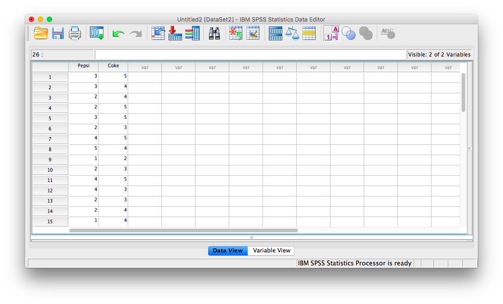
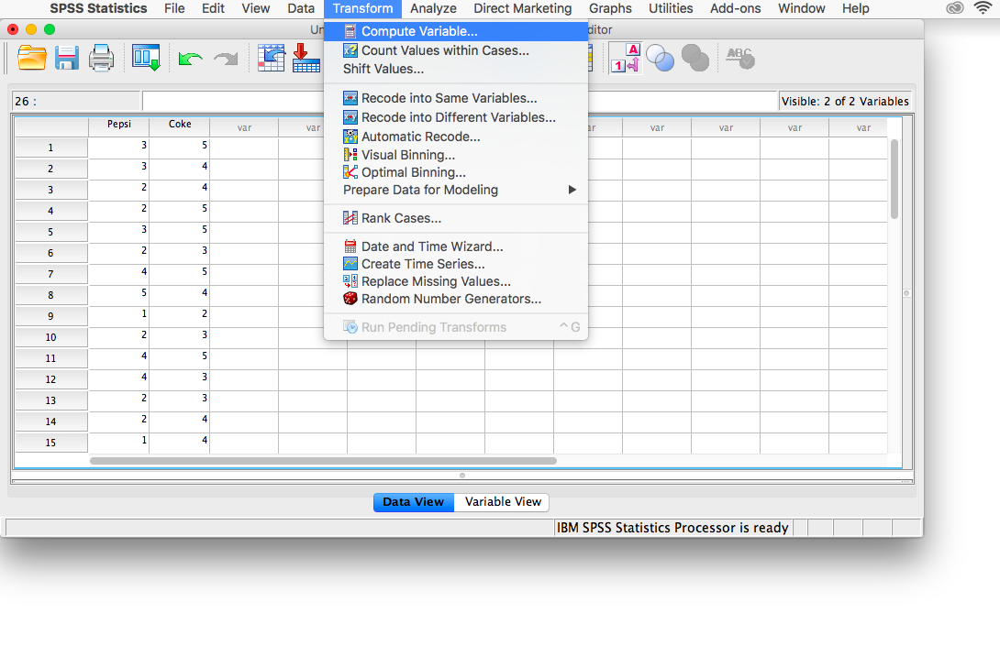
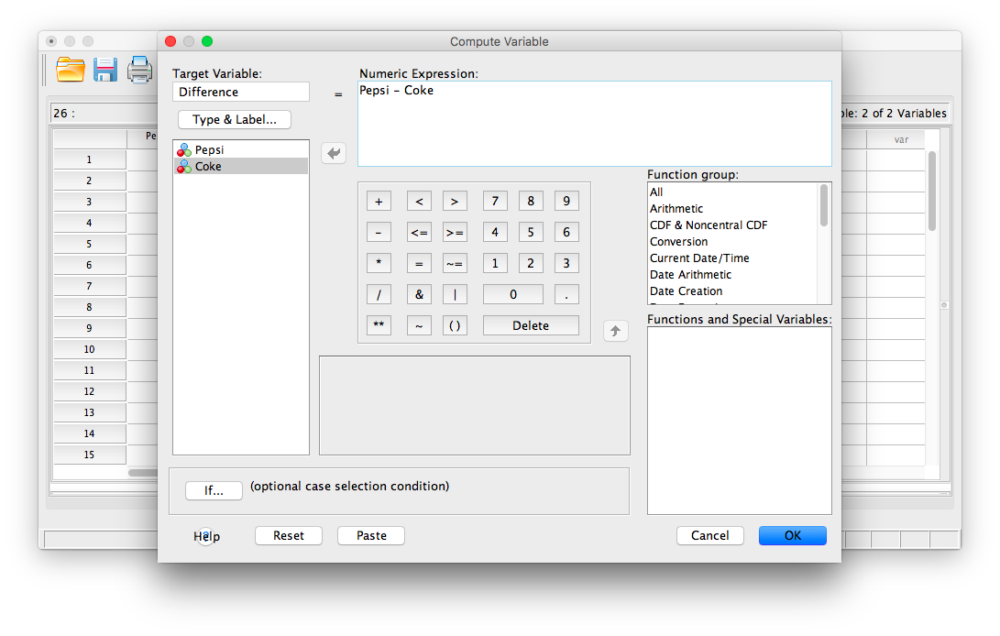
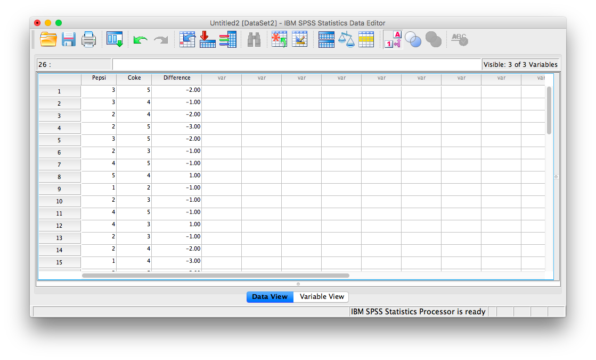
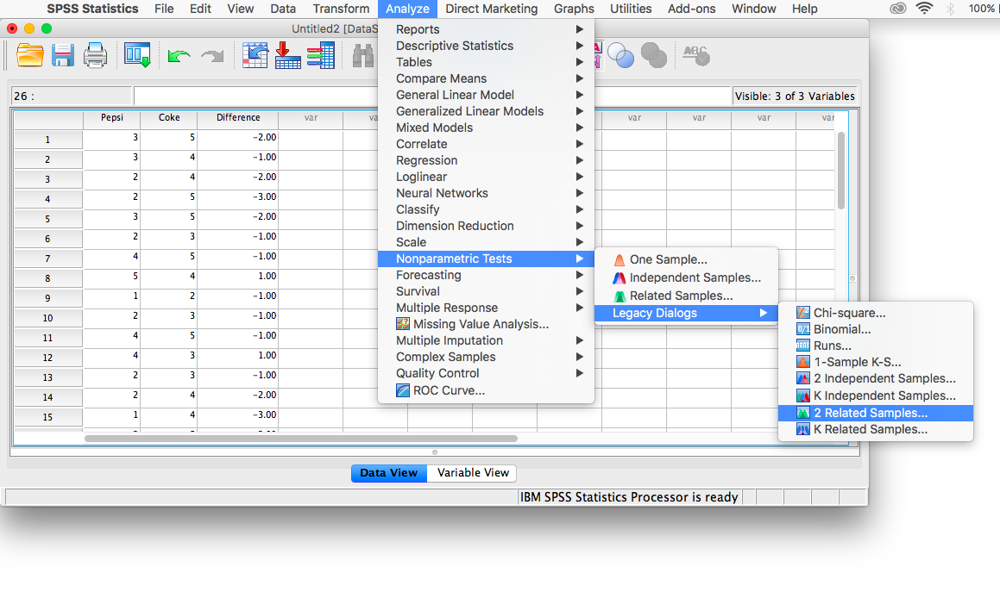
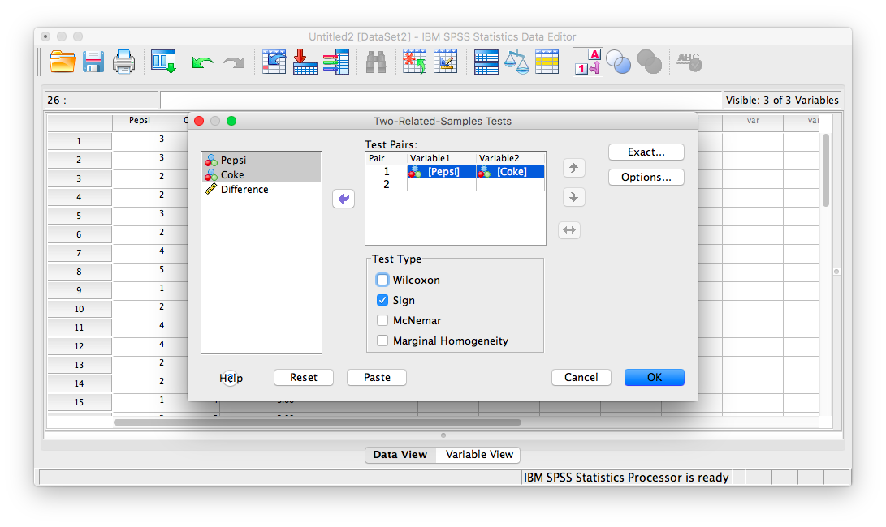
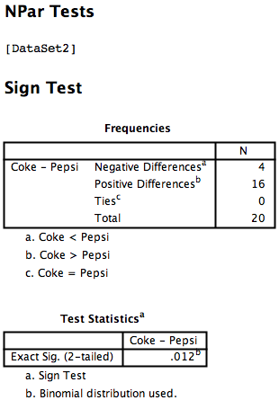
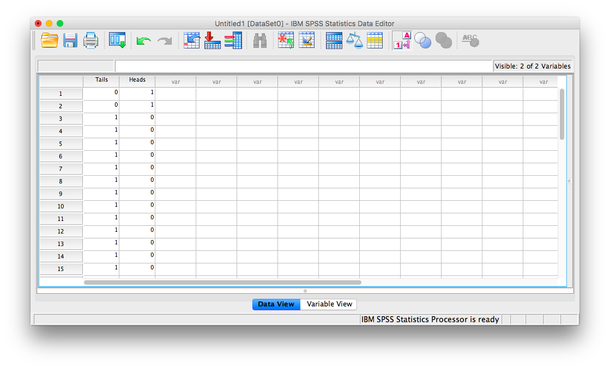

# Lab 5: Fundamentals of Hypothesis Testing

<script>
$("#coverpic").hide();
</script>

<span class="newthought">
The null hypothesis is never proved or established, but is possibly disproved, in the course of experimentation. Every experiment may be said to exist only to give the facts a chance of disproving the null hypothesis.
---R. A. Fisher
</span>


## R

From here on, we will be focusing on making sense of data from experiments. In all of this, we use experiments to ask a question about whether one thing causes change (influences) another thing. Then, we look at the data to help us answer that question. In general, we expect to find a difference in our measurement between the conditions of the experimental manipulation. We expect to find a difference when the manipulation works, and causes change in our measure. We expect not to find a difference when the manipulation does not work, and does not cause change.

However, as you well know from reading the textbook, and attending the lectures. Experimental manipulations are not the only thing that can cause change in our measure. Chance alone can cause change. Our measures are usually variable themselves, so they come along with some change in them due to sampling error. 

At a minimum, when we conduct an experiment, we want to know **if the change we observed is bigger than the change that can be produced by chance**. Theoretically, random chance could produce most any change we might measure in our experiment. So, there will always be uncertainty about whether our manipulation caused the change, or chance caused the change. But, we can reduce and evaluate that uncertainty. When we do this, we make **inferences** about what caused change in our experiments. This process is called **statistical inference**. We use **inferential statistics** as tools to help us make these inferences. 

In this lab we introduce you to foundational concepts in **statistical inference**. This is also commonly termed **hypothesis testing**. But, for various reasons using that language to describe the process is tied to particular philosophies about doing statistical inference. We use some of that language here, so that you know what it means. But, we also use our own plain language, so you know what the point is, without the statistical jargon.

The textbook describes a few different statistical tests for building your conceptual understanding for statistical inference. In this lab, we work through some of them. In particular, we work through the Crump test, and the Randomization test. We show you how to conduct these tests in R on fake data, and real data.

### The Crump Test

[The Crump test is described more fully in the textbook here](https://crumplab.github.io/statistics/foundations-for-inference.html#the-crump-test), but you already read that in preparation for this lab, right! I hope you did.

The big idea behind the Crump test is this. You find out what kind of differences between two conditions can be found by chance alone. This shows you what chance can do. Then, you compare what you actually found in one experiment, with the chance distribution, and make an inference about whether or not chance could have produced the difference.

#### Make assumptions about the distribution for your measurement

The first step in conducting the Crump test is to make a guess at the distribution behind your measurement. We will see in the next part how to do this from real data. For now, we just pick a distribution. For example, let's say we are measuring something that comes from a normal distribution with mean = 75 and standard deviation = 5. Perhaps, this is a distribution for how people perform on a particular test. The mean on the test is 75%, with a standard deviation of 5%. We know from last lab that 3 standard deviations away from the mean is pretty unlikely with this distribution. So, for example, most people never score above 90% (5*3=15, 75+15 = 90) on this test.

In this example situation, we might imagine an experiment that was conducted to determine whether manipulation A improves test performance, compared to a control condition where no manipulation took place. Using the Crump test, we can simulate differences that can occur by chance. We are formally simulating the differences that could be obtained between two control conditions, where no manipulation took place.

To, restate our assumptions, we assume a single score for each subject is sampled from:

`rnorm(n, mean=75, sd=5)`

#### Make assumptions about N

In the real world, experiments have some number of subjects in each condition, this number is called N. For our simulation we, need to choose the number of subjects that we have. For this demonstration, we choose N = 20 in each condition. 

#### Choose the number of simulations to run

We are going to run a fake experiment with no manipulation, and do this many times over (doing it many times over is called **monte carlo simulation**). Each time we will do this:

1. Sample 20 numbers for control group A using `rnorm(20, mean=75, sd=5)`
2. Sample 20 numbers for control group B using `rnorm(20, mean=75, sd=5)`
3. Compute the means for control group A and B
4. Compute the difference between the mean for group A and B
5. Save the differences score in a variable
6. Repeat as many times as we want

If we repeat the simulation 100 times, we will see the differences that can be produced by chance, when given the opportunity 100 times. For example, in a simulation like this, the biggest difference (the maximum value) only happens once. We can find that difference, and then roughly conclude that a difference of that big happens 1 out of 100 times just by chance. That's not a lot. 

If we want to be more restrictive, we can make the simulation go to 1,000, or 10,000, or greater. Each time the maximum value will tell us what is the biggest thing chance did 1 out of 1000 times, or 1 out of 10,000 times. 

The textbook uses 10,000 times. Let's use 100 times here to keep things simple.

#### Run the simluation

```{r}
library(ggplot2)

# set paramaters of simulation

sims_to_run <- 100
sample_n   <- 20
dist_mean  <- 75
dist_sd    <- 5

# run simulation

mean_differences <- length(sims_to_run)
for(i in 1:sims_to_run){
  mean_control_A      <- mean(rnorm(sample_n, dist_mean, dist_sd))
  mean_control_B      <- mean(rnorm(sample_n, dist_mean, dist_sd))
  mean_differences[i] <- mean_control_A - mean_control_B
}

# plot the  distribution of mean difference scores

plot_df <- data.frame(sim=1:sims_to_run,mean_differences)

ggplot(plot_df,aes(x=mean_differences))+
  geom_histogram(bins=20, color="white")+
  theme_classic()+
  ggtitle("Histogram of mean differences between two samples (n=20) \n
          both drawn from the same normal distribution (u=75, sd=5")+
  xlab("mean difference")

```


#### find the range

We can see that chance produces some differences that are non-zero. The histogram shows all the mean differences that were produced by chance. Most of the differences are between -2 and +2, but some of them are bit more negative, or a bit more positive. If we want to know what chance **did** do in this one simulation with 100 runs, then we need to find the range, the minimum and maximum value. This will tell us the most negative mean difference that chance did produce, and the most positive mean difference that chance did produce. Then, we will also know that chance **did not** produce any larger negative, or larger positive differences, in this simulation.

We use the `min()` and `max()` functions to get the minimum and maximum value.

```{r}
min(mean_differences)
max(mean_differences)

```

We now know, that biggest negative difference was `r round(min(mean_differences), digits=3)`, and the biggest positive difference was `r round(max(mean_differences), digits=3)`. We also know that any mean difference inside the range **was produced by chance** in our simulation, and any mean difference outside the range **was not produced by chance** in our simulation

#### Make inferences 

This part requires you to think about the answers. Let's go through some scenario's.

1. You sample 20 numbers from a normal distribution with mean = 75, and standard deviation =5. The mean of your sample is 76. Then, you take another sample of the same size, from the same distribution, and the mean of your second sample is 78. The mean difference is +1 (or -1, depending on how you take the difference)

    a. **Question**: According to the histogram did a mean difference of 1 or -1 occur by chance?
    b. **Answer**: Yes, it is inside the range
    
2. Same as above, but the mean of your first sample is 74, and the mean of your second sample is 80, showing a mean difference of 6, or -6.

    a. **Question**: According to the histogram did a mean difference of 6 or -6 occur by chance?
    b. **Answer**: No, it is outside the range
    
3. You run an experiment. Group A receives additional instruction that should make them do better on a test. Group B takes the test, but without the instruction. There are 20 people in each group. You have a pretty good idea that group B's test scores will be coming from a normal distribution with mean = 75, and standard deviation = 5. You know this because you have given the test many times, and this is what the distribution usually looks like. You are making an educated guess. You find that the mean test performance for Group A (with additional instruction) was 76%, and the mean test performance for Group B (no additional instruction) was 75%. The mean difference has an absolute value of +1.

    a. **Question #1**: According to the histogram, could chance alone have produced a mean absolute difference of +1?
    b. **Answer**: Yes, it is inside the range
    c. **Question #2**: It looks like Group A did better on the test (on average), by 1%, compared to the control group B. Are you willing to believe that your additional instruction **caused the increase in test performance**?
    d. **Answer**: The answer is up to you. There is no correct answer. It could easily be the case that your additional instruction did not do anything at all, and that the difference in mean test performance was produced by chance. My inference is that I do not know if my instruction did anything, I can't tell it's potential influence from chance.
    
4. Same as 3, except the group mean for A (receiving instruction) is 90%. The group mean for B (no instruction control) is 75%. The absolute mean difference is 15%.

    a. **Question #1**: According to the histogram, could chance alone have produced a mean absolute difference of +15?
    b. **Answer**: No, it is well outside the range
    c. **Question #2**: It looks like Group A did better on the test (on average), by 15%, compared to the control group B. Are you willing to believe that your additional instruction **caused the increase in test performance**?
    d. **Answer**: The answer is up to you. There is no correct answer. You know from the simulation that chance never produced a difference this big, and that producing a difference this big by chance would be like winning the lottery (almost never happens to you). My inference is that I believe chance did not produce the difference, I'm willing to believe that my instructional did cause the difference.
    
#### Planning your experiment

We've been talking about a hypothetical experiment where an instructor tests whether group A does better (when receiving additional instruction) on a test, compared to a group that does receives no additional instruction and just takes the test.

If this hypothetical instructor wanted to make an experiment, they would get to choose things like how many subjects they will put in each condition. How many subjects should they plan to get?

**The number of subjects they plan to get will change what chance can do, and will change the sensitivity of their experiment to detect differences of various sizes, that are not due to chance**.

We can use the simulation process to make informed decisions about how many subjects to recruit for an experiment. This is called **sample-size planning**. There are two goals here. The instructor might have a first goal in mind. They may be only interested in adopting a new method for instruction, if it actually improves test performance beyond more than 1% (compared to control). Differences of less than 1% are just not worth it for the instructor. They want bigger differences, they want to help their students improve more than 1%. 

One problem for the instructor, is that they just don't know in advance how good their new teaching materials will be. Some of them will be good and produce bigger differences, and some of them won't. The size of the difference from the manipulation can be unknown. However, this doesn't really matter for planning the experiment. The instructor wants to know that they can **find** or detect any real difference (not due to chance) that is say 2% or bigger. We can use the simulation to figure out roughly (or more exactly, depending on how much we work at it) how many subjects are needed to detect difference of at least 2%.

Notice, from our prior simulation, chance does produce differences of 2% some of the time (given 100 runs). The task now is to re-run the simulation, but use different numbers of subjects to figure out how many subjects are needed to always detect differences of 2%. To be simple about this, we are interested in producing a distribution of mean differences that never produces a mean difference of -2% to + 2% (not once out of 100 times). You can re-run this code, and change N until the min and max are always smaller than -2 to +2.

The code starts out exactly as it was before. You should change the number for `sample_n`. As you make the number bigger, the range (min and max) of the mean differences by chance will get smaller and smaller. Eventually it will be smaller than -2 to +2. When you get it this small, then the N that you used is your answer. Use that many subjects. If you run your experiment with that many subjects, **AND** you find a difference or 2 or greater, then you know that chance does not do this even 1 times out of 100. 


```{r}
library(ggplot2)

# set paramaters of simulation

sims_to_run <- 100
sample_n   <- 20
dist_mean  <- 75
dist_sd    <- 5

# run simulation

mean_differences <- length(sims_to_run)
for(i in 1:sims_to_run){
  mean_control_A      <- mean(rnorm(sample_n, dist_mean, dist_sd))
  mean_control_B      <- mean(rnorm(sample_n, dist_mean, dist_sd))
  mean_differences[i] <- mean_control_A - mean_control_B
}

# plot the  distribution of mean difference scores

plot_df <- data.frame(sim=1:sims_to_run,mean_differences)

ggplot(plot_df,aes(x=mean_differences))+
  geom_histogram(bins=20, color="white")+
  theme_classic()+
  ggtitle("Histogram of mean differences between two samples (n=20) \n
          both drawn from the same normal distribution (u=75, sd=5")+
  xlab("mean difference")

min(mean_differences)
max(mean_differences)

```

### Crumping real data

In this example we look at how you can run a Crump test to evaluate the results in a published paper. The goal of this is to build up your intuitions about whether or not an observed difference could have been caused by chance. We take many liberties, and this is not an exact test of anything. However, we will see how a series of rough, and reasonable assumptions can be made to simulate the results of published experiments, even when exact information is not provided in the paper.

#### Test-enhanced learning

We have already been using an educational example. We've been talking about a manipulation that might be employed to help students learn something better than they otherwise would without the manipulation.

Research in Cognitive Psychology has discovered clear evidence of some teaching practices that really work to enhance memory and comprehension. One of these practices is called test-enhanced learning. Students who study material, and take a quick test (quiz) while they study, do better at remembering the material compared to students who just studied the whole time and did not take a quiz (why do you think we have so many quizzes, in the textbook and for this class? This is why. Prior research shows this will improve your memory for the content, so we are asking you to take the quizzes so that it helps you learn!).

Here is a link to a [paper demonstrating the test-enhanced learning effect](https://www.jstor.org/stable/pdf/40064526.pdf?casa_token=jMQnevvTRoIAAAAA:J96DQ0EHWCDKvjV3D-OdQ7TFnJ_DTZEz_G6zG1YMstqGu7fuzjzM0V4PiNREvB1sfLxTXn68FpHhoIUFpOx9p5fjsB7hcqQTUCQix9jxdj_hx-zqoZ8).

The citation is: Roediger III, H. L., & Karpicke, J. D. (2006). Test-enhanced learning: Taking memory tests improves long-term retention. Psychological science, 17(3), 249-255.

#### Brief summary

The subjects learned about some things in two conditions. In one condition (study-study) they studied some things, then studied them again. In the other condition (study-test) they studied some things, then took a quiz about the things rather then studying them one more time.

Everyone received follow up tests to see what they learned and remembered. They came back one week later and took the test. The researchers measured the mean proportion of things remembered in both conditions. They found the study-test condition had a higher mean proportion of remembered idea units than the study-study condition. So, the difference between the mean proportions suggest that taking a quick test after studying was beneficial for remembering the content. The researchers also conducted statistical tests, and they concluded the difference they found was not likely due to chance. Let's apply the Crump test to their findings, and see if we come to the same conclusion about the role of chance.


#### Estimate the paramaters of the distribution

To do the Crump test, we need to make assumptions about where the sample data is coming from. Download the paper from the link, then look at Figure 1. We will estimate our distribution by looking at this figure. We will be doing **informed guesstimation** (a real word I just made up).

Look only at the two bars for the `1 week` condition. 

The mean for the study-study group is about .4. The mean for the study-test group is about .55. The results section reports that the actual mean for the study-study group was .42 (42%) and the mean for the study-test group was .56 (56%). Pretty close to our visual guesstimate.

The data show that the study-test group remembered .14 (14%, or .56-.42=.14) more idea units than the study-study group. 

**Estimating the mean**

We can imagine for the moment that this difference could have been caused by chance. For example, in this case, both samples would have been drawn from the same distribution. For example, we might say that on average people remember about .49 idea units after a one week delay. I got .49 by averaging the .42 and the .56 together. We can use this as the mean for our distribution in the Crump test. 

**N**

The paper says there were 120 subjects in total, and that different groups of subjects were measured in the three different delay conditions (5 minutes, 2 Days and 1 week). We will assume there were an equal number of subjects in each group. There were 3 groups, 120/3 = 40, so we assume there were 40 subjects in the 1 week delay group

**Estimating Standard Deviation**

The paper doesn't directly report the standard deviation for the measurement of proportion idea units. But, we can guesstimate it visually. Look at the little bars with a line on them coming out of each bar. These are called error bars, and they represent the standard error of the mean. 

These look like they are about .033 in length. We know the standard error of the mean (SEM) is the standard deviation divided by the sqare root of N. So, we can infer that the standard deviation is $.033 * \sqrt{40} = .21$.

The paper also reports cohen's D, which is a measure of effect size using the mean difference divided the standard deviation. Cohen's D was .83, so the standard deviation must have been $.14/.83 = .168$, which is pretty close to our guesstimate of .21.

#### Findings from the original study

One week after the initial learning conditions, subjects came back and took a retention test to see how much they learned. The mean proportion "idea units" recalled was:

1. study-study : 42% or .42
2. study-test : 56% or .56

The mean difference was .56-.42 = .14 or a whopping 14% improvements. That's actually pretty big.

What we want to know is whether chance could produce a difference of 14%, or .14, just by itself.


#### Run the simulation

Now we can plug our numbers in to the Crump test simulation.

1. We run the simulation 100 times
2. Our sample N is 40
3. The mean of our distribution is .49
4. The standard deviation of the distribution is .168

```{r}
# set paramaters of simulation

sims_to_run <- 100
sample_n   <- 40
dist_mean  <- .49
dist_sd    <- .168

# run simulation

mean_differences <- length(sims_to_run)
for(i in 1:sims_to_run){
  mean_control_A      <- mean(rnorm(sample_n, dist_mean, dist_sd))
  mean_control_B      <- mean(rnorm(sample_n, dist_mean, dist_sd))
  mean_differences[i] <- mean_control_A - mean_control_B
}

# plot the  distribution of mean difference scores

plot_df <- data.frame(sim=1:sims_to_run,mean_differences)

ggplot(plot_df,aes(x=mean_differences))+
  geom_histogram(bins=20, color="white")+
  theme_classic()+
  ggtitle("Histogram of mean differences in proportion remembered")+
  xlab("mean difference")

min(mean_differences)
max(mean_differences)

```

According to the simulation, the biggest negative difference was `r round(min(mean_differences), digits=3)`, and the biggest positive difference was `r round(max(mean_differences), digits=3)`. We also know that any mean difference inside the range **was produced by chance** in our simulation, and any mean difference outside the range **was not produced by chance** in our simulation.

A difference of .14 or 14% was never produced by chance, it was completely outside the range. Based on this analysis we can be fairly confident that the test-enhanced learning effect was not a fluke, it was not produced by chance. We have evidence to support the claim that testing enhances learning, and because of this we test you while you are learning to enhance your learning while you learn.

### The Randomization Test

Unlike the Crump test, which was made to help you understand some basic ideas about how chance can do things, the Randomization test is a well-known, very real, statistical test for making inferences about what chance can do. You will see that it is very similar to the Crump test in many respects. In fact, we might say that the Crump test is really just a randomization test.

You read about the randomization test in the textbook. We won't repeat much about that here, but we will show you how to do one in R.

To briefly remind you, in a randomization test we first obtain some data from an experiment. So we have a sample of numbers for group A, and Group B. We calculate the means for both groups (or other statistic we want to know about), and then see if they are different. We want to know if the difference we found could be produced by chance, so we conduct the randomization test on using the sample data that we have.

The major difference between the Crump test and the Randomization test, is that we make no assumption about the distribution that the sample data came from. We just randomize the sample data. We do:

1. Take all the numbers from group A and B, put them in the same pot. Then randomly take the numbers out and assign them back into A and B. Then, compute the means, and the difference, and save the difference
2. Do this over and over
3. Plot the histogram of the mean differences obtained by shuffling the numbers. This shows you what chance can do.

#### Run the randomization test

Note, this time when we calculate the mean differences for each new group, we will take the absolute value of the mean difference.

```{r}

# get sample numbers from one experiment
Group_A <- rnorm(20,50,10)
Group_B <- rnorm(20,50,10)

# randomize the numbers, compute mean difference, save the mean difference
mean_differences <- length(1000)
for(i in 1:1000){
  shuffle_numbers <- sample(c(Group_A, Group_B), replace=FALSE)
  new_group_A <- shuffle_numbers[1:20]
  new_group_B <- shuffle_numbers[21:40]
  mean_differences[i] <- abs(mean(new_group_A)-mean(new_group_B))
}

# plot the histogram
plot_df <- data.frame(sim=1:1000,mean_differences)

ggplot(plot_df,aes(x=mean_differences))+
  geom_histogram(bins=20, color="white")+
  theme_classic()+
  ggtitle("Histogram of mean differences")+
  xlab("mean difference")


```

The histogram shows us the kinds of absolute mean difference that happen by chance alone. So, in this data, a mean difference of 10 hardly wouldn't happen very often. A difference between 0 and 2.5 happens fairly often by chance.

#### Decision criteria

When you are determining whether or not chance could have produced a difference in your data, you might want to consider how stringent you want to be about accepting the possibility that chance did something. For example chance could produce a difference of 0 or greater 100% of the time. Or, it produces a difference of 10 or greater, a very small (less than .00001% of the time). How big does the difference need to be, before you will consider the possibility that chance probably didn't cause the difference.

**Alpha**. Researchers often set what is called an **alpha** criteria. This draws a line in the histogram, and says I will be comfortable assuming that chance did not produce my differences, when chance produces difference less than X percent of the time. This X percent, is the alpha value. For example, it is often set to 5%, or **p <= .05**. 

Where is 5% of the time on our histogram? What mean difference or greater happens less than or equal to 5% of the time.

#### Finding the critical region

1. Take the simulated mean difference scores and order them from smallest to largest
2. We have 1000 numbers, ordered from smallest to largest.
3. The number in position 950 is the alpha location. All of the numbers from position 0 to 950, reflect 95% of the numbers. What is left over is 5% of the numbers.
4. Find the alpha cut-off, and plot it on the histogram

```{r}
ordered_differences <- sort(mean_differences) # sort
alpha_cutoff <- ordered_differences[950] # pick 950th number
alpha_cutoff

# add to histogram using vline

ggplot(plot_df,aes(x=mean_differences))+
  geom_histogram(bins=20, color="white")+
  geom_vline(xintercept=alpha_cutoff)+
  theme_classic()+
  ggtitle("Histogram of mean differences")+
  xlab("absolute mean difference")

```

OK, so our alpha criterion or cutoff is located at `r round(alpha_cutoff, digits=2)` on the x-axis. This shows us that mean differences of `r round(alpha_cutoff, digits=2)` or larger happen only 5% of the time by chance. 

You could use this information to make an inference about whether or not chance produced the difference in your experiments

1. When the mean difference is `r round(alpha_cutoff, digits=2)` or larger, you might conclude that chance did not produce the difference

2. When the mean difference is less than `r round(alpha_cutoff, digits=2)`, you might conclude that chance could have produced the mean difference.

It's up to you to set your alpha criterion. In practice it is often set at p=.05. But, you could be more conservative and set it to p=.01. Or more liberal and set it to p=.1. It's up to you. 

### Generalization Exercise

Complete the generalization exercise described in your R Markdown document for this lab.

1. Consider taking measurements from a normal distribution with mean = 100 and standard deviation = 25. You will have 10 subjects in two conditions (20 subject total). You will take 1 measurement (sample 1 score) of each subject.

Use the process for simulating the Crump test. Pretend that there are now differences between the conditions. Run a Crump test simulation 100 times.

a. Report the maximum mean difference in the simulation
b. Report the minimum mean difference in the simulation
c. Report a mean difference that, according to the simulation, was not observed by chance
d. Report a mean difference that, according to the simulation was observed by chance
e. What is the smallest mean difference that, if you found this difference in an experiment, you would be willing to entertain the possibility that the difference was unlikely to be due to chance (note this is a subjective question, give your subjective answer)


### Writing assignment

Complete the writing assignment described in your R Markdown document for this lab. When you have finished everything. Knit the document and hand in your stuff (you can submit your .RMD file to blackboard if it does not knit.)

Imagine you conduct an experiment. There is one independent variable with two levels, representing the manipulation. There is one dependent variable representing the measurement. Critically, the measurement has variability, so all of the samples will not be the same because of variability. The researcher is interested in whether the manipulation causes a change in the dependent measure. Explain how random chance, or sampling error, could produce a difference in the dependent measure even if the manipulation had no causal role.

a. Explain how the sampling distribution of the mean differences from the Crump or Randomization test relates to the concept that chance can produce differences (0.5 points)

b. Imagining a sampling distribution of the mean differences from a Crump test simulation, which values in the distribution are most likely to be produced by chance (0.5 points)

c. From above, which values are least likely to be produced by chance (0.5 points)

d. If you obtained a mean difference that was very large and it fell outside the range of the sampling distribution of the mean differences from a Crump test, what would you conclude about the possibility that chance produced your difference. Explain your decision. (0.5 points)

General grading. 

- You will receive 0 points for missing answers 
- You must write in complete sentences. Point form sentences will be given 0 points.
- Completely incorrect answers will receive 0 points. 
- If your answer is generally correct but very difficult to understand and unclear you may receive half points for the question


## Excel

How to do it in Excel

## SPSS


In this lab, we will use SPSS to:

1. Calculate difference scores between pairs of measures
2. Conduct a sign test
3. Entering data for sign test problems

### Experiment Background

---


This is a fictitious experiment based on the infamous Coke vs. Pepsi Taste Test Challenge. 20 blindfolded participants were presented with two cups of soda (Coke and Pepsi). Presentation sequence was randomly determined, and participants were required to rate the taste of the soda on a scale from 1-5. 

### Calculate difference scores between pairs of measures

---


First, let's open the relevant data file; [Here](https://github.com/CrumpLab/statisticsLab/blob/master/data/spssdata/PepsiCoke.sav) is the link; it is called PepsiCoke.sav. Open this file in SPSS. Your data should look like this:

```{r , echo=FALSE,dev='png'}

```

First, let's calculate, for each participant, the difference between the rating they gave for Coke vs. Pepsi. We will use SPSS to create a new variable (in a new column) containing only difference scores. 

To begin, go to <span style="color:blue">Transform</span>, then <span style="color:blue">Compute Variable...</span>

```{r , echo=FALSE,dev='png'}

```

A calculation window will open. First, give your new variable a name in the field "Target Variable". I am going to call it `Difference`. Then, in the field labeled "Numeric Expression", we must convey that we want SPSS to take the `Pepsi` score minus the `Coke` score (the order in which you do this really doesn't matter, as long as you know the order you used). Take your `Pepsi` variable from the list on the left and move it into the "Numeric Expression" field using the arrow. Then, type (or you can use the keypad in the window to insert) a minus sign, followed by moving the `Coke` variable into the field. The result in this field should look like "Pepsi - Coke". 

```{r , echo=FALSE,dev='png'}

```

Click <span style="color:blue">OK</span>. An SPSS output window will pop up to confirm that you have created a new variable, but you can ignore or x it out. Go back to the data spreadsheet and you will find there is a new variable, labeled `Difference` that contains the difference scores for each person. Pay attention to the sign on each difference score. Since we used the calculation "Pepsi - Coke"", anyone who has a positive difference score preferred the Pepsi better, while anyone with a negative difference score preferred the Coke.

```{r , echo=FALSE,dev='png'}

```


### Conduct a sign test

---


Our goal here is not simply to calculate difference scores. We really want to know if there were more instances of preference for one soda over the other. Since the sign tells us who liked Pepsi better or who liked Coke better, comparing the number of pluses to minuses will tell us which soda wins out (and is also the reason this test is called a Sign test).

To conduct the sign test, go to <span style="color:blue">Analyze</span>, then <span style="color:blue">Nonparanetric tests</span>, then <span style="color:blue">Legacy Dialogs</span>, then <span style="color:blue">2 Related Samples...</span>

```{r , echo=FALSE,dev='png'}

```

In the window that appears, move `Pepsi` and `Coke` from the list on the left to the field labeled "Test Pairs". Make sure that you uncheck "Wilcoxon" (which is set as the default Test Type), and instead choose <span style="color:blue">Sign Test</span>.

```{r , echo=FALSE,dev='png'}

```

Then click <span style="color:blue">OK</span>. SPSS will produce two output tables:

```{r , echo=FALSE,dev='png'}

```

The first table tells you how many difference scores were negative (look at the notes below the table):

a. Negative differences refers to when `Coke` < `Pepsi`, indicating a preference for Pepsi
b. Positive differences refers to when `Pepsi` < `Coke`, indicating a preference for Coke
c. Ties refers to an instance when `Pepsi` and `Coke` are given the same rating. We did not have any of these in our data.

Nota bene: Do not get confused by this table. The reason it says Coke - Pepsi on the left-hand side is because SPSS automatically arranges the variable names alphabetically to label the table. This does not matter for or affect our calculations. 

So, looking at this table, it's clear that more people preferred Coke (there are 16 positive differences), and much fewer people preferred Pepsi (there are only 4 negative differences). The question is, is this difference (16 vs. 4) large enough to be statistically significant. The table labeled "Test Statistics" answers this question.

The binomial distribution is used to obtain a p-value (referred to in SPSS output as Sig.) for this exact outcome. The p-value listed in the table is .012. Since this number is less than the commonly used alpha level (.05), we can say that this difference is indeed significant. People significantly prefer Coke over Pepsi in the Taste Test Challenge.

(Neither this lab manual nor any of its authors are affiliated with, funded, or in any way associated with the Coca Cola Company)

### Entering data for sign test problems

---


What if you aren't given a set of paired scores? What if your professor asks you to perform a sign test on a single outcome statement? For example: Test the hypothesis that a coin is weighted if, out of 15 flips of the coin, it lands on tails 13 times. 

Notice that in this problem, there are no pairs of scores. We're essentially only given the number of signs: out of 15 flips, the coin landed on tails 13 times (you can think of this as 13 pluses) and on heads obviously twice (you can think of this as 2 minuses). 

Since SPSS needs paired input to conduct the sign test, you can simply create two columns: one for `Tails`, and the other for `Heads`. Since you know that 13 of the flips were tails, treat each row as a flip. For 13 of the rows, place a 0 in the `Heads` column and a 1 in the `Tails` column. For the remaining two rows, place a 1 in the `Heads` column and a 0 in the `Tails` column. Your data should look like this:

```{r , echo=FALSE,dev='png'}

```

From here, you can conduct a sign test as described above.


### Practice Problems

___

1. In this lab, you will be conducting a sign test to determine whether a coin is weighted. Individually or in small groups, take a coin out of your pocket. If working in groups, use only one coin for the whole group. Now, flip the coin 25 times. Write down how many heads and tails you observed. 

2. Enter this into your SPSS spreadsheet and run a sign test using an alpha level of .05. What is your result? 

3. Have students in the class (or groups) announce their results as well. Did anyone have a trick coin? Do you think some of the coins used were actually weighted? Why or why not?

## JAMOVI

How to do it in JAMOVI


