# Lab 8 One-way ANOVA

<script>
$("#coverpic").hide();
</script>

<span class="newthought">
The analysis of variance is not a mathematical theorem, but rather a convenient method of arranging the arithmetic.
---R. A. Fisher
</span>


<div class="marginnote">
This lab is modified and extended from [Open Stats Labs](https://sites.trinity.edu/osl). Thanks to Open Stats Labs (Dr. Kevin P. McIntyre) for their fantastic work.
</div>

## How to not think about bad memories by playing Tetris

This lab activity uses the open data from Experiment 2 of James et al. (2015) to teach one-way ANOVA with planned comparisons. Results of the activity provided below should exactly reproduce the results described in the paper.

### STUDY DESCRIPTION

Following traumatic experiences, some people have flashbacks, which are also called "intrusive memories"" and are characterized by involuntary images of aspects of the traumatic event. Although people often try to simply forget traumatic memories, this approach is not very effective. Instead, previous research suggests that a better approach may be to try to change aspects of the memory after it is formed. For example, some research shows that traumatic memories can be altered and weakened to the point that they are no longer intrusive.

Because intrusive memories of trauma are often visual in nature, James and colleagues (2015) sought to explore whether completing a visuospatial task (e.g., Tetris) after a memory was formed would interfere with the storage of that memory, and thereby reduce the frequency of subsequent intrusions. They hypothesized that  only participants who complete a visuo-spatial task after reactivation of the traumatic memories would experience a  reduction in intrusive memories. In comparison, simply completing a visuo-spatial task (without reactivation) or reactivation (without a visuo-spatial task), would not reduce the occurrence intrusive memories.

In other words, if you play Tetris shortly after you were remembering bad memories, playing Tetris might weaken those memories, which could cause you experience those kinds of intrusive memories less often in the future.

### Study Methods

To test their hypothesis, the  authors conducted an experiment ( N = 72,  n = 18 per condition). The procedure is summarized as follows:

**Trauma Film**: All participants viewed a series of video clips of graphic violence (e.g., a person getting hit by a van while using his phone as he crosses the road) as a way to create memories that should become intrusive memories. Participants then went home and recorded the number of intrusive memories they experienced over the next 24 hours. Because this is before the experimental manipulations, all groups were predicted to have an  equal occurrence of intrusive memories during the first 24-hours (called Day 0).

**Experimental Task**: After this 24-hour period, the participants returned to the lab and completed the experimental task. The experimenters randomly assigned participants to ONE of the following conditions:

1. No-task control: These participants completed a 10-minute music filler task.
2. Reactivation + Tetris: These participants were shown a series of images from the trauma film to reactivate the traumatic memories (i.e., reactivation task). After a 10-minute music filler task, participants played the video game Tetris for 12 minutes.
3. Tetris Only: These participants played Tetris for 12 minutes, but did not complete the reactivation task.
4. Reactivation Only: These participants completed the reactivation task, but did not play Tetris.

**Intrusive Memories**: All participants were asked to record the number of intrusive memories that they experienced over the next seven days (Days 1 to 7).

After the seven days had passed, participants completed an Intrusion-Provocation Task, in which they were shown blurred images from the trauma film and asked to indicate whether the blurred image triggered an intrusive memory.


## Lab Skills Learned

## Important Stuff
- citation: James, E. L., Bonsall, M. B., Hoppitt, L., Tunbridge, E. M., Geddes, J. R., Milton, A. L., & Holmes, E. A. (2015). Computer game play reduces intrusive memories of experimental trauma via re-consolidation-update mechanisms. Psychological Science, 26, 1201-1215.
- [Link to .pdf of article](http://journals.sagepub.com/stoken/default+domain/hQ2W4fbPrZVJ7eyNJaqu/full)
- <a href="https://raw.githubusercontent.com/CrumpLab/statisticsLab/master/data/Jamesetal2015Experiment2.csv" download>Data in .csv format</a>
- [Data in SPSS format](https://drive.google.com/file/d/0Bz-rhZ21ShvOZ1lvQ0dQekZGWU0/view?usp=sharing)

## R

### Load the data

Remember that any line with a \# makes a comment and the code does not run. Below is how to load the .csv data from the online repository, or from a local file (you need to change the file path to where the local file is, if you downloaded it). The data contains all of the measures and conditions from Experiment 2 in the paper.

```{r}
library(data.table)
#fread("https://raw.githubusercontent.com/CrumpLab/statisticsLab/master/data/Jamesetal2015Experiment2.csv")
all_data <- fread("data/Jamesetal2015Experiment2.csv")
```

### Inspect the dataframe

This will give you a big picture of the data frame. Click the button to view it in your browser, then take a look to see what is in it. 

```{r, eval=F}
library(summarytools)
view(dfSummary(all_data))
```

### Get the data you need

Again we have only the data from Experiment 2, so we don't need to get rid of any rows of the data. But we do need look at the columns to see how the independent variable and dependent variables were coded. 

#### The independent variable

There was one important independent variable, and it had four levels. The first column in the data frame is called condition, and it has four levels. The levels are 1, 2, 3, and 4 in the data-frame. These will correspond to the four levels in shown in figure: 

- No-task control
- Reactivation Plus Tetris
- Tetris only
- Reactivation only

Each of these refer to what subjects did after they watched the traumatic film. But, which of these correspond to the numbers 1 to 4 in the data-frame? It turns out the are in the right order, and 1 to 4 refer to:

1. No-task control
2. Reactivation Plus Tetris
3. Tetris only
4. Reactivation only

Let's do ourselves a favor and rename the levels of the `Condition` column with words so we know what they refer to. First, convert the `Condition` column to a factor, then rename the levels. Then.


```{r}
all_data$Condition <- as.factor(all_data$Condition)
levels(all_data$Condition) <- c("Control",
                                "Reactivation+Tetris", 
                                "Tetris_only",
                                "Reactivation_only")
```

#### The dependent variable

The authors showed two figures, one where they analysed intrusive memory frequency as the mean for the week, and the other where the used intrusive memory frequency on Day 7. In this tutorial, we will do the steps to run an ANOVA on the mean for the week data, and you will do follow these steps to run another ANOVA on the Day 7 data.

The mean for the week data for each subject is apparently coded in the column `Days_One_to_Seven_Number_of_Intrusions`.

### Look at the data

Remember before we do any analysis, we always want to "look" at the data. This first pass let's us know if the data "look right". For example, the data file could be messed up and maybe there aren't any numbers there, or maybe the numbers are just too weird. 

In the last two labs, we saw how to show all the data we are interested in looking at in one go. We can do the same things here. For example, in one little piece of code, we can display the means in each condition, the standard errors of the mean, and the individual scores for each subject in each condition. This is a lot to look at, but it's everything we want to look at for starters all in the same place. Looking at the data this way will also give us intuitions about what our ANOVA will tell us before we run the ANOVA. This is helpful for determining whether the results of your ANOVA are accurate or not. Let's do it...also notice that the code is very similar to what we did for the independent t-test. In fact, all I did was copy and paste that code right here, and edited it a little bit. This is really fast, and shows the efficiency of doing things this way.

```{r}
library(dplyr)

library(ggplot2)

# get means and SEs
descriptive_df <- all_data %>% 
                    group_by(Condition) %>% 
                    summarise(means= mean(Days_One_to_Seven_Number_of_Intrusions),
                              SEs = sd(Days_One_to_Seven_Number_of_Intrusions)/sqrt(length(Days_One_to_Seven_Number_of_Intrusions)))

# Make the plot
ggplot(descriptive_df, aes(x=Condition, y=means))+ 
  geom_bar(stat="identity", aes(fill=Condition))+ # add means
  geom_errorbar(aes(ymin=means-SEs,               # add error bars
                    ymax=means+SEs), width=.1) +
  geom_point(data=all_data, aes(x=Condition, y=Days_One_to_Seven_Number_of_Intrusions), alpha=.5)+
  geom_point(alpha=.25)+
  ylab("Intrusive Memories (Mean for Week)")

```


There we have it. A nice graph showing us everything. We can see there was a lot of differences at the level of individual subjects. Some subjects had a mean of 15 intrusive memories for the week. Some had 0. Lots of differences.

And, to be completely honest, this data seems a bit weird to me. It might not be weird, but it might be. The wording in the manuscript is that this data is the mean frequency of intrusive memories over the week. For the people who had 15, this means that every day they had on average 15 intrusive memories. Some people had on average 0 per day. This could be the data. But, it also seems like the data might just be frequency counts and not means at all. For example, the data could be that some people had a total of 15 intrusive over the week. The data might make more sense if these were frequency counts. Otherwise the differences between people are truly very large. For example the person who had an average of 15 intrusive memories per week, must have had 15*7 = 105 intrusive memories, which is a lot more than zero. In any case, this kind of wondering about the data is what happens when you start to notice how numbers work. It's useful develop your data sense.

Let's move on to the ANOVA. By looking at the above graph do you have an intuition about what the ANOVA will tell us? I do, it should easily tell us that we are going to get an F-value that is bigger than one, and a p-value that is probably smaller than .05? How do I know this? I looked at the error bars, which represent the standard errors of the mean. If we look across conditions we can see that that the error bars don't always overlap. This suggests there are differences in the data that don't happen very often by chance. So, we expect a smallish p-value. Why do you think I expect the F-value to be greater than 1? If you can answer this question with a justification and explanation of how F works, pat yourself on the back!

### Conduct the ANOVA

Conducting an ANOVA in R is pretty easy. It's one line of code, just like the t-test.

It's worth knowing that there are a few different packages out there to do an ANOVA, for example Mike Lawrence's `ezANOVA` package is pretty popular. 

For this tutorial we'll show you how to run the ANOVA using the `aov` function from base R (comes pre-installed). This is pretty "easy" too. I put easy in quotes because the first time I saw this, it was not easy for me. Here's a brief digression for me to tell you that I feel your pain. I was first introduced to R by Patrick Bennett (a professor at McMaster University, where I attended graduate school). Pat, like I am doing know, forced us to use R in his statistics class. I remember having zero clue about so many things, and was often very frustrated. So, I imagine some of you are quite frustrated too. I was luck, like some of you, to have had some previous experience with other programming languages, so I was familiar with what R might be doing. What I was most frustrated with, was learning how to tell R what to do. In other words, I didn't know how to write the commands properly. I didn't understand what we call the **syntax** of R.

This was back many years ago now, well before there was so many helpful examples on Google with working code, showing you how the syntax works. All we had was the R help files, which were a total mystery to me. If you want to see the help file for `aov`, just type `?aov()` into the console, and press enter. You will see an "explanation" of how the `aov` function is supposed to work. You can use the same trick for any R function, like this `?name_of_function()`. To be clear, you have to replace the letters `name_of_function`, with the name of the function. Some of you think that might be super obvious, but that is the kind of thing I did not think was obvious. So, when I read the help file for how to use the `aov` function, that is to learn what to put where, I didn't feel like it was showing me what I needed to do. Usually, at the bottom of the help file, there are some examples, and these are helpful, but sometimes they are missing the example you need, and you are expected to generalize your knowledge of how `aov` works, to make it work for your problem. This is a catch-22 because if you don't know how it works, you can't generalize. IMO, you need a lot of examples of things that work. 

So, with that digression, I'm going to explain the syntax for the aov function. It looks like this:

`aov(DV ~ IV, dataframe)`

That probably looks really foreign. Let me explain. First you need write `aov()`. `aov` is the name of the function, followed by the brackets. The brackets are a sandwich. Sandwiches have a top and a bottom, and they enclose the things you put in the sandwich. We then put things inside the `()`, in specific ways to make the `aov` sandwich. The `DV` stands for the name of the dependent variable in the data frame. For us, this will be `Days_One_to_Seven_Number_of_Intrusions`. So, when we add that, our function will look like:


`aov(Days_One_to_Seven_Number_of_Intrusions ~ IV, dataframe)`

Next, the `~` (tilda) stands for the word 'by'. We are saying we want to analyse the Dependent variable **by** the conditions of the independent variable.

The `IV` stands for the name of the column that is your independent variable. Our's is called `Condition`. Adding that in, our formula looks like:

`aov(Days_One_to_Seven_Number_of_Intrusions ~ Condition, dataframe)`

Finally, the last part is the name of the data-frame we are using. The `aov` function only works on long-form data, where each score on the dependent variable has it's own row. Our's is already set up this way! The name of our data-frame is `all_data`. We add that in, and it looks like:

`aov(Days_One_to_Seven_Number_of_Intrusions ~ Condition, all_data)`

In English, this means, do an ANOVA on the dependent variable as a function of the independent variable, and use the data in my data frame.

This is it for now. The `aov` function is very flexible because you can define different kinds of formulas (the `DV ~ IV` part). We'll see other examples in later chapters. For now, this is all we need. Also, what's cool, is that this will work for any single IV with any number of levels (conditions) 2 or greater. Fun. Let's see it in action.

```{r}
aov(Days_One_to_Seven_Number_of_Intrusions ~ Condition, all_data)
```

What is this garbage? I don't see an ANOVA table, what is this? You are seeing the raw print out of the aov function. Clearly, this is not helpful, it's not what we want to see.

Fortunately, R comes with another function called `summary`. What it does is summarize the results of functions like `aov`, and prints them out in a nicer way. Let's see the summary function do it's thing:

```{r}
summary(aov(Days_One_to_Seven_Number_of_Intrusions ~ Condition, all_data))
```

Alright, now we have an ANOVA table we can look at. However, it still looks ugly, at least to me. When you are working inside an R Markdown document, you have some more options to make it look nice. We can use the `kable` and `xtable` function together, like this. 

```{r}
library(xtable)
aov_out<-aov(Days_One_to_Seven_Number_of_Intrusions ~ Condition, all_data)
summary_out<-summary(aov_out)

knitr::kable(xtable(summary_out))
```

Now we see a nicer print out. Especially if we `knit` the document into a webpage.

### Reporting the ANOVA results

Refer tot the textbook on ANOVAs for a deeper discussion of all the things in the ANOVA table. We'll remind about some of those things here.

First, let's look at how we might report the results. There are three very important parts to this. 

1. Saying what test you did to what data
2. Reporting the inferential statistics
3. Reporting the pattern in the means

Here is part 1, we need to say what data we used, and what kind of test we used on that data:


> We submitted the mean intrusive memories for the week from each subject in each condition to a one-factor betwee-subjects ANOVA, with Intervention type (No-task control, Reactivation Plus tetris, Tetris only, Reactivation only) as the sole independent variable. 

Part 2 is saying what the results of the test were. Specifically, we report the values from the inferential test (see the textbook for why these values). Also, you should be able to answer this question: why do we report the values that we do?

> We found a main effect of Intervention type, F(3, 68) = 3.79, MSE = 10.09, p = 0.014.

Part 3 is saying what the pattern was in the means. Remember, that in the ANOVA, a significant effect refers to the global variation among the means. In other words, we can say that there are some differences between the means, but we can't specifically say which pairs of means are different, or which groups of means are different from one another. How can we report this, where are the means? In fact, we already found them when we plotted the data earlier. So, we can copy paste that code, and print out the means, rather than the figure:

```{r}
# get means and SEs
descriptive_df <- all_data %>% 
                    group_by(Condition) %>% 
                    summarise(means= mean(Days_One_to_Seven_Number_of_Intrusions),
                              SEs = sd(Days_One_to_Seven_Number_of_Intrusions)/sqrt(length(Days_One_to_Seven_Number_of_Intrusions)))

knitr::kable(descriptive_df)

```

No we have to use a sentence to describe these means.

> Refer to table 1 for the means and standard errors of the mean in each condition

or,

> Mean intrusive memories per week were 5.11 (SE = .99); 1.89 (SE = .41); 3.89 (SE = .68); and 4.83 (SE= .78), in the Control, Reaction plus Tetris, Tetris Only, and Reactivation only conditions, respectively

Ugh, what a mouthful. Be mindful of how you write results. The above is not helpful because you see a list of numbers, and then a list of conditions, and the reader has to do a lot of work to keep everything straight. I like the table option.

I also like this other kind of option:

> Mean intrusive memories were significantly different between the Control (M = 5.11, SE = .99), Reactivation plus Tetris (M = 3.89, SE = .68), Tetris only (M= 3.89, SE = .68), and Reactivation only (M = 4.83, .78) conditions.

That's a little bit better. Let's put it all in one place to see what it look like:

> We submitted the mean intrusive memories for the week from each subject in each condition to a one-factor betwee-subjects ANOVA, with Intervention type (No-task control, Reactivation Plus tetris, Tetris only, Reactivation only) as the sole independent variable. We found a main effect of Intervention type, F(3, 68) = 3.79, MSE = 10.09, p = 0.014. Mean intrusive memories were significantly different between the Control (M = 5.11, SE = .99), Reactivation plus Tetris (M = 3.89, SE = .68), Tetris only (M= 3.89, SE = .68), and Reactivation only (M = 4.83, .78) conditions.

### Individual comparisons

This next part is complicated, so we intentionally simplify it. There are these things (remember from the textbook), called comparisons. We use them to compare differences between specific conditions of interest. That part isn't very complicated. You just pick the things you want to compare, and compare them. 

What is complicated is exactly what you "should" do to make the comparison. It turns out there are lots of recommendations and disagreements about what you should do. There are also lots of tests that you can do, so you have a lot of options. We are not going to show you here all of the tests. This is beyond the scope of what we are trying to teach you. Instead, we will use tests that you already know, the t-test for independent samples from the last lab. It will do the job for this data.

We think that before you can make good decisions about the kind of comparison test you want to use, you have to have a solid understanding of **what you are comparing** and **what you are not comparing** when you use different tests. We think this understanding is more important than what test you use. More important, is that you know what means you want to compare. In this case, we will talk about what means we want to compare, and then just do a t-test.

#### What did the ANOVA tell us

Remember, the ANOVA we conducted is termed the **omnibus** test in the textbook. What means was it comparing? It wasn't comparing specific means. It was asking a kind of blind and very general question: Are any of these means different. Our answer was yes. Our next question is: What means were different from what other means? The ANOVA doesn't know the answer to this question. It just says I don't know...

#### Comparing specific means and the experimental question

Notice there are 4 means to compare. So, there are (4-1)! = 3! = 3x2x1 = 6 total different comparisons. The ! stands for factorial. What's more important is recognizing that when you have more than two conditions (where you can only make one comparison, A vs. B), you get increasingly more comparisons. For four conditions, A, B, C, D, you get six comparisons, they are:

`AB, AC, AD, BC, BD, and CD` where each letter pair refers to A compared to B (AB), A compared to C (AC), and so on.

Do we actually care about all of these comparisons? Perhaps. What was the point of the experiment? Remember, the experiment was asking a questions, that's why they set-up the condition necessary to produce these means. What question were they asking? What did they want to know? 

They wanted to find out if various interventions after watching the scary movie, would change how many bad intrusive memories people would experience in the week following the movie. They discuss the idea that a memory can become malleable when it is re-activated. They want to "Re-activate" the bad memories, and then while they were changeable, do something to them to make them less likely to be intrusive later on. The big idea was that doing a bit of "re-activation" AND then playing Tetris (which takes up visual cognitive bandwidth) could cause changes to the re-activated memories, that would decrease the number of intrusive memories later on. With that reminder, let's go through some different comparisons that we can make, and talk about what they might mean.

#### Control vs. Reactivation_only

There was a control group that did not do anything special after watching the traumatic movie. The mean number of intrusive memories for the control group, gives some idea of the amount of intrusive memories we would expect to measure, when you do nothing to change that number.

Comparing to the control group is a very sensible thing do to for each of the other groups. If one of the manipulations worked, it should show a different mean (something changed) than the control group.

So, did the Reaction_only group have less intrusive memories over the control group? First we use the `filter` function from `dplyr` to select only the rows from the data frame that have the Control and Reactivation_only conditions. Then we run a t-test

```{r}
comparison_df <- all_data %>% 
                  filter(Condition %in% c('Control','Reactivation_only')==TRUE)
                        
t.test(Days_One_to_Seven_Number_of_Intrusions ~ Condition, 
       comparison_df,
       var.equal=TRUE)
```

The means are both basically 5, not a big difference!. The p-value is large, suggesting that change could easily have produced the tiny differences between the means. In other words, it doesn't look like the "re-activation" phase did anything to suppress the amount of intrusive memories that people would have over one week, compared to control.

Notice, this was a comparison we could make. But, was it an informative one about the goal of the study? Not really. 

#### Control vs. Reactivation+Tetris

What we really want to know is if Reactivation+Tetris cause fewer intrusive memories...but compared to what? Well, if it did something, it should have a smaller mean than the Control group. So, let's do that comparison:

Note: we just change the one level name to the level we want `Reactivation+Tetris`.

```{r}
comparison_df <- all_data %>% 
                  filter(Condition %in% c('Control','Reactivation+Tetris')==TRUE)
                        
t.test(Days_One_to_Seven_Number_of_Intrusions ~ Condition, 
       comparison_df,
       var.equal=TRUE)
```

There is a bigger difference now, roughly 5.1 intrusive memories for control, and 1.9 for Reactivation+Tetris. The p-value is quite small, indicating this difference was not likely produced by chance. Now, we have some evidence that Reactivation+Tetris caused something to change, that condition produced fewer intrusive memories than control. 

#### Control vs. Tetris_only

Now we can really start wondering what caused the difference. Was it just playing Tetris? It wasn't just doing the reactivation, we already found out that didn't do anything. Does just playing Tetris reduce the number of intrusive memories during the week? Let's compare that to control:

```{r}
comparison_df <- all_data %>% 
                  filter(Condition %in% c('Control','Tetris_only')==TRUE)
                        
t.test(Days_One_to_Seven_Number_of_Intrusions ~ Condition, 
       comparison_df,
       var.equal=TRUE)
```

There's mean difference of about 1, but the p-value isn't very small. This suggests chance produces a difference of this size fairly often. If we claimed that just playing Tetris caused a difference based on this data, we could  easily be making a type I error (claiming the result is real when it is not, a false-positive). Still, the difference was in the right direction wasn't it.

#### Tetris_only vs. Reactivation + Tetris

Finally, we might ask if the Reactivation+Tetris group had fewer unwanted memories than the Tetris_only group. Did putting the two things together (reactivation AND Tetris) really do something special here, beyond just playing Tetris.

```{r}
comparison_df <- all_data %>% 
                  filter(Condition %in% c('Tetris_only','Reactivation+Tetris')==TRUE)
                        
t.test(Days_One_to_Seven_Number_of_Intrusions ~ Condition, 
       comparison_df,
       var.equal=TRUE)
```

Well, according to the t-test, the p-value is again fairly small. Suggesting that the difference between Reactivation+Tetris (M=1.89) and Tetris_only (3.89), was not likely to be produced by chance. So, on the basis of this, there is some evidence that Reactivation+Tetris, really does cause fewer intrusive memories.

### Writing it all up.

Because we have spent so much time on individual comparisons, we won't do a full write up of the results. A full write-up would include telling the reader what data was used, what test was conducted, the results of the test, and the pattern of the means, AND then, the results of specific comparisons of interest. You can read the paper to see how the authors did it.


### Food for thought

Think about what we did here. We almost blindly just downloaded the data and ran the same analysis as the authors did. Sure, we looked at the data first, and then did the analysis. But, did we really look? Did you notice anything about what you looked at? What did we not look closely at that might make you skeptical of the conclusions from the research...

Here's a hint. Sample-size. We know that is important. Let's ask the question, was there an equal number of participants in each of the 4 conditions. We can use `dplyr` again to do this. We'll add the `length` function, which counts the number of subjects in each condition:

```{r}
descriptive_df <- all_data %>% 
                    group_by(Condition) %>% 
                    summarise(means= mean(Days_One_to_Seven_Number_of_Intrusions),
                              SEs = sd(Days_One_to_Seven_Number_of_Intrusions)/sqrt(length(Days_One_to_Seven_Number_of_Intrusions)),
                              count = length(Days_One_to_Seven_Number_of_Intrusions))

knitr::kable(descriptive_df)


```

The answer is YES, there were an equal number of subjects. That's good. We should have checked that before. Lesson for next time. For example, if there were only 9 subjects in the Reactivation+Tetris group, we might be suspicious that they got lucky, and accidentally (by chance) assigned people to that group who are unlikely to report having intrusive memories. After all, different people are different, and not everybody is as susceptible to intrusive memories.

Let's do one more thing for fun, and to see everything in action all in one place. Let's consider the role of outliers. Looking at the first graph we can see that most people in all the groups had fewer than 10 intrusive memories (mean we assume) per week. It looks like 5 people had more than that, and they just happened to be in the other groups. Maybe Reactivation+Tetris made those people have way less intrusive memories (which is why no one is above 10), or maybe the researchers got a little bit unlucky, and accidentally didn't get any "outliers" (people with extreme values on the measure) in that group. 

Let's re-run the analysis, but remove anybody with a mean higher than 10. This will only remove 5 subjects, so we will still have a lot left. What happens?

Before we find out, let me point out again the beauty of R. All we need to do is copy and paste our previous code. Then, just filter the data once to remove the outliers, then voila, we redo everything all in one go. It's much more complicated and time consuming to do this in many other software programs. You are lucky to be learning R.

```{r}

# get rid out of outliers

all_data  <- all_data %>%
             filter(Days_One_to_Seven_Number_of_Intrusions < 10)

# get means and SEs

descriptive_df <- all_data %>% 
                    group_by(Condition) %>% 
                    summarise(means= mean(Days_One_to_Seven_Number_of_Intrusions),
                              SEs = sd(Days_One_to_Seven_Number_of_Intrusions)/sqrt(length(Days_One_to_Seven_Number_of_Intrusions)))

# Make the plot

ggplot(descriptive_df, aes(x=Condition, y=means))+ 
  geom_bar(stat="identity", aes(fill=Condition))+ # add means
  geom_errorbar(aes(ymin=means-SEs,               # add error bars
                    ymax=means+SEs), width=.1) +
  geom_point(data=all_data, aes(x=Condition, y=Days_One_to_Seven_Number_of_Intrusions), alpha=.5)+
  geom_point(alpha=.25)+
  ylab("Intrusive Memories (Mean for Week)")

# run and report the ANOVA

aov_out<-aov(Days_One_to_Seven_Number_of_Intrusions ~ Condition, all_data)
summary_out<-summary(aov_out)

knitr::kable(xtable(summary_out))

# conduct critical comparisons

## control vs reactivation+Tetris

comparison_df <- all_data %>% 
                  filter(Condition %in% c('Control','Reactivation+Tetris')==TRUE)
                        
t.test(Days_One_to_Seven_Number_of_Intrusions ~ Condition, 
       comparison_df,
       var.equal=TRUE)

## Tetris_only vs reactivation+Tetris

comparison_df <- all_data %>% 
                  filter(Condition %in% c('Tetris_only','Reactivation+Tetris')==TRUE)
                        
t.test(Days_One_to_Seven_Number_of_Intrusions ~ Condition, 
       comparison_df,
       var.equal=TRUE)

```

The take home is that yes, even after removing outliers, the same basic pattern in the data is observed. Overall, this is a small n study, and ideally the basic findings should be replicated in another lab before we really have full confidence in them. But, I'd say the trends here look promising.

That's ANOVA. Come back next week for another ANOVA tutorial, this time using within-subject data. It's called a repeated measures ANOVA, and it's what's happening next week.

### Generalization Exercise

Your task is to conduct the ANOVA using `Day_Zero_Number_of_Intrusions` as the dependent variable. Report the ANOVA table, a figure to show the means, and a short write-up of the results.


### Writing assignment

(2 points - Graded)

Answer the following questions:

1. Explain why the ANOVA is called an omnibus test, and how the omnibus test is different from comparing specific means with t-tests. (1 point)

2. Explain the general similarity between the ratios that are used to calculate the F value and the t-value (1 point)

General grading. 

- You will receive 0 points for missing answers 
- You must write in complete sentences. Point form sentences will be given 0 points.
- Completely incorrect answers will receive 0 points. 
- If your answer is generally correct but very difficult to understand and unclear you may receive half points for the question


## Excel

How to do it in Excel

## SPSS

In this lab, we will use SPSS to:

1. Perform a One-Factor Analysis of Variance (ANOVA) and Graphing the data
2. Planned comparisons: Use t-tests to locate differences
3. Unplanned comparisons: Use a post-hoc test to locate differences

### Experiment Background

---


As described at the beginning of this lab manual section, researchers in the James et al. (2015) study sought to explore whether completing a visuospatial task (e.g., Tetris) after a memory was formed would interfere with the storage of that memory, and thereby reduce the frequency of subsequent intrusions. They hypothesized that only participants who complete a visuo-spatial task after reactivation of the traumatic memories would experience a reduction in intrusive memories. In comparison, simply completing a visuo-spatial task (without reactivation) or reactivation (without a visuo-spatial task), would not reduce the occurrence intrusive memories.In other words, if you play Tetris shortly after you were remembering bad memories, you will experience intrusive memories less often in the future.

The authors conducted an experiment ( N = 72, n = 18 per condition) wherein all participants viewed a series of video clips of graphic violence (e.g., a person getting hit by a van while using his phone as he crosses the road). Pver the next 24 hours, participants recorded their intrusive memories. All groups were predicted to have an equal occurrence of intrusive memories during this pre-manipulation period (called Day 0).

Experimental Task: After this 24-hour period, the participants returned to the lab and completed the experimental task. The experimenters randomly assigned participants to ONE of the following conditions:

1. No-task control: These participants completed a 10-minute music filler task.
2. Reactivation + Tetris: These participants were shown a series of images from the trauma film to reactivate the traumatic memories (i.e., reactivation task). After a 10-minute music filler task, participants played the video game Tetris for 12 minutes.
3. Tetris Only: These participants played Tetris for 12 minutes, but did not complete the reactivation task.
4. Reactivation Only: These participants completed the reactivation task, but did not play Tetris.

Dependent variable: Intrusive Memories: All participants were asked to record the number of intrusive memories that they experienced over the next seven days (Days 1 to 7).

### Performing a One-Factor Analysis of Variance (ANOVA) & Graphing the data

---


First, let's open the relevant data file; [Here](https://github.com/CrumpLab/statisticsLab/blob/master/data/spssdata/James2015_Experiment2.sav) is the link. It's called "James2015_Experiment2.sav" Open this file in SPSS. Your data should look like this:

```{r , echo=FALSE,dev='png'}
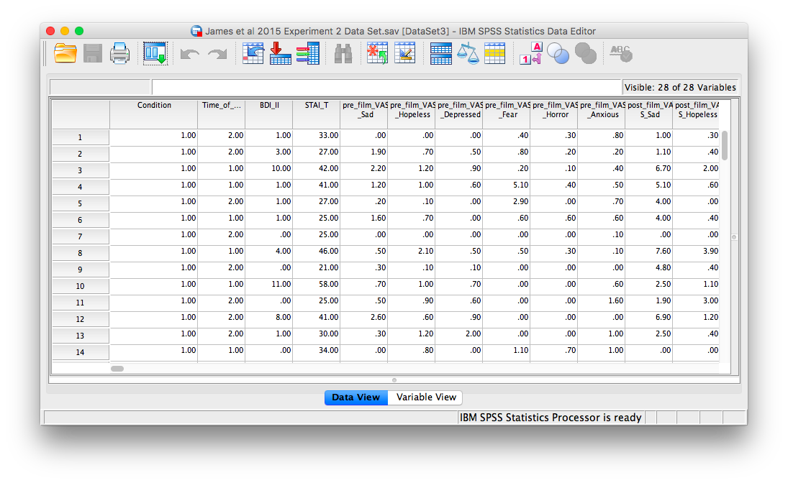
```

In this experiment, there was one important independent variable, called `condition`, and it has four levels. The levels are 1, 2, 3, and 4 in the spreadsheet. These will correspond to the four levels in shown below:

1. No-task control
2. Reactivation Plus Tetris
3. Tetris only
4. Reactivation only

The dependent variable is coded in the column `Days_One_to_Seven_Number_of_Intrusions`. This represents the mean number of intrusions for that week. We are testing the hypothesis that the number of intrusive memories will be different among the groups (1-4). For now, we will not specify which group we think is going to have the highest or lowest number of memories, but rather we will test if there is a difference SOMEWHERE between these 4 groups.

Let's begin. Go to <span style="color:blue">Analyze</span>, then <span style="color:blue">Compare Means</span>, then select <span style="color:blue">One-Way ANOVA...</span>

```{r , echo=FALSE,dev='png'}
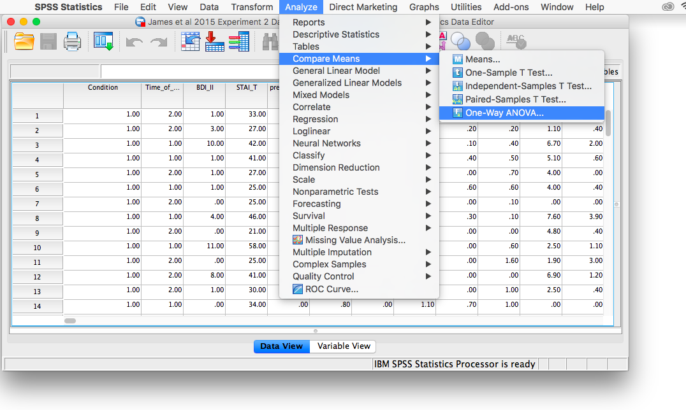
```

The next window will ask you to specify the dependent variable (move the variable `Days_One_to_Seven_Number_of_Intrusions` from the list on the left to the field labeled Dependent Variable) and the "Factor"", which is the same thing as the independent variable or grouping variable (remember back to t-tests!). Move the variable `Condition` from the list into the field labeled "Factor". Your window should look like this:

```{r , echo=FALSE,dev='png'}
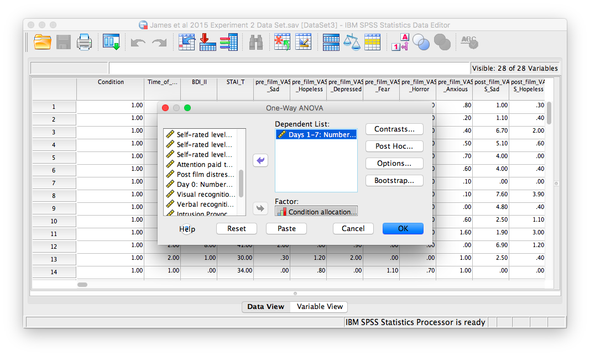
```

Now, click the <span style="color:blue">Options</span> button, and then choose <span style="color:blue">Means plot</span>.

```{r , echo=FALSE,dev='png'}
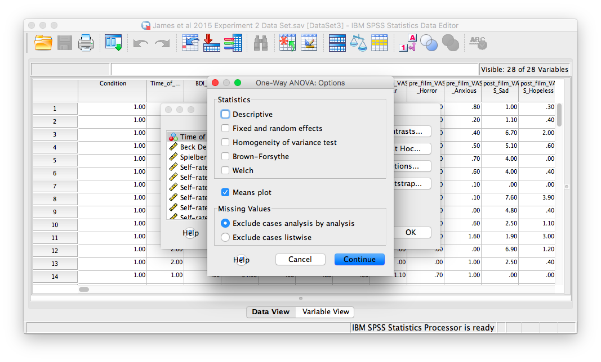
```

Then, click <span style="color:blue">Continue</span> and <span style="color:blue">OK</span>.

SPSS will produce an output window containing the results of the ANOVA (an ANOVA table), as well as a graph of the group means. It should look as follows:

```{r , echo=FALSE,dev='png'}
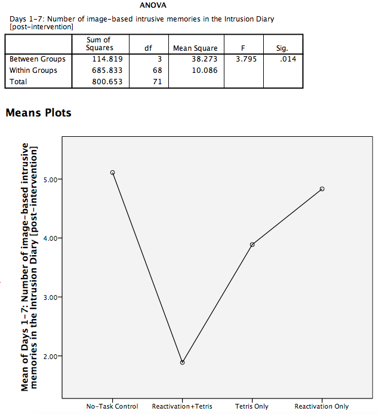
```

First, let's look at our ANOVA  table: We see our F-statistic listed is 3.795, with a p-value o .014. This tests the null hypothesis that there is no difference among the groups. Since p is less than our likely alpha level (.05), we can reject the null hypothesis and conclude that there IS a difference somewhere among these groups. We may say it more formally as follows:

The effect of condition on mean intrusive memories over days 1-7 was significant, F(3, 68)=3.795, p<.05. 

To examine the data further, let's refer to the graph created by SPSS: we can see that the Reactivation + Tetris condition appears to have the smallest mean. As for the others, they are all greater than Reactivation + Tetris, but differ somewhat from each other as well. It is important to know that at this point, we do not know where the significant differences could be. For example, it could be that only Reactivation + Tetris is different from No-Task Control, or it could be that there are other groups different from one another as well. In order to locate where the differences are, we must conduct additional analyses called either planned or unplanned comparisons.

### Planned Comparisons: T-tests

---


To find out where the differences are, one approach is to conduct as many t-tests as 2-group comparisons (also called pairwise comparisons) you can make out of your groups. That is, if you have 4 groups like we do, we can make the following pairwise comparisons:

1. groups 1 vs. 2
2. groups 1 vs. 3
3. groups 1 vs. 4
4. groups 2 vs. 3
5. groups 2 vs. 4
6. groups 3 vs. 4

For each of these, we can run a separate independent-samples t-test. Let's start with the first comparison (Groups 1 and 2). Go to <span style="color:blue">Analyze</span>, then <span style="color:blue">Compare Means</span>, then <span style="color:blue">Independent-Samples t-test...</span>

```{r , echo=FALSE,dev='png'}
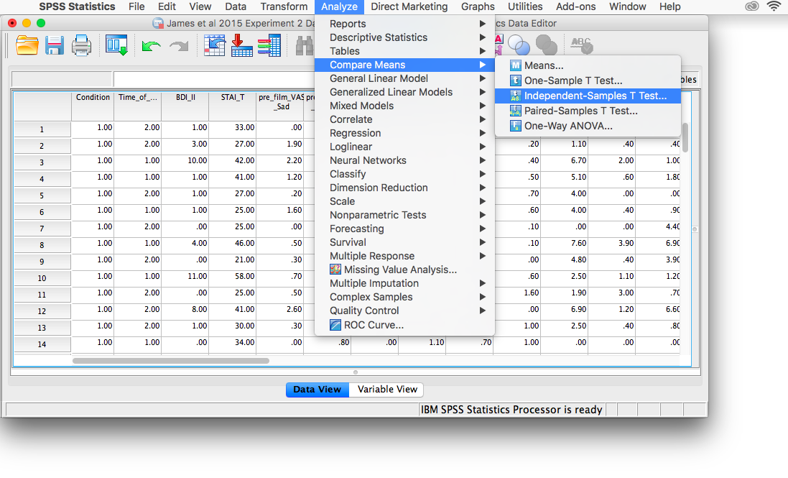
```

Let's place our dependent variable (`Days_One_to_Seven_Number_of_Intrusions`) in its appropriate field. Then, place `Condition` into the Factor field. 

```{r , echo=FALSE,dev='png'}
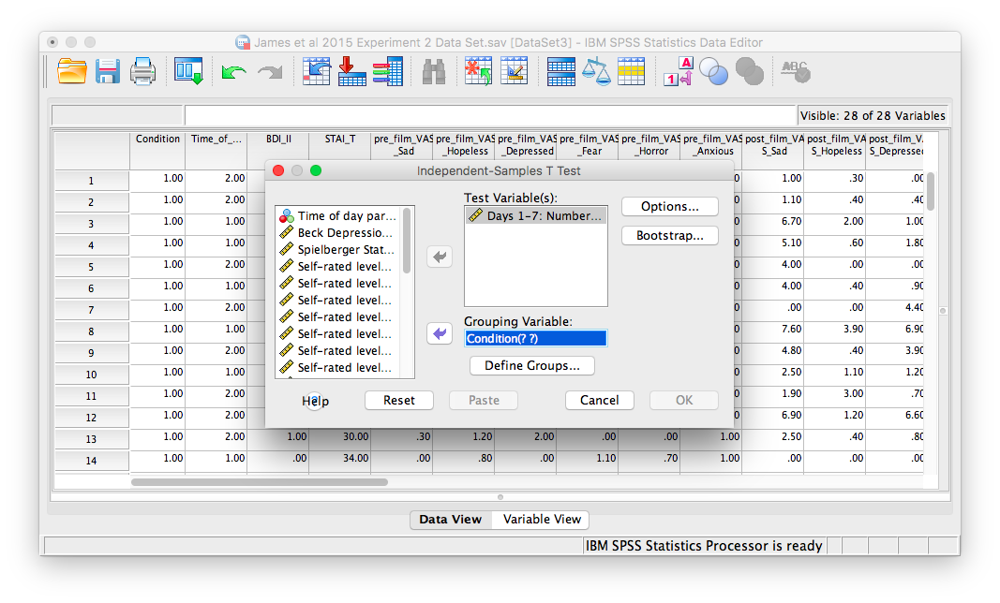
```

Remember here that we have to click <span style="color:blue">Define Groups</span> to specify which groups we are comparing. Let's put 1 and 2 in the fields from Group 1 and Group 2, as follows:

```{r , echo=FALSE,dev='png'}
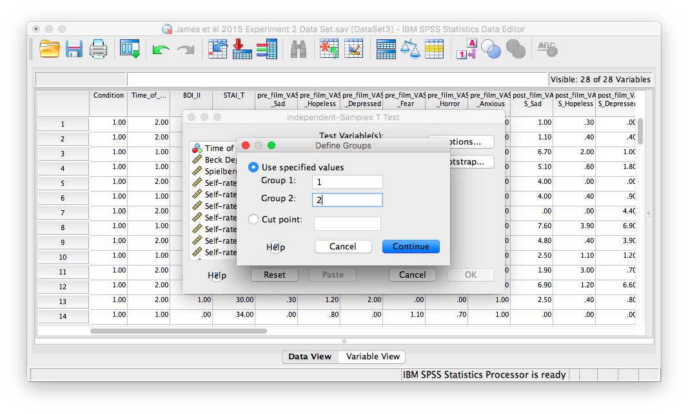
```

Click <span style="color:blue">Continue</span> and then <span style="color:blue">OK</span>. SPSS will produce the standard output tables for an independent-samples t-test. 

```{r , echo=FALSE,dev='png'}
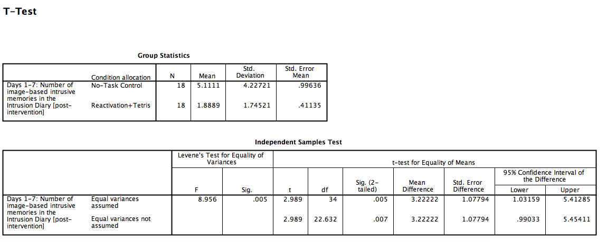
```

As we can see, our t-test is significant; there is indeed a difference between groups 1 and 2, t(22.632)= 2.989, p<.05.

Now, that covers the comparison between groups 1 and 2. We now need to do the same thing for the rest of the comparisons (there are 5 comparisons left to conduct). The procedure for conducting these t-tests is the same as described here, and will only differ in the <span style="color:blue">Define Groups</span> stage of setting up the analysis; in this step, we used the numbers 1 and 2 to represent groups 1 and 2, but for the remainder of the comparisons you will use 1 and 3, 1 and 4, 2 and 3, 2 and 4, and so on. 


### Unplanned Comparisons: Post-hoc tests

---


Another way to find the differences between groups in a One-Factor ANOVA is to conduct something called a post-hoc test. This test is referred to as "unplanned" because you only conduct one when you have a significant overall ANOVA. The post-hoc test is neat because it is conveniently summoned during the process of conducting an ANOVA, and presents its results in a compact table. 

Let's use a post-hoc test to look at this data. Although there are many types of post-hoc tests, we're going to conduct the commonly-used Tukey post-hoc test in this example. Let's begin.

We are going to go through the same steps as before in order to conduct our ANOVA: Go to <span style="color:blue">Analyze</span>, then <span style="color:blue">Compare Means</span>, then <span style="color:blue">One-Way ANOVA...</span>

```{r , echo=FALSE,dev='png'}

```

Place the dependent variable (`Days_One_to_Seven_Number_of_Intrusions`) in its appropriate field. Then, place `Condition` into the "Factor"" field. Now, click the button labeled <span style="color:blue">Post-hoc</span>. A window will appear with options for various post-hoc tests. We are going to choose <span style="color:blue">Tukey</span>:

```{r , echo=FALSE,dev='png'}
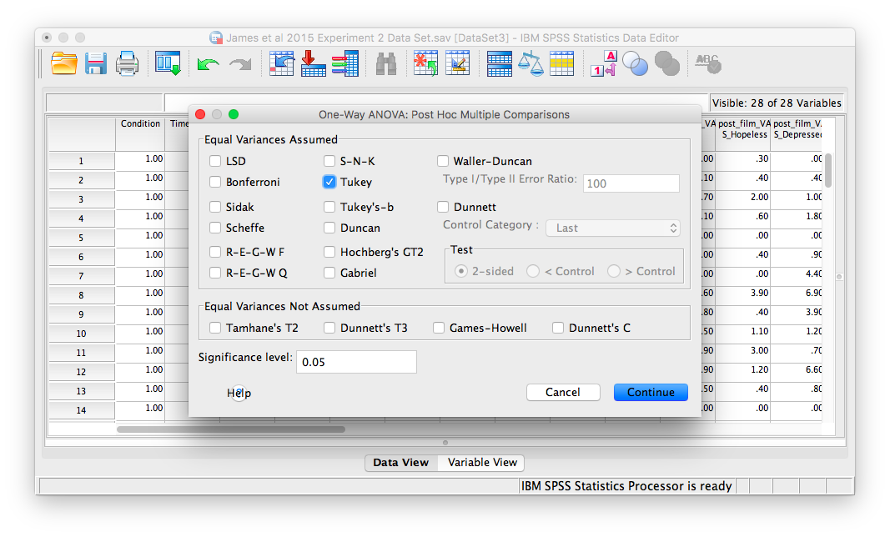
```

Click <span style="color:blue">Continue</span>, and then <span style="color:blue">OK</span>. SPSS will produce the ANOVA table once again, followed by two tables that refer to the post-hoc test. Let's look at the first table, named "Multiple Comparisons:"


#### Multiple Comparisons

---


```{r , echo=FALSE,dev='png'}
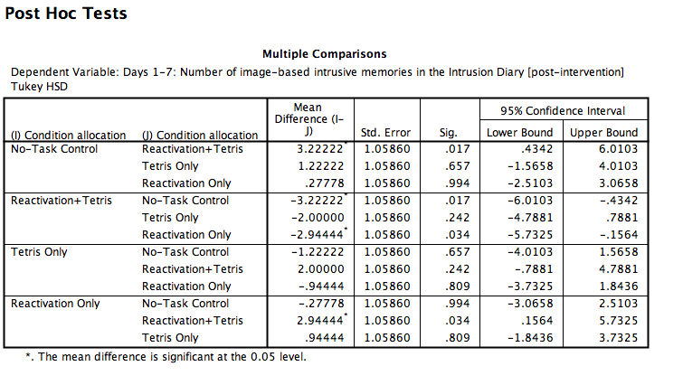
```

In this table, every possible group of 2 conditions is being compared. Notice that the table is redundant; it considers the comparison between no-task control and reactivation + tetris to be different from reactivation + tetris vs. no-task control. However, we know these are the same comparisons. So, we only need to look at half of the table, in essence. 

If you start with row 1, this row compares no-task control with reactivation + tetris. If we find the Sig. column, we see the corresponding p-value for this row is .017. Because this is less than our likely alpha level (.05), this means that these two conditions ARE significantly different from one another. Where else is there a Sig. that is less than alpha (.05)?

Reactivation + Tetris compared with Reactivation only has a p-value of .034. This is also a significant difference. These are the only significant differences we see here. This means that, among the 4 groups, only two differences were found: Reactivation + tetris is different from no-task control, and reactivation + tetris is different from reactivation only.

#### Homogeneous Subsets

---


```{r , echo=FALSE,dev='png'}
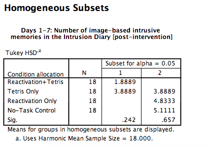
```

This table actually gives you the same kind of information as the above table, but is more compact and easier to use. In this table you will see the conditions listed on the left, and a number of "subsets"--in this case there are 2 subsets (2 columns labeled 1 and 2, respectively). In these columns, the means of the conditions are listed (in this case, mean number of intrusive memories).

The way to read a homogeneous subsets table is as simple as follows: If the means of two groups ever appear in the same column together, they are not significantly different from one another. If the means of two groups NEVER appear in the same column together, then they ARE significantly different from one another. 

Let's start with Reactivation + Tetris and Tetris Only. Look at the table to determine if the means of these conditions ever appear in the same column together. The answer should be yes. The Reactivation + tetris mean (1.89) and Tetris only mean (3.89) appear in column 1 together. Now, let's move on to Reactivation + Tetris as compared to Reactivation only. Do the means of these two groups ever appear in the same column together? No. The Reactivation + Tetris mean (1.89) only appears in column 1, and the reactivation only mean (4.83) only appears in column 2. This means they are different. 

If you go through every possible comparison of two groups, you will find that the only differences are between:

1. reactivation + tetris vs. reactivation only
2. reactivation + tetris vs. no-task control

These are the same pairwise differences we noted using the multiple comparisons table.

### Practice Problems

___

Using this lab’s data set, think about the following question: What if participants’ intrusive memories were not actually affected by the manipulation (tetris and reactivation), but rather the group with the most intrusive memories just happened to react more strongly to the disturbing films? What if there were differences in “level of disturbance” (hint hint: post-film distress rating) among the 4 groups?

1. Test this hypothesis using an alpha level of .05. Report your result in proper statistical reporting format. What do you conclude? 

2. Do the same type of analysis to determine whether the amount of attention paid to the film differed between the 4 groups. Report your result in proper statistical reporting format. What do you conclude?

## JAMOVI

How to do it in JAMOVI


