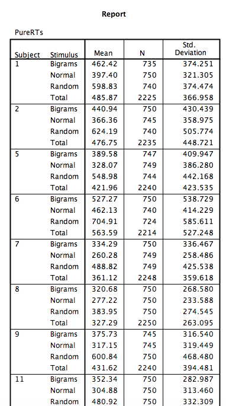

# Lab 9 Repeated Measures ANOVA

<script>
$("#coverpic").hide();
</script>

<span class="newthought">
However, perhaps the main point is that you are under no obligation to analyse variance into its parts if it does not come apart easily, and its unwillingness to do so naturally indicates that one’s line of approach is not very fruitful.
---R. A. Fisher
</span>

## Betcha can't type JHDBZKCO very fast on your first try

This lab activity uses the data from Behmer & Crump (2017) to teach one-factor repeated measures ANOVA with-up follow comparisons

### STUDY DESCRIPTION

Behmer & Crump (2017) used the everyday task of typing on a computer keyboard to ask questions about how people learn to put sequences of actions together. Whenever you type a series of letters on the keyboard, you are putting a sequence of actions together, so typing is task that could be used to measure skilled sequencing. Typing also happens to be a convenient task for measuring sequencing. For example, every time a person types a letter, the timing of the button press and the letter pressed can be measured and stored for later analysis.

Behmer & Crump were interested in asking a few different questions, however, we will simplify everything and talk about replication. First we describe an interesting finding from previous research. Behmer & Crump repeated an experiment that should also produce this same finding. If they succeed in doing this, it means the finding can be replicated, and that it happens in more than one lab.

**Finding from previous resaearch:** Prior research showed that typists do something funny. Skilled typists can type normal words very fast. This suggests they know how to locate all of the letters on the keyboard, and can press each letter very quickly to type words. That part isn't particularly funny. However, if you take really skilled typists and make them type random letters like this:  kwitb dhhgjtryq xkldpt mazhyffdt, guess what happens? They slow down a lot. It's kind of weird that a typist would slow down, after all they can type letters really fast when they appear in words, but not when they appear in random orders...what gives? Last, it turns out that typists are kind of in the middle in terms of speed, if you ask them to type non-words that have similar properties to words, such as: quenp hamlke phwempy.

To summarize, prior research showed that typing speed changes as a function of the structure of the text, roughly in this order from fastest to slowest.

(FASTEST)  Normal Words < Word-like Non-words < Random strings  (SLOWEST)

**Replication question:** Behmer & Crump also measured typists while they typed words, non-words that were English-like, and random strings. They had some additional things they were interested in, but for us, we are interested in whether they would show the same effect. Would they replicate the pattern: Normal words (Fastest) < Word-like Non-words (medium) <- Random strings (Slowest)?


### Study Methods

The authors conducted a repeated measures experiment. A total of 38 subjects were used for the analysis.

**Independent Variable**: The IV Stimulus or typing material had three levels: Normal, Bigrams, and Random. Normal refers to normal 5 letter English words (like truck, or plant). Bigrams refers to non-words that have properties similar to words (e.g., phemt quilp). Random refers to 5 letter strings whose letters were totally random (qmklt gdrzn lprni).

**Dependent Variables**: There were three dependent variables, that all measured different aspects of typing performance. Reaction times (RTs) were defined as the temporal interval between seeing a stimulus (to type), and then starting to type it (first key press). Inter-keystroke intervals (IKSIs) are the times between each key-press. Last, accuracy was also measured (correct or incorrect key-presses)

**The task**: Participants (who happened to also be students from Brooklyn College) sat in front a computer. They were presented with one stimulus (word, bigrams, or random) at a time. As soon as they saw the string of letters, they typed it as quickly and accurately as they could, then they moved on to the next trial. 

Reminder, this is a repeated measures design because each participant typed letter strings from the word, bigrams, and random conditions.

## Lab Skills Learned

- Conducting a one-factor repeated measures ANOVA
- Conducting follow-up comparisons

## Important Stuff
- citation: Behmer, Lawrence P., Crump, M. J. C. (2017). Spatial Knowledge during Skilled Action Sequencing: Hierarchical versus Non-Hierarchical Representations. Attention, Perception & Psychophysics, 79, 2435-2448.
- [Link to .pdf of article](https://github.com/CrumpLab/CrumpLab.github.io/raw/master/files/8753/Behmer%20and%20Crump%20-%202017.pdf)
- <a href="https://github.com/CrumpLab/statisticsLab/raw/master/data/exp1_BehmerCrumpAPP.csv" download>Data in .csv format</a>


## R

### Load the data

Remember that any line with a \# makes a comment and the code does not run. Below is how to load the .csv data from the online repository, or from a local file (you need to change the file path to where the local file is, if you downloaded it). The data contains all of the measures and conditions from Experiment 1 in the paper.

```{r}
library(data.table)
#all_data <- fread("https://github.com/CrumpLab/statisticsLab/raw/master/data/exp1_BehmerCrumpAPP.csv")
all_data <- fread("data/exp1_BehmerCrumpAPP.csv")
```

### Inspect the dataframe

This will give you a big picture of the data frame. Click the button to view it in your browser, then take a look to see what is in it. 

```{r, eval=F}
library(summarytools)
view(dfSummary(all_data[,c(1:7,10:20)]))
```

Note, there is some weird stuff in code above. Normally, we would just write `view(dfSummary(all_data))`, why we add this: `all_data[,c(1:7,10:20)]`? It turns out the dfSummary function didn't like some of the data. In particular it didn't like the data in columns 8 an 9 (notice those numbers are missing, the range inside c is 1 to 7 and 10 to 20). It doesn't mean the data isn't there, just that it didn't want to display it in the viewer.

### Get the data you need

This data file contains all of the data from Experiment 1 in the paper. So, we don't need to get rid of any rows. 

There are numerous columns, some of them we don't need for the analysis. But, we'll just ignore these later when we use `dplyr` to group by the columns we want.

The structure of this data a file is in long form. Every row described a measurement for a single key-press. For example, the first 5 rows, have data for the timing of the first 5 key-presses, that the first subject made to type the first string of letters they saw. In total there were 85,410 key-presses made. That's quite a lot. 

#### The independent variable

The important independent variable is in the column `Stimulus`.

- Normal (5 letter English words)
- Bigrams (5 letter strings that kind of looked like words)
- Random (5 letter strings that were random)

It is also important to know that the `Order` column codes the position for each letter, from 1 to 5.

Note: there was another independent variable in the study as well. We talk about this later. The second IV is coded in the `Block` column. 

- Baseline (normal typing, keyboard is visible while typing)
- Manipulation (occluded typing, keyboard is covered while typing)

#### The dependent variables

1. `TimeFromOnset` : This column records the temporal interval in milliseconds between the onset of the word and each key-press. When order is 1 (first keystroke), the number here is the reaction time to start typing.
2. `PureRTs` : This column contains keystroke intervals. The first interval is between the onset of the word and the first key-press (order 1), the second interval is between the first and second key-press (order 2), and so on. `PureRTs` for orders 2 to 5, represent the inter-keystroke intervals reported in  paper.
3. `AllCorrect` : 0 means incorrect (wrong letter was typed), 1 means correct (correct letter was typed)

### Look at the data

Remember before we do any analysis, we always want to "look" at the data. This first pass let's us know if the data "look right". For example, the data file could be messed up and maybe there aren't any numbers there, or maybe the numbers are just too weird. 

For example, this study involves reaction times: the time between seeing something and responding to it. If you had done a study like this before, you would know that it usually doesn't take people that long to start responding. Most reaction times will be under a second (or 1000 milliseconds). But, sometime people are little slow, and sometimes they do funny things like check their phone in the middle of an experiment.

Before I analyze reaction time data, I often make a histogram of all of the RT data, like this:

```{r}
hist(all_data$PureRTs)
```


We can see that almost all of the reaction times are well below 5000 milliseconds (5 seconds), which is good. Most of the time people were paying attention and not "checking their phone". Notice, the range of the histogram goes out to 15,000 milliseconds. You can't see any bars out there (too small to notice), but there must be at least a few trials where somebody took 15 seconds to start responding. These are called outliers. We will remove them before we conduct our analysis

### Look at the means

As part of looking at the data, we might as well make a figure that shows the mean reaction times in each condition, and some error bars to look at the spread in each condition. The following code takes three important steps:

1. Get the means for each subject in each condition. These are put into the data frame called `subject_means`.
2. Get the means for each condition, by averaging over the means for each subject. These are put into the data frame called `plot_means`.
3. Make a graph with the `plot_means` data frame using ggplot2. 


```{r}
library(dplyr)
library(ggplot2)

all_data$Block<-as.factor(all_data$Block)
levels(all_data$Block) <- c("Visible keyboard","Covered Keyboard")

## get subject mean RTs

subject_means <- all_data %>%
                 filter(Order==1, Correct==1, PureRTs<5000) %>%
                 group_by(Subject, Block, Stimulus) %>%
                 summarise(mean_rt = mean(PureRTs))

subject_means$Subject<-as.factor(subject_means$Subject)
subject_means$Block<-as.factor(subject_means$Block)
subject_means$Stimulus<-as.factor(subject_means$Stimulus)

## get condition mean RTs

plot_means <- subject_means %>%
              group_by(Block, Stimulus) %>%
              summarise(means = mean(mean_rt),
                        SEs = sd(mean_rt)/sqrt(length(mean_rt)))

## plot the condition means

# re-order stimulus factor for plotting
plot_means$Stimulus <- factor(plot_means$Stimulus, levels = c("Normal", "Bigrams", "Random"))

ggplot(plot_means, aes(x=Stimulus, y=means, group=Block, color=Block))+
  geom_point()+
  geom_line()+
  geom_errorbar(aes(ymin=means-SEs, ymax=means+SEs), width=.2)+
  theme_classic()+
  ylab("Mean Reaction Time (ms)")+
  xlab("Typing Material")

```

Alright, we made things a little bit more complicated than they need to be. Our primary question is whether reaction times followed this pattern: Normal < Bigrams < Random. We can see the means do follow this pattern. However, shouldn't we only be looking at three means, why are their six means, and two lines?

The above code included the second independent variable `Block`. As a result, you are seeing the means for Typing material when subjects could see the keyboard, and when the couldn't see the keyboard. We will come back to this later. For now, let's ignore the Block condition, and find the means for the Typing Material IV by averaging over the Block conditions. We run the same code as above, by take out `Block`, in the `group_by` function. We also take `Block` out the ggplot function.

**VERY IMPORTANT**: We did something in the above code that we didn't point out. We filtered the data before we found the means. For most of the data sets in other labs, we given you data that is more or less ready to analyse. More often than not data needs to be pre-processed, or filtered before you analyze it. We can use the `filter` function in `dplyr` to do our filtering. `filter` filters the rows for us, so we will only include the rows that we want.

1. We want to analyze the time between the onset of the stimulus and the first keystroke. The reaction times for this value are in the `PureRTs` column, but this column contains other RTs that we do not want to analyse. For example, the `Order` column codes for the letter position in the string. We only want to analyze the rows that contain a `1`, for the first position. So, that is why we add `Order==1` to the filter function below.

2. We want to analyze only the reaction times that are correct. That is, when the subject typed the first letter correctly, and did not make a typo. Accuracy is coded in the `Correct` column, with 1 = correct, and 0 = incorrect. We add `Correct==1` to the filtering function.

Note the use of `==`, that is two equal signs in a row. In R, two equal signs in a row has a special meaning. It means conduct a `logic` test to determine if one thing is the same as another. 

3. We want to analyze only reaction times that are "sensible" to analyze. What does sensible mean? We don't want to analyze data that is clearly garbage data. For example, if someone fell asleep at the computer and didn't respond for 15 seconds, that kind of data is not what we want to analyze. If we were to filter the data, and exclude these kinds of `outliers`, we would be conducting an outlier elimination procedure. Behmer & Crump (2017) did this, and it is commonly done in many different kinds of studies. We skip an extended discussion of outlier elimination for this lab. But, we do introduce the idea of doing it. We want to keep as much of the data as possible. So, what we do is keep all of the RTs that are less than 5000 ms (that's 5 seconds). To do this, we add `PureRTs<5000` to the filter function.

```{r}
## get subject mean RTs

subject_means <- all_data %>%
                 filter(Order==1, Correct==1, PureRTs<5000) %>%
                 group_by(Subject, Stimulus) %>%
                 summarise(mean_rt = mean(PureRTs))

subject_means$Subject<-as.factor(subject_means$Subject)
subject_means$Stimulus<-as.factor(subject_means$Stimulus)

## get condition mean RTs

plot_means <- subject_means %>%
              group_by(Stimulus) %>%
              summarise(means = mean(mean_rt),
                        SEs = sd(mean_rt)/sqrt(length(mean_rt)))

## plot the condition means

# re-order stimulus factor for plotting
plot_means$Stimulus <- factor(plot_means$Stimulus, levels = c("Normal", "Bigrams", "Random"))

ggplot(plot_means, aes(x=Stimulus, y=means, group=1))+
  geom_point()+
  geom_line(stat="identity")+
  geom_errorbar(aes(ymin=means-SEs, ymax=means+SEs), width=.2)+
  theme_classic()+
  ylab("Mean Reaction Time (ms)")+
  xlab("Typing Material")

```

### Conduct the repeated Measures ANOVA

We use the same `aov` function as we used last time. The only difference is that we add in a new part to the formula. Remember the formula for a one-factor between subjects ANOVA looked like this:

`aov( DV ~ IV , dataframe)`, where DV is the name of the column with your independent variable, IV is the name of the column with your independent variable, and `dataframe` is the name of your data frame containing the means in each condition.

The formula for a repeated-measures ANOVA looks like this:

`aov( DV ~ IV + Error(Subject/IV), dataframe)`. We have added `+ Error(Subject/IV)`. This tells R to use the appropriate error term for the repeated measures ANOVA. In the formula, `Subject` refers to the name of the column coding your subjects (make sure this is a factor in R), and `IV` is the name of the column for your independent variable.

The formula for our data would be: `aov( mean_rt ~ Stimulus + Error(Subject/Stimulus), subject_means)`.

Here is the code below. Just as reminder, the raw data codes every single key press on each row. We don't want to submit this as the data frame to the `aov` function. Instead, we need to calculate the data frame for the subject means in each condition. We did that above as a step toward making the graphs. We do it again here to remind you that you need to do this.

```{r}

# get subject means

subject_means <- all_data %>%
                 filter(Order==1, Correct==1, PureRTs<5000) %>%
                 group_by(Subject, Stimulus) %>%
                 summarise(mean_rt = mean(PureRTs))

# Make sure IV and Subject are coded as factors
subject_means$Subject  <- as.factor(subject_means$Subject)
subject_means$Stimulus <- as.factor(subject_means$Stimulus)

# Conduct the anova

aov_out <- aov( mean_rt ~ Stimulus + Error(Subject/Stimulus), subject_means)
summary_out <- summary(aov_out)

library(xtable)
knitr::kable(xtable(summary_out))
```

Great, we have conducted the ANOVA. We could write up the results of the ANOVA like this:

> For each subject we computed mean reactions for correct keystrokes in each condition of the Stimulus factor. These means were submitted to a one-factor repeated-measures ANOVA, with Stimulus (Normal, Bigrams, and Random) as the sole factor. The effect of Stimulus was signficant, F(2, 74) = 230.58, MSE = 2510.98, p < 0.001.

Note, the p-value shows up as a zero, that's because it is so small that R doesn't want to print the actual number 0.000000000000000...1.

What does this tell us? 

1. The $F$ value we obtained (230.58) almost never occurs by chance. More specifically, the sampling distribution of F from the distribution of no differences virtually never produces a huge F like 230.58

2. It is super-duper unlikely that chance (sampling error) could have produced the difference we observed.

3. We reject the idea that chance caused the differences, and are very confident that the manipulation (changing the kinds of letters that people have to type), has a causal influence on reaction time in typing.

#### Report the means too

Remember, the important goal when conducting analyses, and then writing about them, is to tell people what you did and what you found. This involves more than one step. For this example, we might do three basic things. 1) make a figure to show the means, 2) report the ANOVA so people know if there is support for the inference that the differences between the means are not caused by chance, and 3) report descriptives for the means, so people know what the numbers are (the figure doesn't show the exact values).

We've already made the figure and done the ANOVA, let's report the condition means. To do this, we need to find the means for each condition, collapsing over the means for each subject in each condition. Note that, we already did this to make the figure. Here's the code again:

```{r}
## get subject mean RTs

subject_means <- all_data %>%
                 filter(Order==1, Correct==1, PureRTs<5000) %>%
                 group_by(Subject, Stimulus) %>%
                 summarise(mean_rt = mean(PureRTs))

subject_means$Subject<-as.factor(subject_means$Subject)
subject_means$Stimulus<-as.factor(subject_means$Stimulus)

## get condition mean RTs

plot_means <- subject_means %>%
              group_by(Stimulus) %>%
              summarise(means = mean(mean_rt),
                        SEs = sd(mean_rt)/sqrt(length(mean_rt)))

knitr::kable(plot_means)

```
Now, our full write-up of the results would look like this.

> For each subject we computed mean reactions for correct keystrokes in each condition of the Stimulus factor. These means were submitted to a one-factor repeated-measures ANOVA, with Stimulus (Normal, Bigrams, and Random) as the sole factor. The effect of Stimulus was signficant, F(2, 74) = 230.58, MSE = 2510.98, p < 0.001. The mean reaction time was fastest in the Normal condition (M = 833 ms, SE = 24 ms), followed by the Bigram condition, (M = 924 ms, SE = 27 ms) and slowest in the Random Condition (M = 1078 ms, SE = 32 ms).

### Follow-up comparisons

The ANOVA tells us that the differences between the means are unlikely to be due to chance. But, remember, this is an omnibus test. It does not tell us if specific pairs of means are different from one another. To determine whether the difference between two specific means is not likely due to chance, we need to conduct follow-up tests. 

Because this is a repeated-measures design, we can use the paired-samples t-test for follow-up tests. Let's do two follow-up tests to confirm that the RTs for Normal words were indeed faster than the RTs for the Bigram condition (word-like non-words); and then, let's confirm that the RTs for the Bigram condition were indeed faster than the RTs for the Random condition.

#### Normal vs Bigrams

We use the `subject_means` data frame. But, we want to rid of all the rows containing the means from the Random condition. We use filter to do that, then we conduct the paired-samples t-test.

```{r}
comparison_df <- subject_means %>%
                  filter(Stimulus != "Random")

t.test(mean_rt~Stimulus, 
       paired=TRUE, 
       var.equal=TRUE, 
       data = comparison_df)

```

####  Bigrams vs Random

We use the `subject_means` data frame. But, we want to rid of all the rows containing the means from the Normal condition. We use filter to do that, then we conduct the paired-samples t-test.

```{r}
comparison_df <- subject_means %>%
                  filter(Stimulus != "Normal")

t.test(mean_rt~Stimulus, 
       paired=TRUE, 
       var.equal=TRUE, 
       data = comparison_df)

```

### Reporting everything

Now we can look at some write-ups that report everything we did, and everything we want to know. I'll show you two ways to do it. 

#### First way

In the first way, we embed the results of the t-test into the description of the mean reaction times.

For each subject we computed mean reactions for correct keystrokes in each condition of the Stimulus factor. These means were submitted to a one-factor repeated-measures ANOVA, with Stimulus (Normal, Bigrams, and Random) as the sole factor. The effect of Stimulus was significant, F(2, 74) = 230.58, MSE = 2510.98, p < 0.001. The mean reaction time was significantly faster in the Normal condition (M = 833 ms, SE = 24 ms), compared to the Bigram condition, (M = 924 ms, SE = 27 ms), t(37) = 12.14, p<0.001. Additionally, mean reactions in the Bigram condition were significantly faster than the Random Condition (M = 1078 ms, SE = 32 ms), t(37) = 14.21, p < 0.001.


#### Second way

In the second way, we first report the means as we did the very first time, and then after that we report the t-test results to highlight the size the of the differences between each comparison.

For each subject we computed mean reactions for correct keystrokes in each condition of the Stimulus factor. These means were submitted to a one-factor repeated-measures ANOVA, with Stimulus (Normal, Bigrams, and Random) as the sole factor. The effect of Stimulus was significant, F(2, 74) = 230.58, MSE = 2510.98, p < 0.001. The mean reaction time was fastest in the Normal condition (M = 833 ms, SE = 24 ms), followed by the Bigram condition, (M = 924 ms, SE = 27 ms) and slowest in the Random Condition (M = 1078 ms, SE = 32 ms). Mean reaction times were significantly faster (M = 91 ms) in the Normal than Bigrams condition, t(37) = 12.14, p < 0.001. And, mean reaction times were significantly faster (M = 152 ms) in the Bigrams than Random condition, t(37) = 14.21, p < 0.01.

There are other ways to write-up statistical results. These are just some example recipes. The important thing is to:

1. Say what the numbers were that you are analyzing
2. Say what the statistical test was
3. Say the results of the statistical test
4. Say what the patterns of means were
5. Say what the follow-up tests were when you test differences between specific means.
6. Add a table or figure so it is easier to "see" the results.

### Generalization Exercise

Your task is to conduct another repeated-measures ANOVA. Rather than using the reaction time for the first-keystroke as the dependent measure, you will use the reaction times between all of the keystrokes in each word, these are called interkeystroke intervals. The `Order` variable is used to code keystroke position (1 to 5). You will want to analyze only the `PureRTs` that have an `Order` greater than 1. For example, you could use the following code to get the subject_means for the mean interkeystroke intervals.

```{r, eval=FALSE}
subject_means <- all_data %>%
                 filter(Order > 1, Correct==1, PureRTs<5000) %>%
                 group_by(Subject, Stimulus) %>%
                 summarise(mean_rt = mean(PureRTs))

```

A. Make a figure for the new DV
B. Report the ANOVA table for the new repeated measures ANOVA
C. Discuss whether the general pattern is the same as before.

### Writing assignment

(2 points - Graded)

1. Explain the concept of $SS_\text{Total}$ (.5 points)

2. Explain the concept of partitioning SS_\text{Total} into smaller pieces. What is the goal of the spitting? (.5 points)

3. Explain the major difference between a between-subjects ANOVA and repeated-measures ANOVA in terms of what is being partioned. (1 point)

General grading. 

- You will receive 0 points for missing answers 
- You must write in complete sentences. Point form sentences will be given 0 points.
- Completely incorrect answers will receive 0 points. 
- If your answer is generally correct but very difficult to understand and unclear you may receive half points for the question


## Excel

How to do it in Excel

## SPSS

In this lab, we will use SPSS to:

1. Produce a frequency histogram and remove outliers
2. Conduct and graph One-Factor Repeated Measures ANOVA
3. Conduct planned comparisons using a paired-samples t-test

### Experiment Background

---


In this experiment, Behmer and Crump (2017) recruited 38 subjects to type words presented on a screen as quickly as they could. The independent variable was typing material and it had 3 levels: Normal (5 letter English words), Bigrams (5 letter non-words that have properties like real words), and Random (random 5 letter strings). The authors wanted to know whether reaction time (RT) was different according to the type of word being typed.

Dependent Variables: There were three dependent variables, that all measured different aspects of typing performance. Reaction times (RTs) were defined as the temporal interval between seeing a stimulus (to type), and then starting to type it (first key press). Inter-keystroke intervals (IKSIs) are the times between each key-press. Last, accuracy was also measured (correct or incorrect key-presses). For this analysis we will use `Pure RTs` as our one DV.

Nota bene: This is a repeated measures design because each participant typed letter strings from the word, bigrams, and random conditions.


### Produce a frequency histogram and remove outliers

---


[Here](https://github.com/CrumpLab/statisticsLab/blob/master/data/spssdata/BehmerCrump.sav) is a link to the data file. It is named BehmerCrump.sav. Your data should look like this:

```{r , echo=FALSE,dev='png'}
knitr::include_graphics('img/9.4.11.png')
```

First, we'll be creating a histogram to look at our data. Go to <span style="color:blue">Graphs</span>, then <span style="color:blue">Legacy Dialogs</span>, then <span style="color:blue">Histogram...</span>


```{r , echo=FALSE,dev='png'}

```


The next window will ask you to specify the variable you would like graphed. Choose `PureRTs` from the list on the left and move it into the "Variable" field using the arrow. 

```{r , echo=FALSE,dev='png'}
knitr::include_graphics('img/9.4.13.png')
```


Click <span style="color:blue">OK</span>. SPSS will produce a frequency histogram of your data. 

```{r , echo=FALSE,dev='png'}
knitr::include_graphics('img/9.4.14.png')
```

Notice that the RTs form a positively skewed distribution. Most RT measurements are on the lower end of the scale, and there are very few RTs that are higher than 5000ms. These measurements could have resulted from subjects falling asleep, looking at their phones, or being otherwise distracted in the middle of the experiment. We want to remove those values so they do not influence and mischaracterize our results. To do this, go to the top menu and choose <span style="color:blue">Data</span>, then <span style="color:blue">Select Cases...</span>

```{r , echo=FALSE,dev='png'}

```

The next window will ask you which cases to select. We specifically want to remove any cases larger than 5000, so check off <span style="color:blue">If condition is satisfied:</span>

```{r , echo=FALSE,dev='png'}
knitr::include_graphics('img/9.4.16.png')
```

Then click <span style="color:blue">If...</span> The window that follows will ask you to specify the condition for inclusion. Find the variable `PureRTs` in the left-hand list and move it to the field on top using the arrow. Then, type "< 5000" to specify that we want to keep only values under 5000ms.

```{r , echo=FALSE,dev='png'}
knitr::include_graphics('img/9.4.17.png')
```

Click <span style="color:blue">Continue</span>. Your data has now been edited so that trials on which the `PureRTs` value was greater than 5000 have been removed. 

Let's take some time to think about this data. We have measurements taken from many participants across multiple trials and multiple conditions. Our goal is to be able to come up with a single RT for each person per condition. The only way to do this is to take an individual's RTs for a particular condition and average them. To do this, we need to calculate means. First, go to <span style="color:blue">Analyze</span>, then <span style="color:blue">Compare Means</span>, then <span style="color:blue"> Means...</span>

```{r , echo=FALSE,dev='png'}
knitr::include_graphics('img/9.4.18.png')
```

In the next window, move the `PureRTs` variable into the "Dependent List" field. In the field below, labeled "Independent List", place the `Subject` variable:

```{r , echo=FALSE,dev='png'}

```

Then, click <span style="color:blue">Next</span>. The bottom field will become blank again, and you can now place the `Stimulus` variable into it. 

```{r , echo=FALSE,dev='png'}
knitr::include_graphics('img/9.4.20.png')
```

Click <span style="color:blue">OK</span>. SPSS will produce an output table containing each subject's average RT per condition:

```{r , echo=FALSE,dev='png'}

```

### Conduct and graph One-Factor Repeated Measures ANOVA

---

For this part of the tutorial, we will switch over to a new SPSS file. [Here](https://github.com/CrumpLab/statisticsLab/blob/master/data/spssdata/BehmerCrumpMeanRTs.sav) is the link; it's called BehmerCrumpMeanRTs.sav. When you open the file, it should look like this:

```{r , echo=FALSE,dev='png'}
knitr::include_graphics('img/9.4.22.png')
```

Notice that this file contains the means from the table we just created. Each person's data is contained within a row: there are 3 measurements corresponding to all stimulus conditions. To calculate a One-Factor Repeated Measures ANOVA, go to <span style="color:blue">Analyze</span>, then <span style="color:blue">General Linear Model</span>, then <span style="color:blue">Repeated Measures...</span>

```{r , echo=FALSE,dev='png'}
knitr::include_graphics('img/9.4.23.png')
```

The next window will ask you to label your within-subjects variable. Type `Stimulus` into the "Within-Subjects Factor Name" field. Indicate that this variable has 3 levels. Then click <span style="color:blue">Add</span>, and then <span style="color:blue">Define</span>.

```{r , echo=FALSE,dev='png'}

```

In the next window, move all 3 conditions listed on the left into the "Within-Subjects Variables" field. 

```{r , echo=FALSE,dev='png'}
knitr::include_graphics('img/9.4.25.png')
```

Click <span style="color:blue">OK</span>. SPSS will produce an output table labeled "Tests of Within-SUbjects Effects" that contains The F statistic and its corresponding p-value.

```{r , echo=FALSE,dev='png'}
knitr::include_graphics('img/9.4.26.png')
```

From this table, we see that there is a significant effect of stimulus on RT, F(2, 74)= 420.33, p<.05. In order to graph this data and look at the means, go to <span style="color:blue">Graphs</span>, then <span style="color:blue">Legacy Dialogs</span>, then <span style="color:blue">Bar...</span>

```{r , echo=FALSE,dev='png'}

```

In the next window, choose <span style="color:blue">Simple</span>, but this time select <span style="color:blue">Summaries of separate variables</span>, then <span style="color:blue">Define</span>:

```{r , echo=FALSE,dev='png'}
knitr::include_graphics('img/9.4.28.png')
```

In the next window, move the three stimulus conditions listed in the field on the left into the field labeled "Bars Represent."

```{r , echo=FALSE,dev='png'}
knitr::include_graphics('img/9.4.29.png')
```

Then click <span style="color:blue">OK</span>. SPSS will produce a bar graph with each bar representing the mean of each of the conditions. We can see that the Random condition has the longest RT, followed by Bigrams, and then Normal. However, at this point we do not know which groups are significantly different from the others. 

```{r , echo=FALSE,dev='png'}

```

### Conduct planned comparisons using a paired-samples t-test

---


To find out where the difference among these 3 conditions exists, we will use a planned comparison in the form of a paired-samples t-test. This method takes 2 groups at a time and tests for pairwise differences. There are three comparisons that can be made here:

1. normal vs. bigram
2. bigram vs. random
3. random vs. normal

We will use a paired-samples t-test instead of an independent-samples t-test because in each comparison, the same people are being remeasured in each group. 

To begin, go to <span style="color:blue">Analyze</span>, then <span style="color:blue">Compare Means</span>, then <span style="color:blue">Paired Samples T-test...</span>

```{r , echo=FALSE,dev='png'}

```

In the next window, move the two conditions of our first pairwise comparison (`normal` vs. `bigram`) into the field on the right using the arrow.

```{r , echo=FALSE,dev='png'}
knitr::include_graphics('img/9.4.32.png')
```

Click <span style="color:blue">OK</span>. SPSS will produce a series of tables. The "Paired Samples test" table contains the t-statistic and its associated p-value.

```{r , echo=FALSE,dev='png'}
knitr::include_graphics('img/9.4.33.png')
```

Looking at this output, we can see that the Normal and Bigrams conditions are indeed significantly different, t(37)= 13.09, p<.05. 

You can use this same method for the remaining comparisons.


### Practice Problems

___


1. Run the same analysis as illustrated in this lab tutorial but with accuracy (correct) as the dependent variable. Use an alpha level of .05. Remember to calculate  means per subject and stimulus first. This will generate a table, whose values you can enter into a new SPSS spreadsheet file.

2. Is there an effect of stimulus on error rate? If so, conduct the appropriate planned comparisons. 

3. Graph the means using a bar graph; include +/-1 SEM Error bars.

## JAMOVI

How to do it in JAMOVI


