# Lab 10: Factorial ANOVA

<script>
$("#coverpic").hide();
</script>

<span class="newthought">
Simplicity is complex. It's never simple to keep things simple. Simple solutions require the most advanced thinking.
---Richie Norton
</span>

## Does standing up make you focus more?

This lab activity uses the data from "Stand by your Stroop: Standing up enhances selective attention and cognitive control" (Rosenbaum, Mama, Algom, 2017) to teach the analysis of a 2x2 design using ANOVA. Although the research design is a 2x2 repeated meaures design, we treat the design both as repeated measures, and as a between-subjects design to illustrate how to conduct either type of ANOVA in software.

### STUDY DESCRIPTION

Do you pay more attention when you are sitting or standing? We analyse the data from "Stand by your Stroop: Standing up enhances selective attention and cognitive control" (Rosenbaum, Mama, Algom, 2017). This paper asked whether sitting versus standing would influence a measure of selective attention, the ability to ignore distracting information.

They used a classic test of selective attention, called the Stroop effect. In a typical Stroop experiment, subjects name the color of words as fast as they can. The trick is that sometimes the color of the word is the same as the name of the word, and sometimes it is not. Here are some examples:

```{r,echo=FALSE}
knitr::include_graphics("figures/Stroop.png")
```

Congruent trials occur when the color and word match. So, the correct answers for each of the congruent stimuli shown would be to say, red, green, blue and yello. Incongruent trials occur when the color and word mismatch. The correct answers for each of the incongruent stimuli would be: blue, yellow, red, green.

The Stroop effect is an example of a well-known phenomena. What happens is that people are faster to name the color of the congruent items compared to the color of the incongruent items. This difference (incongruent reaction time - congruent reaction time) is called the Stroop effect.

Many researchers argue that the Stroop effect measures something about selective attention, the ability to ignore distracting information. In this case, the target information that you need to pay attention to is the color, not the word. For each item, the word is potentially distracting, it is not information that you are supposed to respond to. However, it seems that most people can't help but notice the word, and their performance in the color-naming task is subsequently influenced by the presence of the distracting word. 

People who are good at ignoring the distracting words should have small Stroop effects. They will ignore the word, and it won't influence them very much for either congruent or incongruent trials. As a result, the difference in performance (the Stroop effect) should be fairly small (if you have "good" selective attention in this task). People who are bad at ignoring the distracting words should have big Stroop effects. They will not ignore the words, causing them to be relatively fast when the word helps, and relatively slow when the word mismatches. As a result, they will show a difference in performance between the incongruent and congruent conditions.

If we take the size of the Stroop effect as a measure of selective attention, we can then start wondering what sorts of things improve selective attention (e.g., that make the Stroop effect smaller), and what kinds of things impair selective attention (e.g., make the Stroop effect bigger).

The research question of this study was to ask whether standing up improves selective attention compared to sitting down. They predicted smaller Stroop effects when people were standing up and doing the task, compared to when they were sitting down and doing the task.

### Study Methods

The design of the study was a 2x2 repeated-measures design. The first IV was congruency (congruent vs incongruent). The second IV was posture (sitting vs. standing). The DV was reaction time to name the word. There were 50 participants in the study. 

## Lab Skills Learned

- Conducting a 2x2 between-subjects ANOVA
- Conducting a 2x2 repeated-measures ANOVA

## Important Stuff

- citation: Rosenbaum, D., Mama, Y., & Algom, D. (2017). Stand by Your Stroop: Standing Up Enhances Selective Attention and Cognitive Control. Psychological science, 28(12), 1864-1867.
- [Link to .pdf of article](https://www.researchgate.net/profile/David_Rosenbaum6/publication/320070495_Stand_by_Your_Stroop_Standing_Up_Enhances_Selective_Attention_and_Cognitive_Control/links/5a82b4f10f7e9bda869fac5b/Stand-by-Your-Stroop-Standing-Up-Enhances-Selective-Attention-and-Cognitive-Control.pdf)
- <a href="https://raw.githubusercontent.com/CrumpLab/statisticsLab/master/data/stroop_stand.csv" download>Data in .csv format</a>


## R


### Load the data

Remember that any line with a \# makes a comment and the code does not run. Below is how to load the .csv data from the online repository, or from a local file (you need to change the file path to where the local file is, if you downloaded it). The data contains all of the measures and conditions from Experiment 1 in the paper.

```{r}
library(data.table)
#all_data <- fread("https://github.com/CrumpLab/statisticsLab/raw/master/stroop_stand.csv")
all_data <- fread("data/stroop_stand.csv")
```

### Inspect the dataframe

This will give you a big picture of the data frame. Click the button to view it in your browser, then take a look to see what is in it. 

```{r, eval=F}
library(summarytools)
view(dfSummary(all_data))
```

We see there are four columns of numbers. The column names tell us whether the data is for a congruent or incongruent condition, and whether the participant was sitting or standing. Note, this data is in wide-format, not long-format. Each subject has 4 measures per row. We will need to change this to work with the data in R.

### Get the data you need

This data file contains all of the data from Experiment 1 in the paper. So, we don't need to get rid of any rows. 


### Get the data into the format you want

As mentioned before we need to convert the data from wide to long format. What we want at the end of this conversion is:

1. A column for the subject variable
2. A column for the congruency variable
3. A column for the posture (sit vs. stand) variable
4. A column for the DV ( mean reaction times)

We look at two ways to do the transformation from wide to long. The first way is to "do it by hand", which refers to creating every variable individually, and then putting them together in a single data frame. This next bit of code does this, and you can check out `stroop_df` to see the result.

```{r}
RTs <- c(as.numeric(unlist(all_data[,1])),
         as.numeric(unlist(all_data[,2])),
         as.numeric(unlist(all_data[,3])),
         as.numeric(unlist(all_data[,4]))
         )

Congruency <- rep(rep(c("Congruent","Incongruent"),each=50),2)
Posture <- rep(c("Stand","Sit"),each=100)
Subject <- rep(1:50,4)

stroop_df <- data.frame(Subject,Congruency,Posture,RTs)
```

Another way to transform between long and wide is to use R functions that were designed to do this job. For example there are the `spread` and `gather` functions from the `tidyr` package, and the `melt` and `cast` functions, which also do some data frame transforming. The transformation from wide to long can be complicated depending on the structure of the data, and you may often find it helpful to google these functions to look for more examples of their use.

Let's use the `tidyr` `gather` function to change our data from wide to long 

```{r}
library(tidyr)

stroop_long<- gather(all_data, key=Condition, value=RTs, 
                     congruent_stand, incongruent_stand,
                     congruent_sit, incongruent_sit)
```

Take a moment to look at `stroop_long`. It is almost what we need. It is certainly in long format. There is a column for Subjects, and a column for the RTs, but there is only one column for both IVs, that's no good. There are two IVs, we need two columns. Fortunately, the levels in the new Condition column are coded with a specific and consistent structure:

1. congruent_stand
2. incongruent_stand
3. congruent_sit
4. incongruent_sit

If only we could split these by the "_" (underscore), then we would have two columns for the congruency and the posture variable. We can do this using `tstrsplit` from the `data.table` package

```{r}
new_columns <- tstrsplit(stroop_long$Condition, "_", names=c("Congruency","Posture"))
```

You can look inside `new_columns` to see that we succesfully made the split. Now, we just need to add them on to the `stroop_long data` frame.

```{r}
stroop_long <- cbind(stroop_long,new_columns)
```

Look at the `stroop_long` data frame and you will find that we have added two new columns, one that codes for Congruency, and the other that codes for posture. 

Using this method we still haven't added a column for subjects. We can do that like this:

```{r}
stroop_long <- cbind(stroop_long,Subject=rep(1:50,4))
```

#### The independent variables

After all of this data transformation you should be familiar with the IVs. 

1. Congruency: congruent vs. incongruent
2. Posture: stand vs. sit

#### The dependent variables

There is only one DV that we look at, that is the mean reaction time to name the color.

### Look at the data

Remember before we do any analysis, we always want to "look" at the data. This first pass let's us know if the data "look right". For example, the data file could be messed up and maybe there aren't any numbers there, or maybe the numbers are just too weird. 

Let's make a quick histogram of all of the RT data, like this:

```{r}
hist(stroop_long$RTs)
```


This looks pretty good, there are no super huge numbers here. 

### Look at the means

As part of looking at the data, we might as well make a figure that shows the mean reaction times in each condition, and some error bars to look at the spread in each condition. The following code takes two important steps:


1. Get the means for each condition, by averaging over the means for each subject. These are put into the data frame called `plot_means`.

2. Make a graph with the `plot_means` data frame using ggplot2. 

```{r}
library(dplyr)
library(ggplot2)

plot_means <- stroop_long %>%
            group_by(Congruency,Posture) %>%
            summarise(mean_RT = mean(RTs),
                      SEM = sd(RTs)/sqrt(length(RTs)))

ggplot(plot_means, aes(x=Posture, y=mean_RT, group=Congruency, fill=Congruency))+
  geom_bar(stat="identity", position="dodge")+
  geom_errorbar(aes(ymin=mean_RT-SEM, ymax=mean_RT+SEM), 
                position=position_dodge(width=0.9),
                width=.2)+
  theme_classic()+
  coord_cartesian(ylim=c(700,1000))

```


### Conduct the ANOVA

In this lab we will show you how to conduct ANOVAs for factorial designs that are for:

1. fully between-subjects designs (both IVs are between-subjects IVs)
2. fully repeated measures designs (both IVs are repeated measures)

The data we are looking at right now is fully repeated measures.

However, in this lab we are first going to pretend that the experiment was not repeated measures. We are going to pretend it was fully between-subjects. Then we are going to conduct a between-subjects ANOVA. After that, we will conduct a repeated-measures ANOVA, which is what would be most appropriate for this data set. The overall point is to show you how to both of them, and the discuss how to interpret them and write them both up.

### Between Subjects ANOVA

We can always conduct a between-subjects version of the ANOVA on repeated-measures data if we wanted to. In this case we wouldn't really want to do this. But, we will do this for educational purposes to show you how to do it in R. 

The syntax is very similar to what we do for one-way ANOVAs, remember the syntax was:

`aov(DV ~ IV, dataframe)`

If you want to add another IV, all you need to do is insert another one into the formula, like this:

`aov(DV ~ IV1*IV2, dataframe)`

Just, switch DV to the name of your dependent measure, and IV1 and IV2 to the names of your independent variables. Finally, put the name of your dataframe. Your dataframe must be in long format with one observation of the DV per row.

Our formula will look like this:

`aov(RTs ~ Congruency*Posture, stroop_long)`

In plain language, this formula means, analyze RTs by the Congruency and Posture Variables. R will automatically produce the main effects for Congruency and Posture, as well as the interaction (Congruency X Posture). Also, remember, that in the following code, we use a few other functions so that we can print out the results nicely.

```{r}
library(xtable)

aov_out<-aov(RTs ~ Congruency*Posture, stroop_long)
summary_out<-summary(aov_out)

library(xtable)
knitr::kable(xtable(summary_out))


```


We can also have R print out the Grand Mean, the means for each level of each main effect, and the means for the interaction term. This is the same print out you would get in the console for R. It is admittedly not very pretty. There's probably a way to make the means provided by `model.tables()` more pretty. If we find a way we will update this section, if you find a way, please let us know.

```{r}
print(model.tables(aov_out,"means"), format="markdown")
```


#### ANOVA write-up

Here are the steps for writing up the results of an ANOVA:

1. Say what means you analyzed
2. Say what test you performed
3. Say the inferential statisic for each of the effects (main effects and interaction)
4. Say the pattern of results for each effect.

A short example of the whole write-up is below:

---

**Example write-up**

We submitted the mean reaction times for each group to a 2 (Congruency: congrueny vs. incongruent) x 2 (Posture: Standing vs. Sitting) between-subjects ANOVA.

There was a main effect of Congruency, F (1, 196) = 43.73, MSE = 13189.185, p < 0.001. Mean reaction times were slower for incongruent (922 ms) than congruent groups (815 ms). 

There main effect of Posture was not significant, F (1, 196) = 2.45, MSE = 13189.185, p =.119. Mean reaction times were slower for sitting  (881 ms) than standing groups (855 ms). 

The two-way interaction between Congruency and Posture was not significant, F (1, 196) = .497, MSE = 13189.185, p < 0.481.

---

For every F-value, we report F (df1, df2) = F-value, MSE = MSE for the error term, and p = x.xxx. 

In R, the df1, for the df in the numerator is always listed beside the name for a particular effect. For example, Congruency has 1 degree of freedom (there are two condition, and 2-1 =1). Similarly, the relevant F and p-value are listed in the same row as the effect of interest.

However, the error term used to calculate the F-value is listed at the bottom, in R this is called "Residuals". Df2, the df for the denominator is listed beside "Residuals", in our case it was 196. The important bit is the MSE, which was 13189.185. Notice, that in the write up for each main effect and interaction we always reported the same MSE. That's because in this between-subjects version of the ANOVA, we divide by same very same error term. Also notice that we don't report the sums of squares of the MSE for the effect. 

Why not? The main reason why not is that you can reconstruct those missing numbers just by knowing the dfs, the MSE for the error, and the f-value. 

For example, you can get the MSE for the effect by multiplying the F-value by the MSE for the error. Now you have both MSEs. You can get both Sums of Squares by multiplying by their associated dfs. That's just working backwards from the F-value. 

You can always check if you are reporting the correct MSE for the error term. If the MSE for your effect (numerator) divided by the MSE you are using for the error term does not equal the F-value, then you must be using the wrong terms! 

### Repeated measures ANOVA

Of course, the design for this experiment was not between-subjects, it was fully within-subjects. Every participant completed both congruent and incongruent trials, while they were standing or sitting. For this reason, we should conduct a repeated measures ANOVA. This way we will be able capitilize on the major benefit provided by the repeated measures design. We can remove the variance due to individual subjects from the error terms we use to calculate F-values for each main effect and interaction.

Rember the formula for the one-factor repeated-measures ANOVA, we'll remind you:

`aov( DV ~ IV + Error(Subject/IV), dataframe)`

To do the same for a design with more than one IV we put in another IV to the formula, like this:

`aov( DV ~ IV1*IV2 + Error( Subject/(IV1*IV2) ), dataframe)`

- DV = name of dependent variable
- IV1 = name of first independent variable
- IV2 = name of second indpendent variable
- Subject = name of the subject variable, coding the means for each subject in each condition
- dataframe = name of the long-format data frame

Here is what our formula will look like:

`aov(RTs ~ Congruency*Posture + Error(Subject/(Congruency*Posture)), stroop_long)`

The main thing you need to watch out for when running this analysis in R, is that all your factors need to be `factors` in R. Often times people will use numbers rather than words or letters to code the levels for specific factors. This can be very often done for the subjects factor, using number 1 for subject one, and number 2 for subject 2. If you want your column variable to be treated as a factor, then you may need to convert it to a factor. We do this below for the Subject variable, which happens to be coded as numbers. If we do not do this, the repeated-measures ANOVA will return incorrect results.

For example, if you look at the `stroop_long` data frame, and click the little circle with an arrow on in it in the environment panel, you should see that Subject is an `int`. That stands for integer. You should also see that Congruency and Posture are `Factor`, that's good. We need to turn Subject into `Factor`.

```{r}
stroop_long$Subject <- as.factor(stroop_long$Subject) #convert subject to factor

summary_out<-aov(RTs ~ Congruency*Posture + Error(Subject/(Congruency*Posture)), stroop_long)

library(xtable)
knitr::kable(xtable(summary_out))
print(model.tables(aov_out,"means"), format="markdown")

```


What's different here? Are any of the means different now that we have conducted a repeated-meaures version of the ANOVA, instead of the between-subjects ANOVA? NO! The grand mean is still the grand mean. The means for the congruency conditions are still the same, the means for the Posture conditions are still the same, and the means for the interaction effect are still the same. The only thing that has changed is the ANOVA table. Now that we have removed the variance associated with individual subjects, our F-values are different, and so are the-pvalues. Using an alpha of 0.05, all of the effects are "statistically significant".

Each main effect and the one interaction all have their own error term. In the table below, R lists each effect in one row, and then immediately below lists the error term for that effect.

#### ANOVA write-up

Here is what a write-up would look like.

---

**Example write-up**

We submitted the mean reaction times for each subject in each condition to a 2 (Congruency: congrueny vs. incongruent) x 2 (Posture: Standing vs. Sitting) repeated measures ANOVA.

There was a main effect of Congruency, F (1, 49) = 342.45, MSE = 1684.39, p < 0.001. Mean reaction times were slower for incongruent (922 ms) than congruent groups (815 ms). 

There main effect of Posture was significant, F (1, 49) = 7.33, MSE = 4407.09, p =.009. Mean reaction times were slower for sitting  (881 ms) than standing groups (855 ms). 

The two-way interaction between Congruency and Posture was significant, F (1, 49) = 8.96, MSE = 731.82, p < 0.004. The Stroop effect was 23 ms smaller in the standing than sitting conditions.

---

### Follow-up comparisons

In a 2x2 ANOVA there are some follow-up comparisons you may be interested in making that are not done for you with the ANOVA. If an IV only have 2 levels, then you do not have to do any follow-up tests for the main effects of those IVs (that's what the main effect from the ANOVA tells you). So, we don't have to do follow-up comparisons for the main effects of congruency or posture. What about the interaction?

Notice the interaction is composed of four means. The mean RT for congruent and incongruent for both sitting and standing.

Also notice that we only got one F-value and one p-value from the ANOVA for the interaction term. So, what comparison was the ANOVA making? And what comparisons was it not making? It has already made one comparison, so you do not need a follow-up test for that...which one is it?

If you remember back to the textbook, we should you how to analyze a 2x2 design with paired-samples t-tests. We analyzed the interaction term as the comparison of difference scores. Here, we would find the differences scores between incongruent and congruent for each level of the posture variable. In other words, we compute the Stroop effect for each subjet when they were sitting and standing, then compare the two Stroop effects. This comparison is looking at the difference between two differences scores, and that is the comparison that the ANOVA does for the interaction. To be more precise the comparison is:

$(sit:incongruent - sit:congruent) - (stand:incongruent - stand:congruent)$

What comparisons are not made, what are the other ones we could do? Here are some:

1. sit:congruent vs  sit:incongruent
2. stand:congruent vs  stand:incongruent
3. sit:congruent vs  stand:incongruent
4. stand:congruent vs  sit:incongruent

We could add a few more. These kinds of comparisons are often called **simple effects**, apparently referring to the fact they are just comparing means in a straight forward way. There are a few different comparisons we could do. Should we do any of them?

Whether or not you compare means usually depends on the research question you are asking. Some comparisons make sense within context of the research question, and others may not. We will do two follow-up comparisons. Our question will be about the size of the Stroop effect in the Sitting and Standing conditions. We already know that the size of the effect was smaller in the Standing condition. But, we don't know if it got so small that it went away (at least statistically speaking). Now, we can ask:

1. Was the Stroop effect only for the sitting condition statistically signficant. In other words, was the difference in mean RT between the incongruent and congruent conditions unlikely under the null (or unlikely to be produced by chance)

2. Was the Stroop effect only for the standing condition statistically signficant. In other words, was the difference in mean RT between the incongruent and congruent conditions unlikely under the null (or unlikely to be produced by chance)

We can answer both of the questions using paired sample t-tests comparing the means in question

#### Sitting Stroop

```{r}
means_to_compare <- stroop_long %>%
                      filter(Posture=="sit")

t.test(RTs~Congruency, paired=TRUE, var.equal=TRUE, data=means_to_compare)

```


#### Standing Stroop

```{r}
means_to_compare <- stroop_long %>%
                      filter(Posture=="stand")

t.test(RTs~Congruency, paired=TRUE, var.equal=TRUE, data=means_to_compare)

```

### Generalization Exercise

Here are some means for four conditions in a 2x2 Design:

                   IV1
------  --------- ----------  ---------
                   Level 1     Level 2
IV 2     Level 1     100         200
         Level 2     200         500

Your task is to:

A. Compute the mean difference for the main effect of IV1

B. Compute the mean difference for the main effect of IV2

C. Compute the mean difference for the interaction


### Writing asignment

(2 points - Graded)

Factorial designs have main effects and interactions.

1. Explain the concept of a main effect. (1 point)

2. Explain the concept of an interaction. (1 point)


General grading. 

- You will receive 0 points for missing answers 
- You must write in complete sentences. Point form sentences will be given 0 points.
- Completely incorrect answers will receive 0 points. 
- If your answer is generally correct but very difficult to understand and unclear you may receive half points for the question


## Excel

How to do it in Excel

## SPSS

In this lab, we will use SPSS to:

1. Conduct and graph a Between-Subjects Two-Factor Analysis of Variance (ANOVA)
2. Calculate simple effects
3. Conduct and graph a Repeated Measures Two-Factor Analysis of Variance (ANOVA)
4. Calculate simple effects

### Experiment Background

---


The Rosenbaum, Mama, and Algom (2017) paper asked whether sitting versus standing would influence a measure of selective attention, the ability to ignore distracting information. Selective attention here is measured as performance on the Stroop task.

In a typical Stroop experiment, subjects name the color of words as fast as they can. The trick is that sometimes the color of the word is the same as the name of the word, and sometimes it is not. 

The design of the study was a 2x2 design. The first IV was `congruency` (congruent vs incongruent). The second IV was `posture` (sitting vs. standing). The DV was reaction time (`RT`)to name the word. 

### Conduct a Between-Subjects Two-Factor Analysis of Variance (ANOVA)

---


[Here](https://github.com/CrumpLab/statisticsLab/blob/master/data/spssdata/stroopsit.sav) is a link to our data file. It is named stroopsit.sav. Your data should look like this:

```{r , echo=FALSE,dev='png'}
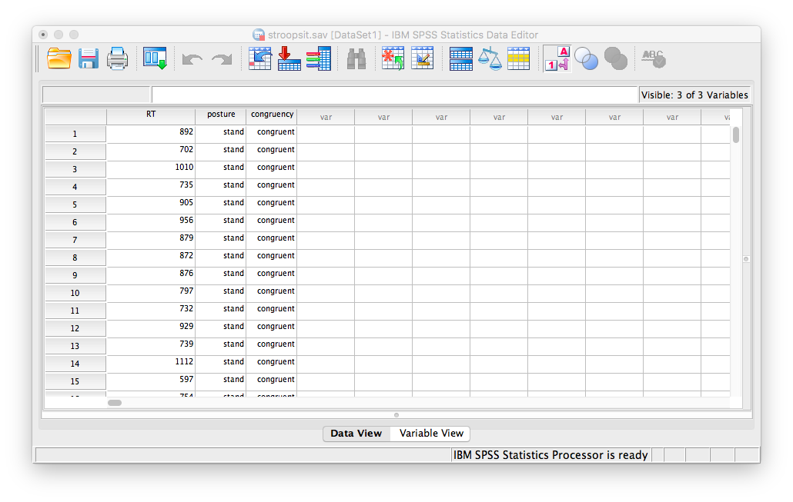
```

Notice that in this file, there are 200 rows (corresponding to 200 subjects). Each subject is categorized according to 2 independent variables: posture (whether they were in the standing or sitting condition), and congruency (whether the stimuli they received were congruent or incongruent). In this application, we are treating the design as between-subjects. This means each participant only experienced one of the following four conditions:

1. congruent stand
2. incongruent stand
3. congruent sit
4. incongruent sit

Now, let's run our Two-Factor ANOVA. Go to <span style="color:blue">Analyze</span>, then <span style="color:blue">General Linear Model</span>, then <span style="color:blue">Univariate...</span>

```{r , echo=FALSE,dev='png'}
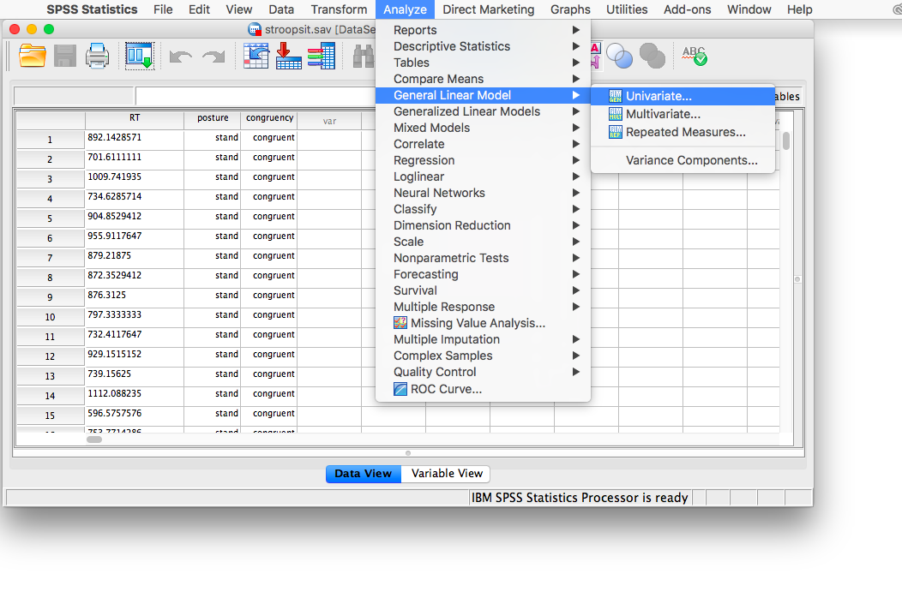
```

A window will appear asking for you to specify your variables. Place `RT` into the "Dependent Variable" field, and put both "posture" and "congruency" into the "Fixed Factors" field. 

```{r , echo=FALSE,dev='png'}
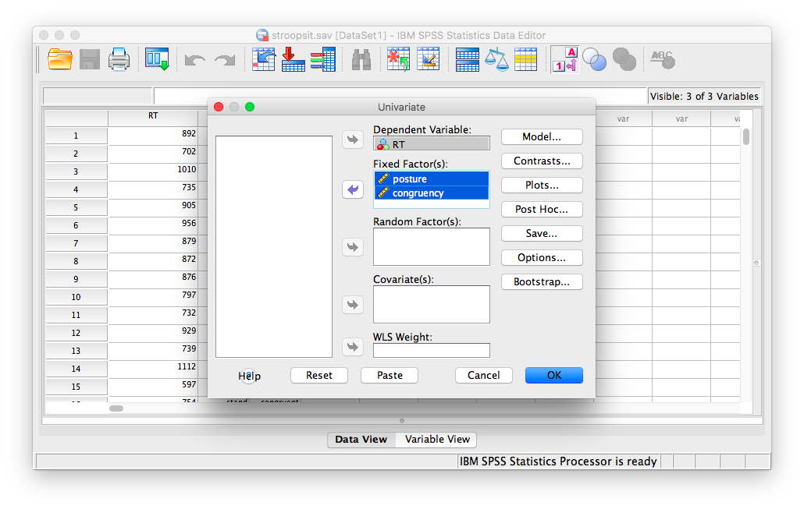
```

Now, before pressing anything else, click on <span style="color:blue">Plots...</span> (this will allow us to create a plot of means right along with our SPSS output). In the plots window, you must place the `congruency` and `posture` variables into the fields labeled "Horizontal Axis"" and "Separate Lines". You can place either variable in either field, and the graph will still make sense. However, for this example, I will be putting `congruency` into the "Separate Lines"" field, and `posture` in "Horizontal Axis":

```{r , echo=FALSE,dev='png'}
knitr::include_graphics('img/10.4.14.png')
```
You must click <span style="color:blue">Add</span> for this table to be included in your SPSS output. After you do this, Your window should look like this:

```{r , echo=FALSE,dev='png'}
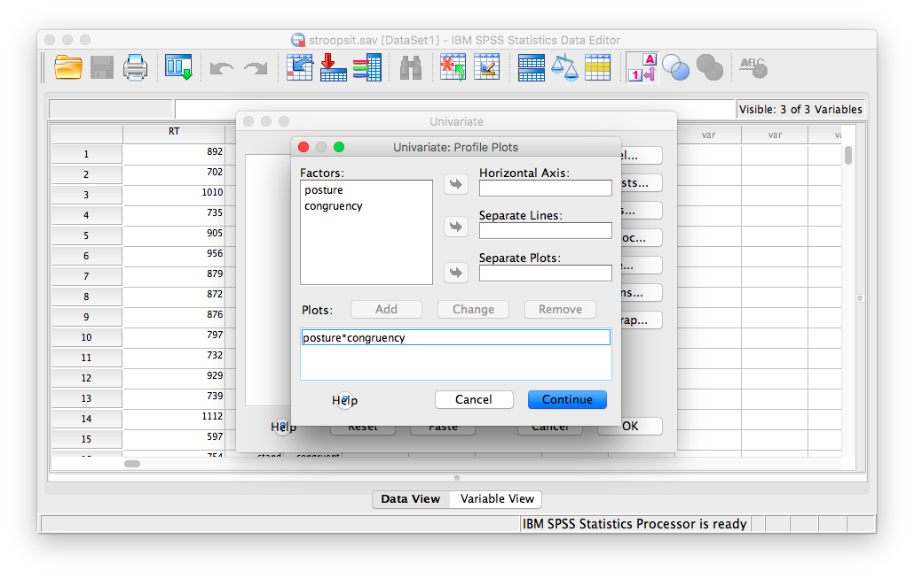
```
Then click <span style="color:blue">Continue</span> and <span style="color:blue">OK</span>. Your output will include a table labeled "Tests of Between Subjects Effects" and a plot of the means. 

```{r , echo=FALSE,dev='png'}
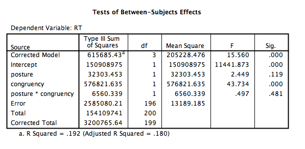
```

```{r , echo=FALSE,dev='png'}
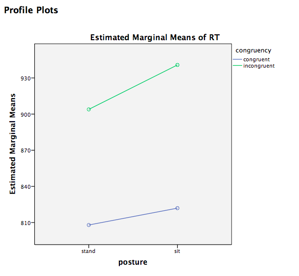
```
You can see from this output that:

1. There is no main effect of posture, F(1, 196)=2.449, p=NS
2. There is a main effect of congruency, F(1, 196)=43.734, p<.05 where (from looking at the plot) incongruent stimuli were processed with a longer reaction time than congruent stimuli.
3. There is no interaction between posture and congruency, F(1, 196)=.497, p=NS

### Calculate simple effects

---


In previous ANOVAs, we have conducted both planned and unplanned comparisons to locate the significant differences. In the case of a two-factor ANOVA, there are many comparisons that can be made. However, the comparisons you choose will depend on the results of your ANOVA. In this case, we found only a significant main effect of congruency. So, we can explore this effect more by asking:

1. For the sitting condition only, are congruent and incongruent means significantly different?
2. For the standing condition only, are congruent and incongruent means significantly different?

To answer these questions, we must calculate something called simple effects. They look at mean differences within levels of a single independent variable. In order to acheive this in SPSS, we have to get into the coding environment that runs the SPSS program; it's called Syntax. Don't freak out here, we're going to make this as simple as possible. 

First, let's go to the menu just as we did to run this ANOVA. <span style="color:blue">Analyze</span>, <span style="color:blue">General Linear Model</span>, then <span style="color:blue">Univariate...</span>

```{r , echo=FALSE,dev='png'}
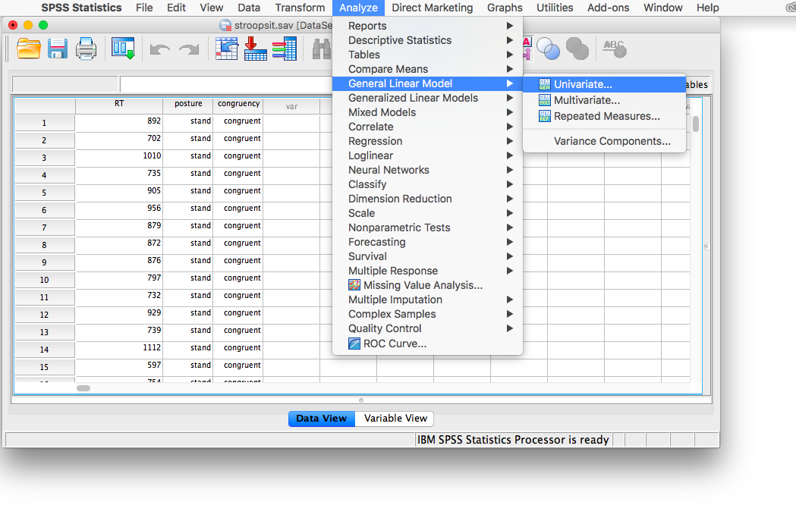
```

The next window looks just as we left it, with the variables in the right places. Here, click on the button that says <span style="color:blue">Paste</span>.

```{r , echo=FALSE,dev='png'}
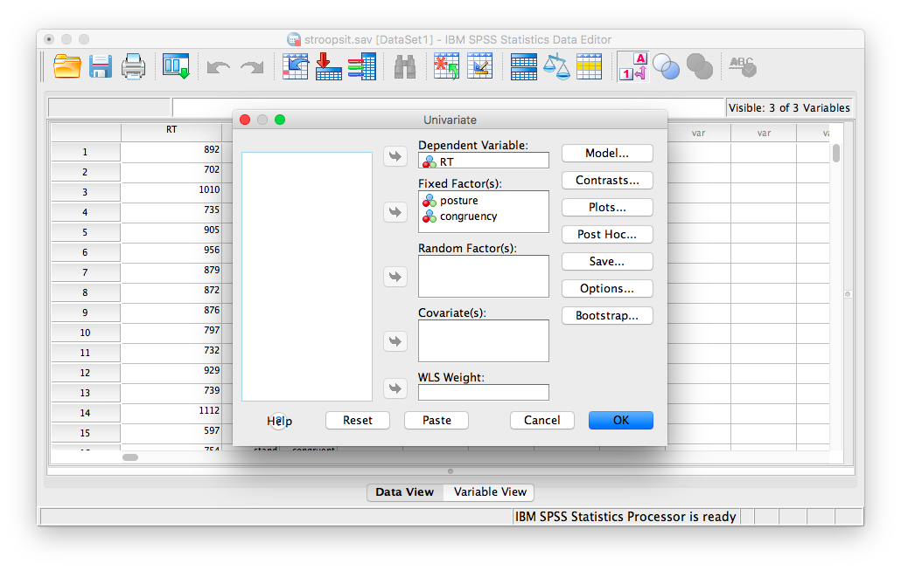
```

The result will be a new window with code already entered into it. This code correponds to the ANOVA setup we have specified. 

```{r , echo=FALSE,dev='png'}
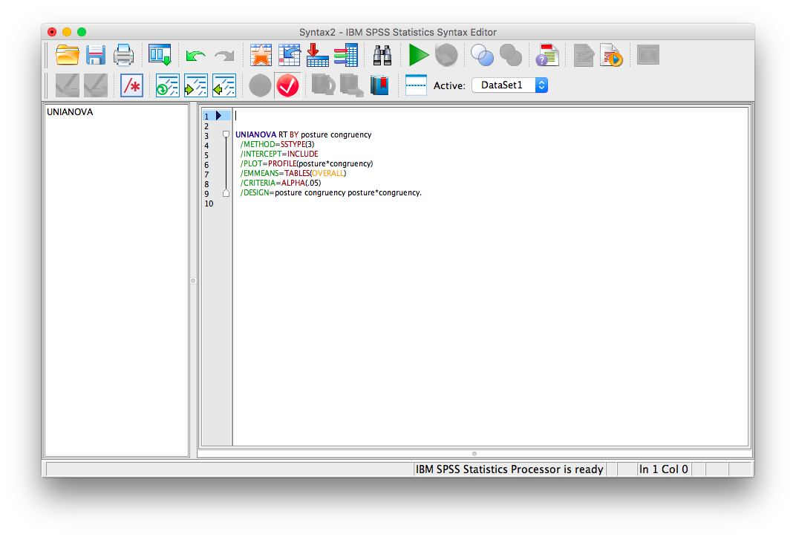
```


You are going to edit this code so that it looks like this:

 > UNIANOVA RT BY posture congruency <br>
 > /METHOD=SSTYPE(3) <br>
 > /INTERCEPT=INCLUDE <br>
 > /PLOT=PROFILE(posture * congruency) <br>
 > /EMMEANS=TABLES(posture * congruency) COMPARE(congruency) ADJ(LSD) <br>
 > /CRITERIA=ALPHA(.05) <br>
 > /DESIGN=posture congruency posture * congruency. 
 
Once it does, click the big green triangle ("<span style="color:blue">play</span>") at the top of the window. 

SPSS will produce a series of tables. The one that refers to simple effects is called "Pairwise Comparisons."

```{r , echo=FALSE,dev='png'}
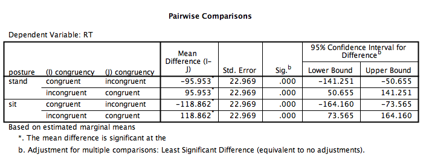
```

From this table, we can see that, 

1. In the sitting condition, the congruent and incongruent conditions are significantly different (p<.05).
2. In the standing condition, the congruent and incongruent conditions are significantly different (p<.05).

### Conduct a Repeated Measures Two-Factor Analysis of Variance (ANOVA)

---


Next, we will use this same data but treat it as a repeated measures (within-subjects) design (just as in the original experiment). This means each person in the study experienced ALL 4 conditions.

To start, we need a new data file. [Here](https://github.com/CrumpLab/statisticsLab/blob/master/data/spssdata/stroopsit_RM.sav) is link. This data file is called stroopsit_RM.sav. I have set it up so that the data is arranged for a repeated-measures design. Notice that each person is represented by a single row, and the columns correspond to the 4 conditions:

```{r , echo=FALSE,dev='png'}
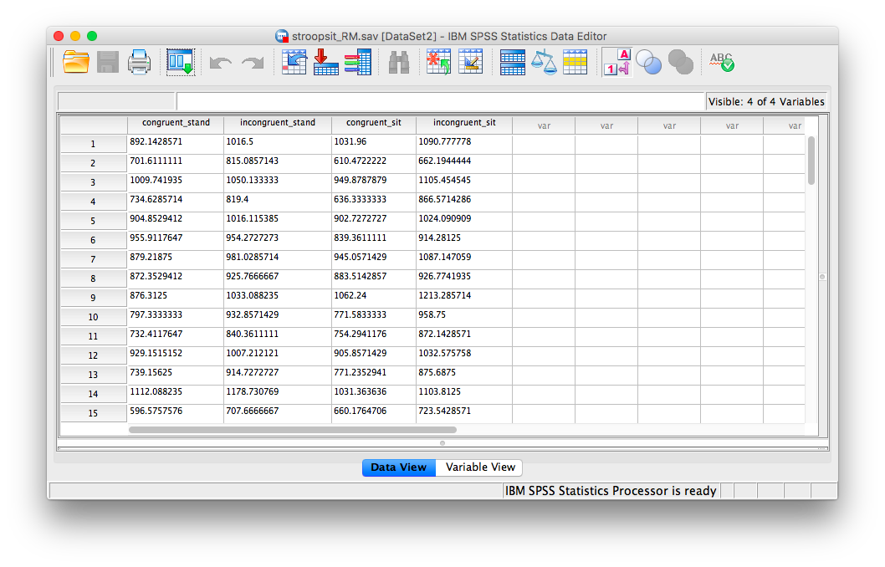
```

Now, to run a repeated measures ANOVA, we go to <span style="color:blue">Analyze</span>, then <span style="color:blue">General Linear Model</span>, then <span style="color:blue">Repeated Measures</span>:

```{r , echo=FALSE,dev='png'}
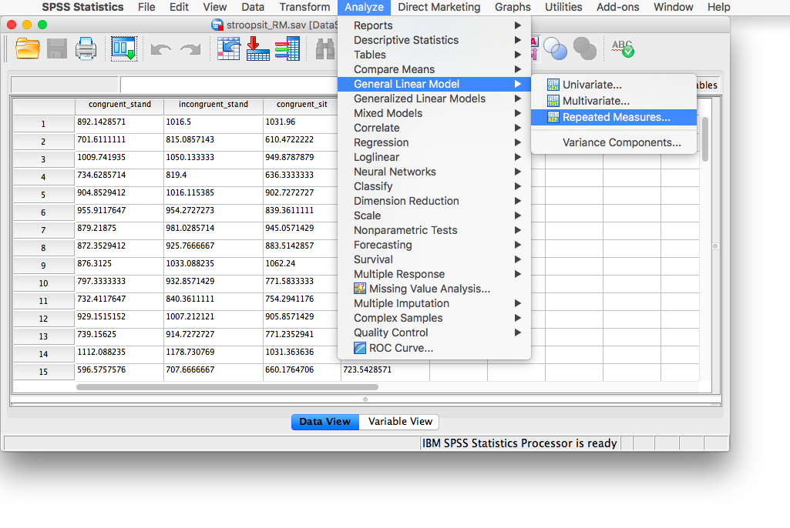
```

The next window will ask for the name and number of levels of your within-subjects factors (variables); We have two within-subjects factors: `posture` and `congruency`, and each factor has two levels. We must enter then here one at a time. First, change the default `factor1` name to `congruency`, and specify that it has 2 levels:

```{r , echo=FALSE,dev='png'}
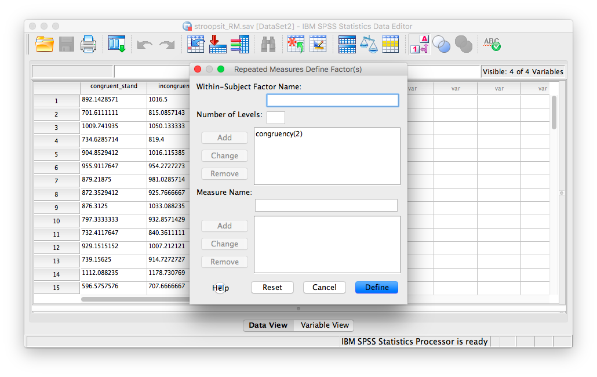
```

Click <span style="color:blue">Add</span>, and then enter a new within-subjects factor, `posture` with 2 levels as well:

```{r , echo=FALSE,dev='png'}

```

Now, click <span style="color:blue">Add</span>, and then <span style="color:blue">Define</a>. The next window asks for the 4 conditions produced by our two independent variables. Because we entered `posture` first, and `congruency next`, the four conditions, in THIS EXACT order, are entered as follows:

```{r , echo=FALSE,dev='png'}
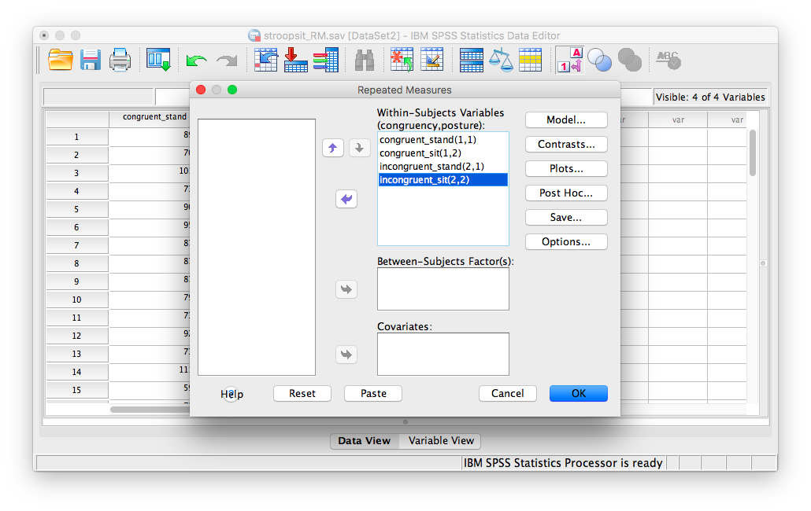
```

Click <span style="color:blue">Plots</span> and specify a graph exactly as we did in the previous example. Place `posture` in the "Separate Lines" field and `congruency` in the "Horizontal axis" field. 

```{r , echo=FALSE,dev='png'}
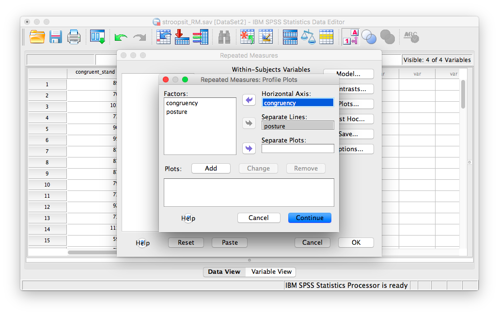
```

Remember, you must click <span style="color:blue">Add</span> to process this graph!

```{r , echo=FALSE,dev='png'}
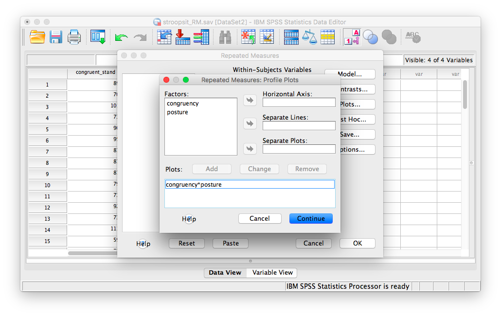
```

Now, click <span style="color:blue">Continue</span>, then <span style="color:blue">OK</span>. 

SPSS will produce several tables of output, along with a graph. The Fs for our ANOVA are located in the table labeled "Tests of Within-Subjects Effects", and the plot we requested is found below:

```{r , echo=FALSE,dev='png'}
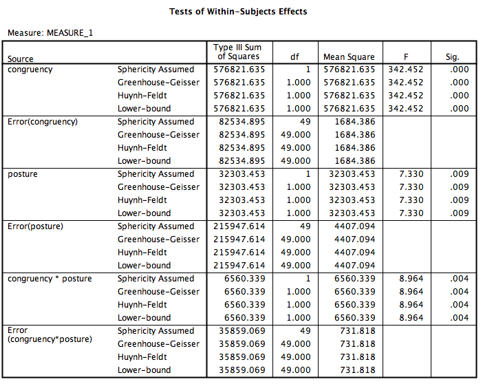
```

```{r , echo=FALSE,dev='png'}
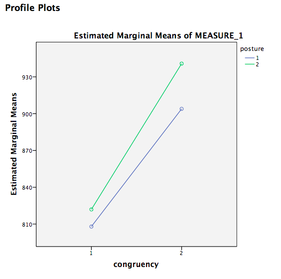
```

According to this output:
1. There is a main effect of congruency, F(1, 49)=342.45, p<.05.
2. There is a main effect of posture, F(1, 49)=7.33, p<.05.
3. There is an interaction effect between congruency and posture, F(1, 49)=8.96, p<.05.

From the plot we can see that incongruent words produced longer RTs than congruent words. We also see that sitting produced longer RTs than standing. As for the interaction, you can see that the difference between congruent and incongruent is more pronounced (larger) in the sitting condition than in the standing condition.

### Calculate simple effects

---


We may want to dissect these effects similarly to the way did in the previous example. This time, because all 3 effects were significant, we will ask SPSS to conduct simple effects for both `congruency` and `posture`. To begin, go to <span style="color:blue">Analyze</span>, <span style="color:blue">General Linear Model</span>, and <span style="color:blue">Repeated Measures...</span>

```{r , echo=FALSE,dev='png'}
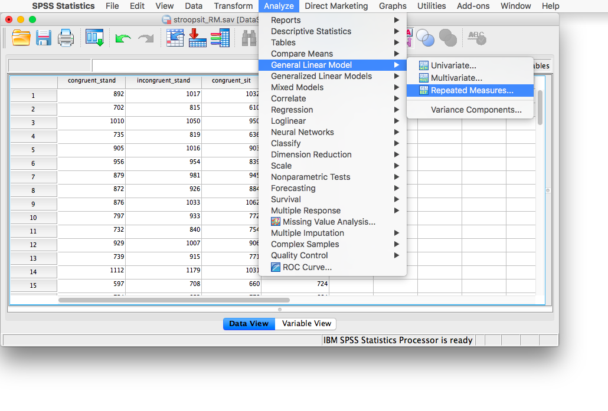
```

In the next window, all of your saved settings are still there, so click <span style="color:blue">Define</span>. In the next window, click <span style="color:blue">Paste</span>:

```{r , echo=FALSE,dev='png'}
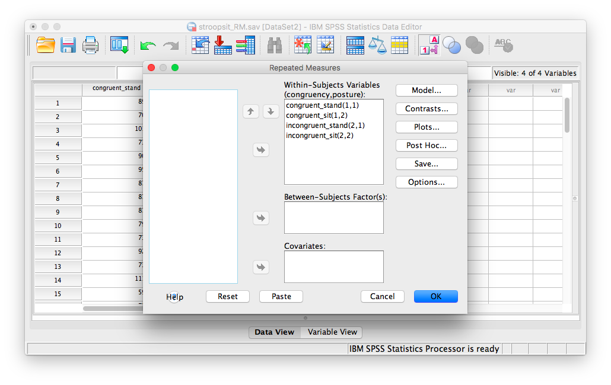
```

You will be taken to the SPSS Syntax window. 

```{r , echo=FALSE,dev='png'}
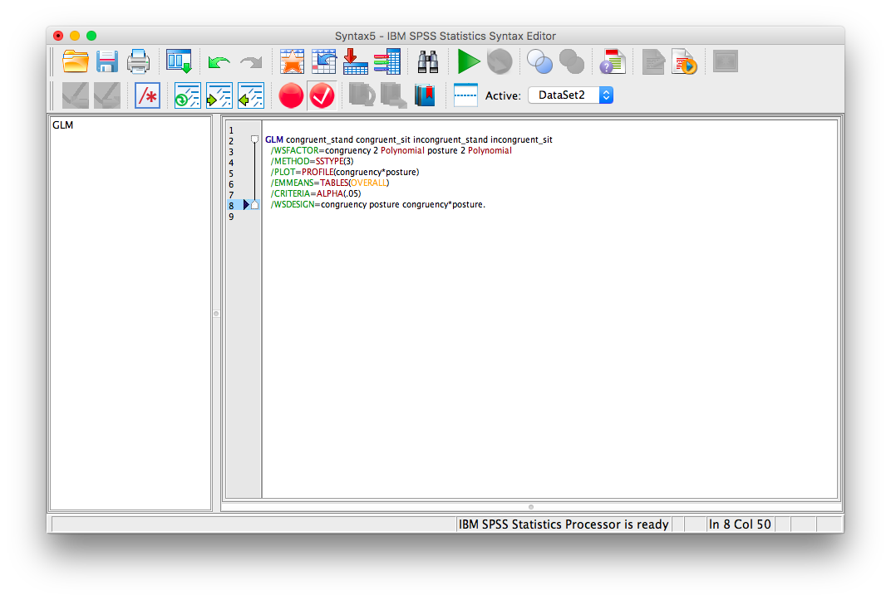
```

Change the syntax you see to the following:


> GLM congruent_stand congruent_sit incongruent_stand incongruent_sit <br>
>  /WSFACTOR=congruency 2 Polynomial posture 2 Polynomial <br>
>  /METHOD=SSTYPE(3) <br>
>  /PLOT=PROFILE(congruency * posture) <br>
>  /EMMEANS=TABLES(congruency * posture) compare(congruency) adj(lsd) <br>
>  /EMMEANS=TABLES(congruency * posture) compare(posture) adj(lsd) <br>
>  /CRITERIA=ALPHA(.05) <br>
>  /WSDESIGN=congruency posture congruency * posture. <br>


  Click the green triangle (<span style="color:blue">"play"</span>)at the top and you will see several output tables appear in the output window. We will focus on the following two:
  
```{r , echo=FALSE,dev='png'}
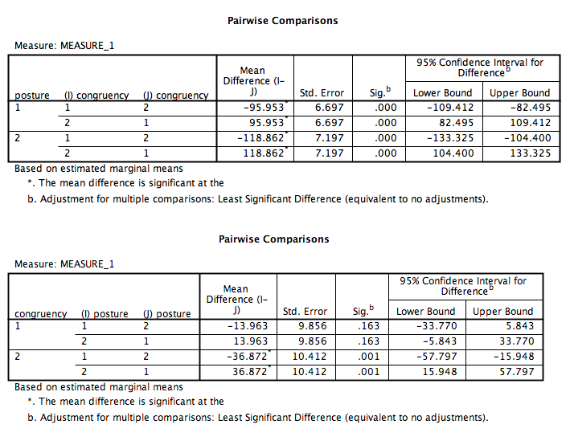
```

When reading these tables, remember that:

1. For `posture`, 1=stand and 2=sit
2. For `congruency`, 1=congruent and 2=incongruent.

In this output, we can see that:
1. For standing only, congruent and incongruent RTs are significantly different (p<.05).
2. For sitting only, congruent and incongruent RTs are significantly different (p<.05).
3. For congruent words only, standing and sitting RTs are not significantly different (p=NS).
4. For incongruent words only, standing and sitting are significantly different (p<.05).


### Practice Problems

___


Below is fictitious data representing the number of milliimeters a plant has grown under several water/sunlight combinations:

| Water & Sunlight  | NoWater & Sunlight | Water & NoSunlight | NoWater & NoSunlight |
--- | --- | --- | ---
1.2 | 2.4 | 3.1 | 2.5
3.0 | 1.1 | 2.2 | 3.4
2.5 | 1.2 | 2.5 | 4.2
1.6 | 2.4 | 4.3 | 2.1

1. Enter this data into SPSS as appropriate for a Two-Factor Between-Subjects ANOVA (N=16). Perform the ANOVA and report all results in standard statistical reporting format (use alpha=.05). Include a plot of means.

2. Enter this data into SPSS as appropriate for a Two-Factor Repeated-Measures ANOVA (N=4). Perform the ANOVA and report all results in standard statistical reporting format (use alpha=.05). Include a plot of means.

## JAMOVI

How to do it in JAMOVI


