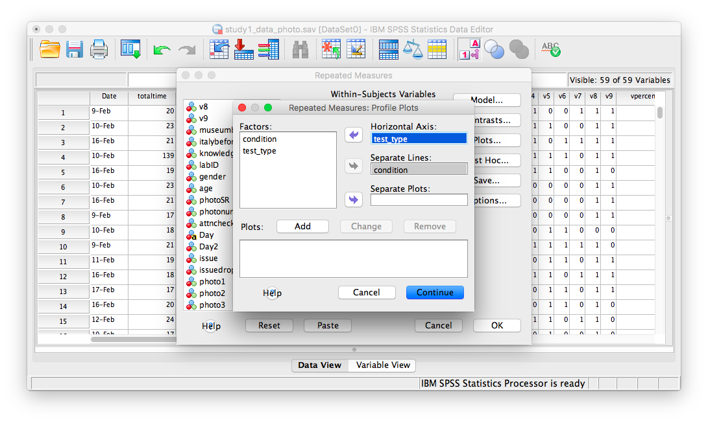
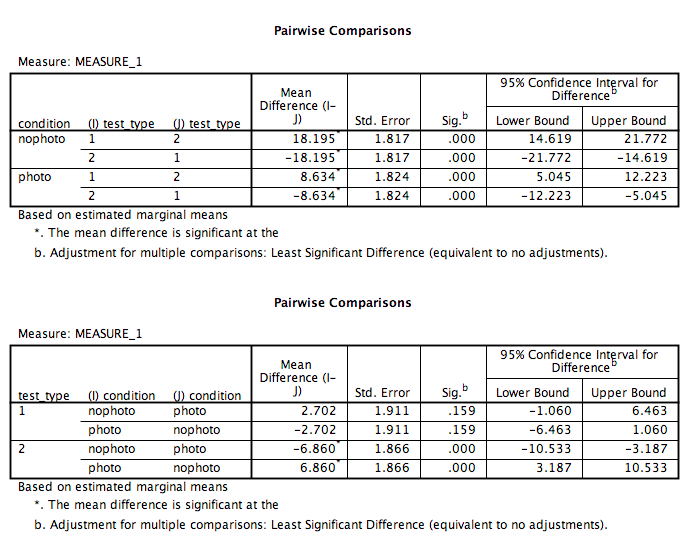

# Lab 11: Mixed Factorial ANOVA

<script>
$("#coverpic").hide();
</script>

<span class="newthought">
No amount of experimentation can ever prove me right; a single experiment can prove me wrong
---Albert Einstein
</span>

## Do you remember things better when you take pictures of them?

People take pictures of things all the time on their phones. Barasch et al. (2017) asked whether taking pictures of things had consequences for later memory of those experiences.

### Study description

In Experiment 1, participants visited a museum exhibit. Half of the participants were allowed to take photographs (with camera, at least 10 pictures) and the other half were not (no camera). They freely looked at anything in the exhibit, and were allowed to take pictures of anything they wanted (if they were in the camera condition). Additionally, while visiting the exhibit, participants listened to audio guides about the things the were looking at. 

After participants were done with the exhibit the returned to the sign-in desk. At this point they were given two memory tests for the things they saw and heard in the exhibit. They were given a visual recognition test containing pictures of objects, and were asked to identify which objects they remembered seeing. They were also given an auditory recognition test containing statements that could have been on the audio guide, and they had to identify which ones they had heard before.

This is a 2x2 mixed design. IV 1 was a between-subjects manipulation involving picture-taking (camera vs. no camera). IV2 was a within-subject manipulation of memory test (visual vs. audio). The dependent measure was performance on the memory test.

An overarching question was whether or not participants would have better visual memory for exhibit objects when they took pictures, compared to when they didn't. Additionally, taking pictures or not, may have no influence on memory for the statements in the audio guide.


## Lab Skills Learned

- Conducting a 2x2 mixed design ANOVA

## Important Stuff

- citation: Barasch, A., Diehl, K., Silverman, J., & Zauberman, G. (2017). Photographic memory: The effects of volitional photo taking on memory for visual and auditory aspects of an experience. Psychological science, 28(8), 1056-1066.
- [Link to .pdf of article](http://journals.sagepub.com/doi/abs/10.1177/0956797617694868)
- <a href="https://github.com/CrumpLab/statisticsLab/raw/master/study1_data_photo.csv" download>Data in .csv format</a>

## R


### Load the data

Remember that any line with a \# makes a comment and the code does not run. Below is how to load the .csv data from the online repository, or from a local file (you need to change the file path to where the local file is, if you downloaded it). The data contains all of the measures and conditions from Experiment 1 in the paper.

```{r}
library(data.table)
#all_data <- fread("https://github.com/CrumpLab/statisticsLab/raw/master/stroop_stand.csv")
all_data <- fread("data/study1_data_photo.csv")
```

### Inspect the dataframe

This will give you a big picture of the data frame. Click the button to view it in your browser, then take a look to see what is in it. 

```{r, eval=F}
library(summarytools)
view(dfSummary(all_data))
```

### Get the data you need

This data file contains all of the data from Experiment 1 in the paper.

### Get the data into the format you want

The data is sort of in long-format, we will see that we need to do some transformation after looking more closely at the independent and dependent variables


#### The independent variables

1. Photo vs. No photo is coded in the `condition` column
2. Memory task (visual vs. audio). There are no column variables describing which memory task people performed. Instead, the percent correct for the visual memory task is coded in the `vpercent` column, and the percent correct for the audio memory task is coded in the `apercent` column. We will need to transform the data, we do that after describing the DV

#### The dependent variable

In a sense there are two dependent variables, `vpercent` and `apercent`. However, we will treat them as a single memory performance variable.

#### Transforming the data

There were 297 participants. You can check that we have data for each participant by looking at the `labID` column.

```{r}
length(unique(all_data$labID))
```

There are 297 rows of data, each corresponding to a single subject. Let's build a data frame we can use for analysis

```{r}
subjects <- as.factor(c(all_data$labID,all_data$labID))
memory_accuracy <- c(all_data$vpercent,all_data$apercent)
memory_task<-as.factor(rep(c("visual","audio"), each=297))
camera <- as.factor(c(all_data$condition,all_data$condition))

new_data <- data.frame(subjects,
                       memory_accuracy,
                       memory_task,
                       camera)

```

### Look at the data

Remember before we do any analysis, we always want to "look" at the data. This first pass let's us know if the data "look right". For example, the data file could be messed up and maybe there aren't any numbers there, or maybe the numbers are just too weird. For example, the memory performance DV is a percent, so it should range between 0 and 100, if we find numbers that are negative or greater than 100, then we know something is wrong.

```{r}
hist(new_data$memory_accuracy)
range(new_data$memory_accuracy)
```


Great, the numbers check out, they are all inside the range of 0 to 100.

### Look at the means

As part of looking at the data, let's graph the means in each condition.

1. Get the means for each condition, by averaging over the means for each subject. These are put into the data frame called `plot_means`.

2. Make a graph with the `plot_means` data frame using ggplot2. 

```{r}
library(dplyr)
library(ggplot2)

plot_means <- new_data %>%
            group_by(memory_task,camera) %>%
            summarise(mean_accuracy = mean(memory_accuracy),
                      SEM = sd(memory_accuracy)/sqrt(length(memory_accuracy)))

ggplot(plot_means, aes(x=memory_task, y=mean_accuracy, group=camera, fill=camera))+
  geom_bar(stat="identity", position="dodge")+
  geom_errorbar(aes(ymin=mean_accuracy-SEM, ymax=mean_accuracy+SEM), 
                position=position_dodge(width=0.9),
                width=.2)+
  theme_classic()+
  coord_cartesian(ylim=c(50,100))

```


### Conduct the ANOVA

This is a 2x2 mixed design. So, we need to run a mixed design ANOVA. The formula for running a mixed design ANOVA is very similar what we have seen before. The only difference is that we specify which IV is within-subjects by placing it in the error term:

`aov(DV ~ IVB * IVW + Error(Subjects/IVW, data)`

```{r}
library(xtable)

aov_out<-aov(memory_accuracy ~ camera*memory_task + Error(subjects/memory_task), new_data)
summary_out<-summary(aov_out)

knitr::kable(xtable(summary_out))
```


Let's also print out the means for the main effects and interaction:


```{r}
print(model.tables(aov_out,"means"), format="markdown")
```


### Generalization Exercise

The generalization exercise is the writing assignment for this lab.

### Writing assignment

Your writing assignment is to write up the results of the ANOVA that you just conducted. You can follow the general recipe from the ANOVA write-up from the previous lab on factorial designs. Your write up will be in two parts

(3 points total)

**Part 1**

1. Say what the numbers were that you are analyzing
2. Say what the statistical test was
3. Say the results of the statistical test for each main effect and interaction
4. For each effect, say what the patterns of the means were.


**Part 2**

Conduct follow-up t-tests. 

A. Determine whether memory accuracy is better in the camera vs no camera condition for the visual memory task. Report the t-test and the pattern of means.

B. Determine whether memory accuracy is better in the camera vs. no camera condition for the audio memory task. Report the t-test and the pattern of means.


## Excel

How to do it in Excel

## SPSS


In this lab, we will use SPSS to:

1. Conduct and graph a Mixed-Factorial Analysis of Variance (ANOVA)
2. Calculate simple effects


### Experiment Background

---


People take pictures of things all the time on their phones. Barasch et al. (2017) asked whether taking pictures of things had consequences for later memory of those experiences.

In this experiment participants visited a museum exhibit. Half the participants were able to use a camera to document their visit, while the other half were not, all while listening to an audio tour of the exhibit. At the end of the visit, everyone was given two memory tests (visual and audio) for the content they saw and heard, respectively.

This is a 2x2 Mixed-Factorial design. The individuals in the photo group are different than the individuals in the no photo group (this is our between-subjects variable--it is called `condition`), while the memory `test_type` (audio and visual) is our within-subjects variable since everyone took both types of tests. 

### Conduct a Mixed-Factorial Analysis of Variance (ANOVA)

---


Using SPSS, open the data file linked [here](https://github.com/CrumpLab/statisticsLab/blob/master/data/spssdata/study1_data_photo.sav). It is called "study1_data_photo.sav". It should look like this:

```{r , echo=FALSE,dev='png'}
knitr::include_graphics('img/11.4.11.png')
```

Scroll through the file. Find the variable named `condition`. This variable tells you if the row in question corresponds to a person who was or was not able to use a camera. Now, find the variables `apercent` and `vpercent`. These variables refer to the percentage score received by everyone on the audio and visual memory tests, respectively. 

Notice that every row in the data file only has ONE "condition" label. That is, you were either in the camera or no camera condition. BUT, everyone in the file has scores for BOTH tests, audio and visual. This is the way your data must be structed in SPSS in order to perform a mixed-factorial ANOVA. Now, let's begin.

Go to the top menu and choose <span style="color:blue">Analyze</span>, <span style="color:blue">General Linear Model </span>, and <span style="color:blue">Repeated Measures...</span>

```{r , echo=FALSE,dev='png'}

```

The next window will ask for you to specify the Within-Subjects variable ONLY. Our within-subjects variable (the variable for which participants were measured across all levels) was the memory `test_type`. Enter `test_type` into this field, and specify that there are 2 levels. You must click <span style="color:blue">Add</span> in order to continue:

```{r , echo=FALSE,dev='png'}
knitr::include_graphics('img/11.4.13.png')
```

Then click <span style="color:blue">Define</span>. The next window will ask you to specify the levels of your within-subjects variable. Place `apercent` and `vpercent` from the list on the left into the field labeled "Within-Subjects Variables". Then, place `condition` into the field labeled "Between-Subjects variables". 

```{r , echo=FALSE,dev='png'}
knitr::include_graphics('img/11.4.14.png')
```

Now, click <span style="color:blue">Plots</span>. Place `condition` in the "Separate Lines" field and `test_type` in the "Horizontal axis" field:

```{r , echo=FALSE,dev='png'}

```

Then click <span style="color:blue">Add</span>. Your window will look like this once you've done that:

```{r , echo=FALSE,dev='png'}

```

Now, click <span style="color:blue">Continue</span> and then <span style="color:blue">OK</span>. SPSS will produce output tables for your ANOVA, as well as a plot:

```{r , echo=FALSE,dev='png'}

```

```{r , echo=FALSE,dev='png'}
knitr::include_graphics('img/11.4.18.png')
```

```{r , echo=FALSE,dev='png'}

```

Let's look at our output tables. Based on its values, we can tell that:

1. There is a significant main effect of test type, F(1, 295)=108.59, p<.05. Overall, memory test scores were higher for the audio test than the video test.

2. There is a significant ineraction effect between test type and condition, F(1, 295)=13.79, p<.05. People taking photos did worse on the audio test than people without photos, however, on the visual test, people taking photos did better than those who did not take photos.

3. There is no significant main effect of condition, F(1, 295)=2.26, p=NS.

### Calculate simple effects

---

What if we asked the questions:
1. In the no photo condition only, was there a difference between audio and visual memory score?
2. In the photo condition only, was there a difference between audio and visual memory score?
3. Were audio memory test scores different between photo and no photo conditions?
4. Were visual memory test scores different between photo and no photo conditions?

To answer these questions, we must run simple effects. If you remember from earlier labs, we must use SPSS syntax to do this. Go to <span style="color:blue">Analyze</span>, then <span style="color:blue">General Linear Model</span>, then <span style="color:blue">Repeated Measures...</span>

```{r , echo=FALSE,dev='png'}
knitr::include_graphics('img/11.4.20.png')
```

In the next window, you'll find your settings from the previously-run ANOVA have been saved. 

```{r , echo=FALSE,dev='png'}
knitr::include_graphics('img/11.4.21.png')
```

Click <span style="color:blue">Define</span>. The following window will appear:

```{r , echo=FALSE,dev='png'}
knitr::include_graphics('img/11.4.22.png')
```

Click <span style="color:blue">Paste</span> and the SPSS Syntax Editor will appear:

```{r , echo=FALSE,dev='png'}
knitr::include_graphics('img/11.4.23.png')
```

Change the code on the screen to the following:


> GLM apercent vpercent BY condition <br>
> /WSFACTOR=test_type 2 Polynomial <br>
> /METHOD=SSTYPE(3) <br>
> /EMMEANS=TABLES(test_type * condition) compare(test_type) adj(lsd) <br>
> /EMMEANS=TABLES(test_type * condition) compare(condition) adj(lsd) <br>
> /CRITERIA=ALPHA(.05) <br>
> /WSDESIGN=test_type <br>
> /DESIGN=condition.
  
  
Click the green triangle (<span style="color:blue">"play"</span>) at the top of the window. The following two tables will appear (among others) in your output window:
  
```{r , echo=FALSE,dev='png'}

```

Keep in mind that for `test_type`, 1=audio and 2=visual
. 
According to the table, we can see that:

1. In the no photo condition only, there was a significant difference between audio and visual memory (p<.05)?
2. In the photo condition only, there was a significant difference between audio and visual memory (p<.05)?
3. Audio memory test scores in the photo condition were not significantly different from those in the no photo condition (p=NS). 
4. Visual memory test scores in the photo condition were significantly different from those in the no photo condition (p<.05).


### Practice Problems

___


1. Using the same data file we used for this lab’s tutorial, run a Mixed-Factorial ANOVA using test type (audio and visual) and Gender (Male, Female). Use an alpha level of .05. Report your results in standard statistical reporting format. 

2. Produce a plot of means.

## JAMOVI

How to do it in JAMOVI


